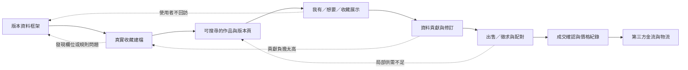
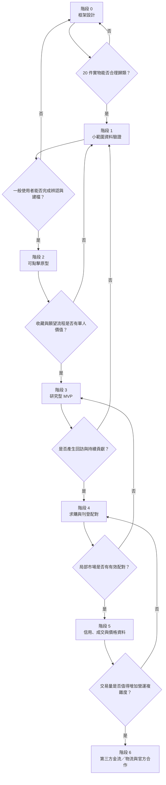

# 開發流程與階段任務（第一版）

**日期**：2026-09-20  
**用途**：把產品如何逐步長出來，與每個階段的實際任務、產出及通過條件分開。這是一條驗證驅動的開發路線，不是固定時程承諾。

## 一、兩種流程不要混在一起

- **產品形成流程**：資料框架如何逐步長成收藏工具、社群與交易功能。
- **專案執行流程**：每個階段具體做什麼、留下什麼證據、何時停下來調整。

若把兩者畫成同一張圖，很容易誤以為「列出功能」就等於「知道現在該做什麼」。

## 二、產品形成流程

這不是單向功能清單。每一階段都可能退回前一步修改資料結構、範圍或使用流程。第三方金流與物流放在最後，因為它不會解決資料、貢獻或供需密度問題。

## 三、專案階段總覽

## 四、各階段任務

### 階段 0：版本資料框架

**目的**：確認作品、版本與個人收藏品能被清楚分開。

**任務**：

- 定義資料層級與核心欄位。
- 訂出版本拆分、合併及待確認規則。
- 設計一般使用者的搜尋、比對及新增流程。
- 建立 20 件實物測試表。

**產出**：資料框架、欄位字典、版本判定規則、測試表。

**通過問題**：20 件真實收藏是否都能放進模型？是否出現大量「不知道該放哪一層」的情況？

### 階段 1：小範圍資料驗證

**目的**：用真實建檔行為修正框架，不急著寫程式。

**任務**：

- 親手建 20 件自己的收藏。
- 記錄每件時間、卡住欄位、查證需求及持續意願。
- 找 5–8 位不同類型樂迷深談實際尋找與辨認過程。
- 選 10 組音樂人，手工建立 100 項商品與版本資料。
- 邀 5 位資深收藏者試著補資料，觀察建檔時間與爭議。

**產出**：修訂後資料模型、實際建檔紀錄、爭議案例集、第一個垂直範圍。

**通過問題**：一般收藏者能否在有限協助下完成版本辨認？資料貢獻是否需要創辦人逐筆代填？

### 階段 2：可點擊原型

**目的**：在開發前驗證使用流程與畫面理解。

**任務**：

- 製作搜尋、作品頁、版本頁及版本比對流程。
- 製作「我有／想要／曾擁有」與收藏頁。
- 製作找不到版本時的候選版本提交流程。
- 用真實資料測試，不用理想化假資料。
- 觀察使用者是否理解作品、版本與個人收藏品的差異。

**產出**：可點擊原型、測試紀錄、修訂後頁面流程。

**通過問題**：使用者不經長篇教學，是否能找到正確版本並完成收藏？

### 階段 3：研究型 MVP

**目的**：驗證單人價值、回訪與資料貢獻，不處理金流。

**任務**：

- 帳號、音樂人、作品及版本頁。
- 搜尋與版本篩選。
- 收藏、願望清單及公開範圍。
- 候選版本、勘誤、資料狀態與修訂紀錄。
- 使用者實拍投稿及署名。
- 最小管理後台、檢舉與下架紀錄。

**刻意不做**：站內錢包、代收代付、全面鑑定、原生 App、收藏總價排行。

**通過問題**：沒有交易時，使用者是否仍會回來管理收藏或補資料？

### 階段 4：求購與刊登配對

**目的**：驗證局部供需密度，仍不自行保管款項。

**任務**：

- 版本頁上的出售／徵求狀態。
- 願望清單的新刊登通知。
- 聯絡、面交或外部物流選項。
- 配對後的狀態回報。
- 明確揭露未經平台金流不提供金流保障。

**產出**：配對紀錄、供需密度、站外流失點及使用者回報意願。

**通過問題**：在選定的垂直範圍內，是否出現足夠的有效配對，而非只有瀏覽與開價？

### 階段 5：信用、成交與價格資料

**目的**：確認平台能否取得可信的成交與交易行為資料。

**任務**：

- 雙方成交確認。
- 品況描述與交易評價。
- 成交價、日期及樣本數標示。
- 異常成交與自售自買偵測規則。
- 站內預約、面交完成與爭議紀錄。

**通過問題**：成交回報是否足以形成可信資料？客服與爭議負擔是否仍可由一人控制？

### 階段 6：第三方金流／物流與官方合作

**目的**：只有在使用與配對成立後，才承擔更高的營運與法規複雜度。

**任務**：

- 評估合規第三方金流與物流，不自行保管款項。
- 由台灣平台律師審查交易、圖片、UGC、個資與通知下架架構。
- 由會計師確認平台收入與交易紀錄處理。
- 依已有使用證據接觸唱片行、樂團、廠牌與官方商品合作。

**通過問題**：交易量與合作需求是否足以抵銷串接、客服、爭議及合規成本？

## 五、現在的位置

目前位於「階段 0 尾端」。資料框架與測試表已完成，但尚未用 20 件實物驗證。因此下一步不是畫完整網站，也不是開發交易功能，而是執行 20 件測試並記錄框架失效的地方。

流程圖與階段任務不是為了讓計畫看起來完整，而是防止跳關。每一階段只有在核心問題獲得足夠證據後才進下一階段。
