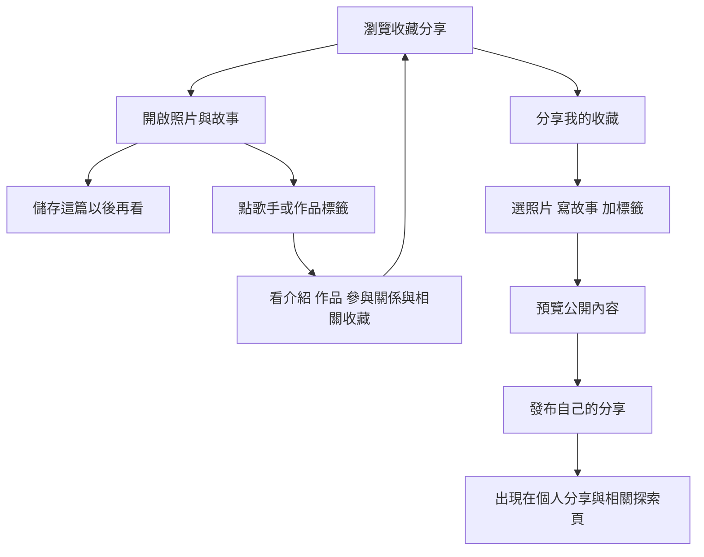

# 音藏分享優先與音樂收藏關聯企劃

**日期**：2026-09-22

**狀態**：使用者已明確指定分享與觀看為首要動機；以下介面命名、標籤行為及關聯細節是 Codex 建議，待討論。

**範圍**：企劃修訂。沒有製作網站、原型或資料庫。

音藏的第一個入口改以「看看別人收藏什麼、分享自己手上的收藏」為主。收藏品、音樂作品、版本、活動與音樂人資料支持瀏覽、理解和延伸探索。沒有持有實物的人也可以儲存喜歡的內容，這個動作不表示持有、想買或自己已公開分享。

本稿優先於同日較早的作品百科優先稿，以及整體重審稿中「私人整理先行」的建議。資料辨識、來源、權限與更正原則仍可沿用；首次流程、首頁、歌手頁及未來階段安排依本稿修訂。

## 一 這次已確認的使用者意圖

- 第一次來主要是看別人的收藏，以及分享自己的收藏。
- 任何人都能把喜歡的內容留著以後看，不需要先擁有那件實物。
- 自己分享的收藏需要獨立入口與展示空間。
- 分享可有使用者自訂的標籤，並能循標籤找到相關人或作品。
- 歌手客串別人的作品、作品被合輯收錄等關係要能被找到，但不能全算成該歌手的主要專輯。
- 歌手頁需要簡介與介紹，不能只有作品索引。
- 收藏品包含音樂相關的場刊、手冊等實物，不能只以專輯或音樂載體理解範圍。刊載藝人名字的物件也能透過適當關係被找到。

使用者補充確認：金曲獎、金音獎的入圍／得獎紀錄，以及官方合輯收錄兩種都需要。兩條關係分別記錄；本稿沒有查核特定真實作品的獲獎、入圍或官方收錄事實。

使用者再提醒：金曲獎官方不一定發行合輯，所指包含早期曾有的情形。因此不預設每屆、每個獎項都有合輯，也不預設金音獎有相同發行歷史。具體合輯的年份、官方性與收錄內容須逐張查證。

使用者進一步以場刊為例，指出是否有合輯不影響其他收藏品成立。規劃應能收錄實際存在的場刊、手冊等物件及其中提及的藝人；本輪沒有查證各活動是否每屆都發行場刊。

## 二 把容易混淆的操作分清楚

| 使用者意思 | 建議介面名稱 | 操作後發生什麼 |
|---|---|---|
| 這篇很喜歡，以後再看 | 儲存這篇 | 加入本人的已儲存內容，與原分享者保持連結 |
| 這張作品的資料以後再看 | 儲存作品 | 加入已儲存作品；不增加持有人數 |
| 這本場刊或其他物件想留著再看 | 儲存收藏品 | 留下公共條目的連結；不表示本人有該物件 |
| 我想展示自己手上的東西 | 分享我的收藏 | 建立本人的分享，可附照片、故事與標籤 |
| 我想找某件東西來買或收 | 加入想要清單 | 記錄願望，不表示已有實物 |
| 我想私下盤點自己的實物 | 記錄持有／持有紀錄 | 可選的管理功能，不是發文前置條件 |

「收藏」可以繼續出現在內容語言，例如收藏故事、收藏分享、收藏者。建議動作按鈕使用「儲存」「分享」「想要」等明確用語，避免一顆模糊的「收藏」同時代表書籤與持有。

這裡的「任何人」指不以持有物品或收藏專業作為門檻。公開內容建議免登入瀏覽；跨裝置儲存與發布分享需登入並保留操作上下文。是否支援訪客暫存另議，不把登入視為持有驗證。

會員頁建議分成「我的分享」「已儲存」「想要清單」，私人持有管理另有入口。對外的個人頁只展示本人選擇公開的分享。儲存別人的貼文不會複製成自己的收藏展，也不會讓原作者看見儲存者的私人清單。

原分享若被刪除、下架或改為私人，儲存位置顯示目前無法查看；不能繼續提供原本已撤下的照片或私人內容。儲存是方便再次找到原內容，不是取得再發布權限。

## 三 首頁與第一次使用流程

首頁以收藏分享為主，卡片先讓人看到實物、分享者、故事重點與可點的相關標籤。保留搜尋，可查分享、歌手、作品或主題。主要行動入口是「分享我的收藏」。

新訪客可以先看真實精選與最近分享，偏好選擇可略過。有實際追蹤與儲存訊號後，再考慮適度個人化；不以虛構人數、假關注或假推薦原因填滿頁面。

第一條成功流程是瀏覽者找到想看的分享，理解標籤並能儲存後再找到；第二條是分享者能發布一件收藏，不需要先建立完整作品或版本資料。兩種行為分開觀察，不能要求每位瀏覽者都上傳實物才算成功。

分享的建議步驟：選自己的實物照片 → 補一句想分享的內容 → 選物件類型及相關歌手、作品、活動或自訂標籤 → 可選擇連到已知收藏品版本 → 預覽 → 發布。已從條目進入時沿用已知類型；未知可以略過分類。照片數量、文字最低要求及是否允許純文字分享，留待使用流程測試決定。

收藏品或版本找不到時可先標示未連結／待辨認，分享仍能成立。系統事後建議相關條目，作者確認後再連結；不因發布照片就自動建立公共版本。新增正式收藏品／作品／版本仍是另一條提案流程。

一則分享可以包含多件收藏，例如合照、同張專輯不同版本或某位歌手的收藏組合。每件可分別連結對應資料；尚未連好的部分維持未知，避免把整篇所有標籤套到每一件物品。

## 四 標籤有不同用途與點擊目的地

畫面可用簡單的標籤呈現，但使用者自己整理的詞、連到歌手的入口、正式作品關係，不能在資料上混為一談。

| 類型 | 例子 | 點下去建議看到什麼 | 可以決定什麼 |
|---|---|---|---|
| 使用者自訂主題 | 首刷、演唱會戰利品、青春回憶 | 主題下的公開分享，顯示全站／這位收藏者的範圍 | 分享分類，不直接更動百科事實 |
| 歌手連結 | 歌手甲、歌手乙 | 對應歌手頁，可切主要作品、合作參與與相關收藏 | 指向哪個人；單純標記不證明正式演出關係 |
| 收藏品／版本連結 | 某專輯、某張再版 CD、某本場刊 | 收藏品資料、版本與收藏者分享 | 這篇提到哪件物件或版本 |
| 活動連結 | 某屆典禮、某次演唱會 | 活動介紹與實際相關收藏品、分享 | 說明物件與哪個活動有關 |
| 已查證的物件或參與關係 | 客串演唱、合輯收錄、場刊介紹、名單列名 | 關係說明、具體曲目／頁碼／版本及來源 | 控制物件在哪個角色分類出現 |
| 獎項關係 | 某屆某獎項入圍／得獎 | 對應屆次、獎項、對象、結果與來源 | 只描述被查證的獎項事件 |

自訂主題的建議點擊行為：在探索頁點標籤，先看同主題的全站公開分享；在某位收藏者的展示頁點標籤，先篩選該人的公開分享，並可切到全站。頁面必須明示目前範圍。這是待確認的互動提案。

歌手名稱建議在輸入時提供既有歌手供選擇，對應穩定身分，保留別名與同名辨識。自由輸入的一段文字可先當自訂標籤，不能只因字面相同就合併歌手或改動作品歸屬。

如果你說的「該員」是收藏者，點頭像與個人主題能看那個人的分享；如果是歌手，點歌手連結能看他的作品與參與資料。兩種人物頁採不同名稱與入口，避免把收藏者的貼文誤認成音樂人的作品。

純粹標記某歌手的貼文可進入「相關收藏」的探索候選；需要基本關聯檢查和檢舉機制，避免大量亂標。只有有來源的關係才會把物件放進歌手的主要作品、合作或出版品相關分類。場刊與歌手確實有關，也不必被改成歌手發行的音樂作品。

## 五 歌手與專輯以參與角色連結

### 先把收藏品範圍放對

前輪將音樂載體設為核心、其他周邊延後的假設需要修訂。這輪企劃的共同入口是「收藏品」，以下類型都在規劃範圍內；第一個實作品類組合尚待使用者另行決定，不能再預設只做 CD。

| 收藏品類型 | 條目主要描述 | 與歌手常見的關聯 |
|---|---|---|
| 音樂載體 | 專輯／合輯、發行版本、曲目與格式 | 主要署名、客串、詞曲、製作、曲目收錄 |
| 場刊與活動手冊 | 刊名、活動屆次／日期、出版或發行單位、印次、內容特徵 | 被介紹、被訪談、名單列名、撰文等 |
| 海報與其他印刷品 | 名稱、用途、活動、尺寸及可辨識批次 | 圖像呈現、演出名單列名、相關宣傳 |
| 其他音樂周邊 | 物件名稱、種類、發行來源、款式與版本線索 | 音樂人／活動／作品的商品關聯 |

這些是要用真實案例修正的概念欄位，不是所有分享的必填表格。音樂作品可有多個實體版本；場刊則有自己的出版與印次資料，不要求填曲目或對應一張專輯。個人物件的損傷、題字與故事仍保留在個人分享或持有紀錄。

### 場刊如何連到歌手

假設收藏者分享一本某屆活動場刊，裡面有甲、乙、丙的名字，並有一頁介紹乙。這本場刊只需一個公共物件條目，可以連到該活動，再分別連到這些音樂人。關係應記成「名單列名」「人物介紹」等，並可附頁碼或照片作依據。

點乙的名字能進歌手頁，在「相關收藏品／場刊與出版品」看到該場刊，點回去則看場刊介紹、版本與收藏者分享。它不會混入乙的主要專輯，也不因乙出現在活動場刊就推定乙參與演唱、得獎或負責發行。

物件提及哪些藝人應依實際內容；活動頁上有某藝人，不代表該活動每一件周邊都印有他的名字。分享者也可自由寫自己的主題與聯想，但公共條目的具體關係仍以證據為準。

### 專輯仍按演出與創作角色處理

一張作品可以同時與多位音樂人有關，關係需要說清楚角色與範圍。下面都是示意案例，不指涉真實發行紀錄。

| 示意情境 | 作品主要署名 | 歌手頁如何呈現 |
|---|---|---|
| 甲的專輯，第 3 首由乙客串演唱 | 專輯依實際署名列甲 | 甲的主要作品；乙的合作／客串，註明第 3 首 |
| 甲與乙共同署名的專輯 | 依實際署名列甲與乙 | 可列入兩人的主要合作作品，不能簡化成單一人的專輯 |
| 乙只替甲寫一首歌 | 依專輯實際署名 | 乙的詞曲參與，註明歌曲；不自動標成乙有演唱 |
| 合輯收錄乙的一首錄音 | 合輯依實際發行資料記錄 | 乙的合輯收錄，連到收錄曲與合輯資料 |
| 只有某個再版附乙的合作加曲 | 作品主要署名不因一個加曲自動改變 | 乙的參與關係連到實際包含該曲的版本，標示僅該版本收錄 |
| 收藏者因為乙而儲存甲的專輯 | 公共資料不變 | 只影響收藏者自己的儲存，不改歌手作品表 |

因此乙的歌手頁可以找到那張專輯，但會顯示在「合作／客串」或「合輯收錄」，不混入他本人主要署名的專輯清單。首頁或搜尋也可提供「全部相關作品」，每張卡片仍標明關係。

「主要演出／作品署名」和「發行公司」也要分開。歌手頁上的主要作品，不要求一定由歌手本人當發行商；作品在哪家廠牌發行另記。

第一輪關聯規劃至少保留人、角色、關聯對象、適用曲目或版本、來源與查證狀態。還不必建立完整歌曲百科，但客串只發生在一首歌時，要有地方指出是哪首歌，不能只留一個模糊的歌手標籤。

MusicBrainz 的正式署名指南區分發行與曲目的署名，並把 featured artist 放在對應的署名中；另以關係表示不同參與。音藏借用「角色與範圍明確」的原則，具體頁面分類是本案設計建議。[署名指南](https://musicbrainz.org/doc/Style/Artist_Credits)、[關係說明](https://musicbrainz.org/doc/Relationships)

## 六 獎項紀錄與相關實物分開

使用者已確認獎項紀錄與官方合輯收錄兩種都需要，並搭配可自由策展的主題：

1. 某歌手、歌曲、專輯或其他對象曾入圍／獲得某屆某獎項。
2. 某首歌被一張實際發行的合輯收錄；若另有證據，才標示該合輯與特定獎項或活動的關係。
3. 收藏者自行整理「我喜歡的金曲獎相關收藏」等主題。

另有場刊、手冊或其他實際存在的獎項活動收藏品。它們沿用上一節的物件與內容關係，不必因沒有合輯就失去收錄位置。

第三種可以自由策展；前兩種的公共資料需各自有來源。自訂 `#金曲獎` 不會產生官方認證徽章。被合輯收錄不等於得獎，得獎歌曲出現在一張合輯，也不代表那張合輯得獎。

獎項紀錄建議呈現屆次／年份、類別、對象、入圍或得獎結果、官方來源。對象可能是人、專輯、歌曲或錄影作品，不能因為一人有關聯，就把同一獎項自動傳給所有合作音樂人或所有版本。

若確有獎項官方合輯，仍建立該合輯自己的作品與版本資料，保留發行單位和收錄曲。歌手透過「曲目被收錄」連回合輯；是否為官方、與何屆活動有關，都需對應來源。

獎項紀錄可以完全沒有合輯。某屆沒有可確認的官方合輯時，只呈現有來源的獎項資訊；不建立空白合輯、不自動把入圍名單當曲目表，也不推定所有入圍作品都被收錄。沒有找到發行證據，與已證明從未發行，是不同結論。

若同屆有場刊而沒有合輯，就在活動的「相關收藏品」呈現場刊。場刊本身記錄實際刊載內容；「被列名」「被介紹」「被列為入圍者」「正式得獎紀錄」分開表達。歌手頁可透過這些關係找到它，同時保留獎項結果本身的來源。

私人策展清單或串流歌單可以另作內容連結，但不能因名稱包含獎項就被當成官方實體合輯。早期若查到真實發行，依其年代、版本與實際收錄內容建檔即可，不把它延伸成每年固定發行的系列。

本稿沒有查核任何特定金曲獎／金音獎結果或合輯，這裡只規劃資料如何表達，不能據此建立真實獎項條目。

## 七 歌手頁升級為可探索的介紹頁

歌手頁要讓初次認識的人知道他是誰，也讓熟悉的人找到不同形式的參與。建議區塊如下：

| 區塊 | 內容 |
|---|---|
| 簡介 | 名稱、別名、個人／團體、簡短介紹與資料來源；合適且可用的圖片另行處理 |
| 主要作品 | 主要署名的專輯、EP、單曲等，可依年代與類型篩選 |
| 合作與客串 | 參與別人作品的情況，每筆顯示角色與曲目 |
| 合輯收錄 | 歌曲收錄在哪些合輯，連到合輯與實體版本 |
| 詞曲與製作參與 | 經來源確認的創作、製作等工作，與演唱分開 |
| 獎項紀錄 | 對應屆次、類別、對象和結果，保持歸屬正確 |
| 相關收藏品 | 場刊、手冊、海報、周邊等，標明被介紹、列名或商品關聯；與主要音樂作品分區 |
| 相關收藏分享 | 收藏者公開分享的實物、故事與對照照片，清楚標示作者 |

初期可用短介紹起步，較長生涯敘事逐步補齊。介紹寫作需保留來源及編輯紀錄；沒有證據的生平、評價或獎項不因 AI 生成而變成事實。人物資訊未完整時，照樣提供已有的作品與相關分享入口。

歌手名稱或身份合併時，應保留正確連結與修訂歷史；樂團與個別成員保留獨立身分，不因成員參與就把樂團所有作品當成個人專輯。不同別名是否是同一音樂人，需另有證據與處理規則。

## 八 模組關係與未來規劃順序

「瀏覽和儲存」服務所有感興趣的人；「分享」服務有實物或收藏故事要展示的人；「收藏品、作品、活動與歌手資料」提供可持續探索的脈絡。私人持有管理是可選功能，不能把分享者先導去完成盤點。

| 模組 | 第一輪企劃要回答的問題 |
|---|---|
| 分享瀏覽 | 哪些內容值得看，照片與文字怎麼呈現，如何找到下一篇 |
| 儲存與個人分享 | 使用者能否分清別人內容的書籤與自己發布的內容 |
| 標籤探索 | 點主題、歌手、作品後的目的地是否符合預期 |
| 關聯資料 | 客串、合輯、獎項等是否放在正確的對象與分類 |
| 跨品類收藏 | 場刊、手冊是否能自然分享與分類，而不被迫填成專輯 |
| 發布與治理 | 版本不明如何發布、如何更正標籤、檢舉或撤下自己的內容 |

未來若決定製作第一個可用切片，分享發布、瀏覽、儲存及基本個人頁應在同一階段規劃，搭配少量可靠的歌手／作品資料。圖片用途、隱私預覽、檢舉、撤下與管理處理需一起準備，不能沿用舊稿把公開分享全部排到私人收藏之後。

公共資料提案、深入版本考據與更完整 AI 協助可再逐步增加。交易仍是後續模組，不把書籤、分享或獎項標籤當成持有或販售證明。

分享優先的冷啟動仍需要真實內容。建議先邀少量收藏者各提供一則他想講的收藏故事，平台協助連結資料與標籤。這是後續執行提案，本輪未邀請任何人或開始製作內容。

## 九 接下來用案例確認而不是先加功能

以下為待測情境，尚未執行：

- 沒有那張專輯的人看到分享、儲存，能在已儲存找到原文，自己的公開分享不增加。
- 分享者可以發布版本未明的收藏，不被要求先補完百科。
- 同一篇多件收藏分別連結，不因一張照片的標籤把其他物件也全部歸到同一歌手。
- 點乙歌手，能在合作區找到甲的專輯並看見乙參與的曲目；乙主要作品不被誤增。
- 只在再版加曲參與的音樂人，不被套到原版沒有該曲的發行。
- 自訂獎項主題只篩出相關分享；正式獎項結果仍看來源，不自動認證。
- 歌曲被合輯收錄、入圍、得獎三者能被使用者正確區分。
- 某屆只有獎項紀錄、沒有可確認的合輯時，頁面仍完整可用，也不生成不存在的合輯。
- 某屆沒有合輯但有場刊，場刊仍有自己的條目與活動關係；所列藝人可從歌手頁找到它。
- 同一場刊提及多位藝人，不複製成多本場刊，也不把所有名字都當成演出或獲獎者。
- 查看歌手簡介後，可接到作品、參與與收藏分享，不被導入沒有內容的空分類。

新一輪的首要觀察是：人是否願意看、能否理解儲存與分享的差別、能否沿標籤發現更多，以及分享者是否願意再次分享。原 20 件實物測試保留作版本資料的補充驗證，不再當成所有分享規劃的前置門檻。

## 十 已確認與仍待討論

**已確認**：觀看與分享優先、儲存和自己分享分開、自訂標籤與相關探索、合作／合輯不能混同主要作品、入圍／得獎與實際官方合輯都納入、場刊等音樂收藏品也在範圍內、歌手頁有簡介、目前仍只做企劃。

**待討論**：按鈕是否採「儲存」；自訂主題點擊的全站／個人範圍；分享的最低輸入；第一批真實內容的範圍。

本稿確認的是本輪使用者意圖，不代表所有建議命名和資料規則已核定，也不構成製作授權。
