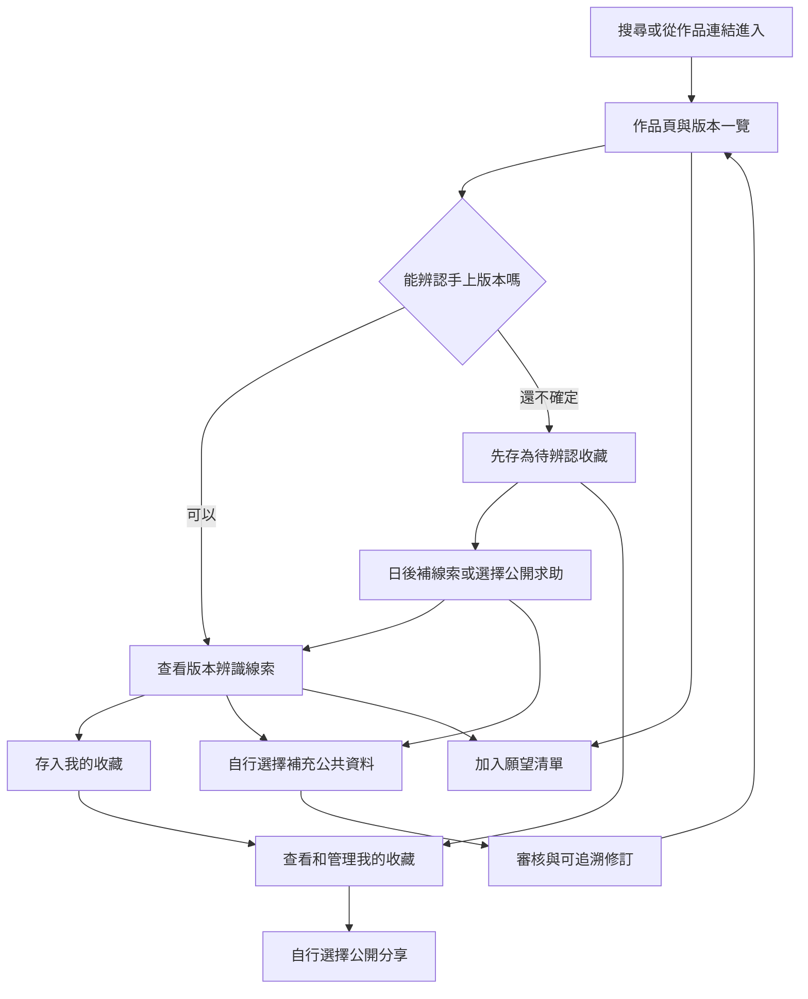
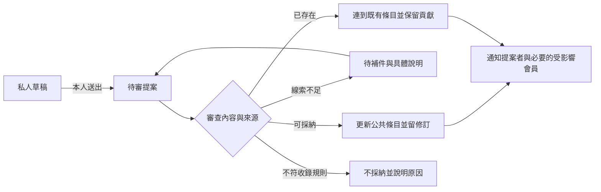

# 音藏網站整體重審與流程企劃

**日期**：2026-09-22

**作者**：Codex on Mac

**狀態**：保留的第一輪重審稿。使用者後續已選擇觀看與分享收藏優先，最新入口、模組、歌手頁與標籤規劃見 [分享優先與音樂關聯企劃](20260922_音藏分享優先與音樂關聯企劃.md)。

**修訂關係**：本稿「先私人整理」「首頁百科優先」「歌手只作索引」及 R1／R2 將分享排後的建議已被後續方向取代。資料品質、隱私、更正與未來交易的審視可保留參考；新稿有不同安排時以新稿為準。

**品類補充**：使用者後續明確將場刊、手冊等音樂收藏品納入規劃。本稿先以 CD 為主、非音樂載體周邊延後的建議不再作預設；物件、活動與藝人的新關係見上方最新企劃。

**本輪範圍**：定位、資訊架構、使用流程、資料與權限、內容營運、驗證方式及未來階段。僅產出企劃文件。

音藏值得保留「作品與版本百科」的主體，並以收藏者能完成的具體任務來安排網站。建議最先交付的價值是：找到手上那張、記住自己的收藏、看懂不同版本，再自行選擇是否分享或補資料。版本辨識遇到困難時，個人整理仍應能繼續。

這份企劃以 9 月 22 日 Windows Claude 整理的作品優先方向為基礎。保留歷次討論中的收藏展示、同好理解與 AI 輔助意圖，再補足中斷、錯認、隱私、資料更正與後台處理。新建議逐項待使用者確認，不視為先前已同意的決策。

使用者本輪明確要求「都先是企劃類別，都先不要開始製作」。因此舊文件中的「規劃已結束」與「階段 0 現在就能做」暫停適用於執行排程。原型、程式、資料庫與部署皆留待後續明確指示。

## 一 審視後最需要處理的問題

| 發現 | 目前依據與影響 | 本輪建議 |
|---|---|---|
| 作品優先已規劃，現有首頁仍是分享動態 | `app/page.tsx` 預設為 feed；新方向尚未落地 | 用新流程決定未來原型，區分已決定方向與已實作功能 |
| 不確定版本的人沒有完整出口 | 舊流程先選版本再收藏；候選版本容易變成唯一出口 | 增加私人「待辨認收藏」，公共提案另行送出 |
| 我有、想要、曾擁有被當成同組狀態 | 一個人可持有兩張，也可同時想再買一張 | 持有實體、願望條件與公開設定分開 |
| 分享與公共資料容易混用 | 故事可能只有個人記憶，照片也未必同意當資料圖 | 分享保留原作者說法；引用成公共資料需另送提案並檢查來源 |
| 已確認標籤語意過強 | 可能被誤解成全欄位正確、正版或賣家可信 | 改成有來源的欄位與辨識資訊，標明檢查範圍 |
| 一般收藏者先承擔太多建檔責任 | 完整版表格與知識要求高 | 個人保存最低門檻低；公共資料品質由審核流程處理 |
| 市場差異尚未被證明 | 作品／版本分層已有 Discogs、MusicBrainz 案例 | 用台灣優先的實物任務比較實際完成成本，暫不宣稱獨有 |
| 原 20 件測試容易過度解讀 | 5 件手工在前、15 件 AI 在後，難度與熟練度會混入 | 保留探索用途，另記品質、協助程度與完整人工時間 |
| 後台工作尚未成為產品流程 | 合併、拆分、爭議與圖片撤回會影響已收藏的人 | 從第一個可保存版本起就規劃可追溯處理與通知 |
| 原文件的成功判斷過早 | 痛點、法律、成本與收入仍有未驗證部分 | 把選定方向、外部事實與待驗證假設明確區分 |

競品、識別碼、搜尋與對比度查證見 [研究紀錄](../研究/20260922_網站重審查證與證據界線.md)。以上實作判讀來自原始碼閱讀，未執行網站或宣稱完成瀏覽器測試。

## 二 產品定位與使用者優先順序

建議的一句話定位：**音藏幫樂迷辨認音樂實體版本、整理自己的收藏，並把願意分享的線索累積成共同資料。**

第一批主要對象建議是手上已有收藏、會遇到版本不明或整理困難的樂迷。資深收藏者是辨識與校對夥伴。單純查資料的人可以免登入取得答案；只想買賣的人則先觀察需求，等供給及營運條件成立再納入完整交易服務。

| 角色 | 來的時候想完成什麼 | 一次有價值的結果 |
|---|---|---|
| 一般收藏者 | 記下自己有哪些，避免忘記或重複購買 | 留下一件可再次找到的收藏，版本不明也能保存 |
| 辨識需求者 | 看懂手上版本與另一版差在哪 | 找到可實際比對的文字與照片，知道哪些仍不確定 |
| 資深貢獻者 | 補一項線索，讓別人少走彎路 | 修改被採納或收到具體待補原因，貢獻有署名 |
| 分享者 | 讓懂的人看到收藏與故事 | 分享有穩定連結，可連回作品或版本，公開範圍清楚 |
| 尋找者 | 記住未來想找哪張 | 保存「任一版本」或「指定版本」的願望，知道目前可通知什麼 |

百科能支持單人查詢，但仍需要先有可用內容。因此「零社群互動也有用」不等於「零資料也有用」。冷啟動要同時準備小範圍可靠條目，以及讓資料不完整的人也能整理收藏的流程。

保留品牌「音藏」、手機優先 Web、台灣音樂先累積與資料模型可容納海外版。建議初期主流程以 CD 為預設示範，黑膠與卡帶列入邊界案例；是否縮到 CD，須看使用者手上收藏與可邀請的貢獻者，不能僅靠規劃決定。

## 三 整個網站的主流程

另一個平行入口是「整理我的收藏」：使用者可以先寫名稱、拍照或輸入已知線索，再接到搜尋與辨識。瀏覽作品的人與拿著實物的人不必從同一頁開始。

**第一個完整成功動作**建議定義為：使用者保存了一件自己的收藏，並能重新找到它。選定版本或標成待辨認都算完成保存；辨認正確率另外計算。這能分辨「資料還不完整」與「收藏工具本身無用」。

## 四 導覽與各頁的責任

主導覽建議保留「探索作品」「我的收藏」「想要清單」，另有清楚的「記錄收藏」入口。待辨認、我的提案與通知從個人區進入。分享動態先作次要入口，等有足夠內容再提升位置。

手機導覽沿用相同名稱與順序，版本表改成精簡列表；比對先限兩版，一次呈現同一欄位的兩個值。桌機可以並排。避免把大量版本欄位直接縮小塞進手機。

| 頁面 | 首要問題 | 首屏應出現 | 主要動作及空白狀態 |
|---|---|---|---|
| 首頁／探索 | 我能在這裡找什麼 | 搜尋、簡短用途、真實精選作品 | 搜尋；資料少時直說目前收錄範圍 |
| 搜尋結果 | 有沒有我要的作品或版本 | 相符作品；識別碼查詢則突出版本 | 開啟結果；無結果可改查詢或先記錄收藏 |
| 作品頁 | 這張作品有哪些版本 | 音樂人、作品名、短介紹、版本一覽 | 看版本或想要這張作品；沒有版本時說尚未收錄 |
| 版本頁 | 怎麼認出這一版 | 格式、主要差異、證據圖、資料狀態 | 我有這一版／想要；缺證據時顯示缺哪項 |
| 版本比對 | 我應該看哪個差異 | 兩版同欄位對照與可辨識照片 | 選版本或仍不確定；未知值不可顯示成相同 |
| 記錄收藏 | 我怎麼把這件留下 | 搜尋、輸入線索、照片的替代選項 | 保存；照片失敗仍可文字記錄 |
| 私人收藏明細 | 我保存的是哪件 | 個人照片、版本連結、備註與公開狀態 | 更正版本／補資料／選擇分享 |
| 我的收藏 | 我已有哪些、還有什麼沒整理完 | 收藏清單、搜尋與待辨認篩選 | 打開或新增；空白時引導第一件 |
| 想要清單 | 我想找哪些、是否限定版本 | 願望對象、格式或版本條件 | 修改／完成／移除；明確顯示不是購買委託 |
| 公開收藏與分享 | 這位收藏者想讓我看什麼 | 只顯示明確公開的內容與署名 | 看相關版本／存這篇；不顯示私人備註與價格 |
| 我的提案 | 我的資料送去哪了 | 送出內容、處理狀態與待補原因 | 補線索或撤回未處理提案 |
| 音樂人頁 | 有哪些已收錄作品 | 別名、簡短識別與作品索引 | 進入作品；不先要求完整人物傳記 |
| 設定與通知 | 我能控制什麼 | 公開範圍、通知、匯出與帳號管理 | 調整、匯出、刪除申請 |
| 管理後台 | 現在哪件事需要處理 | 提案、重複條目、檢舉與處理紀錄 | 採納／補件／合併／限制展示，必須留理由 |

作品頁的長篇介紹是加值內容。首批可先有可靠的名稱、音樂人、版本一覽與辨識差異；沒有文章時不用 AI 補一篇看似完整的歷史。

新訪客首頁以搜尋和真實精選為主。回訪者可看到本人尚未整理完的收藏與自行追蹤的更新，但不強迫每天查看，也不在沒有行為訊號時顯示「為你推薦」。

## 五 八條使用者流程

### F01 找到已收錄版本並保存

搜尋名稱或目錄號 → 作品／版本結果 → 查看辨識線索 → 按「我有這一版」 → 必要時登入並保留先前選擇 → 保存成功 → 到收藏明細。

最低動作只確認持有與對應版本。照片、品況、買入價格、故事和公開展示都可後補。再次按「我有」時顯示已收藏；需要第二張的人選「再記錄一件」，避免重複點擊製造兩筆。

查名稱時以作品聚合；查條碼或目錄號時提供版本候選。同一識別碼對上多筆時顯示差異，不能自動選第一筆。登入取消時回到原內容；保存失敗時保留輸入並清楚提示尚未完成。

### F02 不知道版本但想先整理

按「記錄收藏」 → 填作品名稱或可辨識的個人暫名，可附照片 → 比對候選 → 選「還不確定，先保存」 → 在我的收藏看到「待辨認」。

若作品也不知道，就保留私人暫存項目，不建立空白公共作品。未開封收藏不應被要求拆封；沒有照片或不想公開的人也能留下文字備註。

完成後可選擇補拍局部線索，或預覽準備公開的照片與文字再求助。單純保存不會自動公開、不會增加公共版本數，也不表示已向社群求助。補認成功後沿用原收藏，保留照片與筆記。

### F03 平台缺少一個版本

搜尋與比對既有資料 → 指出目前版本不符之處 → 填差異、證據與來源 → 預覽公共提案內容 → 送出 → 收到提案編號和狀態 → 補件／採納／合併至既有版本。

新版本提案與私人收藏各自保存。提案被退回或認定重複，收藏仍在；合併時說明對應哪個既有版本，保留提案者的貢獻紀錄。

完全沒有作品時可連同作品名稱與音樂人提出；系統再次檢查別名與相似作品，審核時分別決定作品和版本是否建立。最低線索足以進入待補程序，不代表足以成為已校對條目。

### F04 我想要這張但不限定版本

作品頁 →「想要這張作品」→ 預設任一版本，可選格式偏好 → 保存私人願望。版本頁則使用「想要這一版」。兩種願望在清單上明確區分，後續可調整。

有一版不代表不想要另一版；想再收一張同版也成立。第一版的願望是記錄意願，不能顯示成已發出公開求購或一定會有賣家通知。

尚未提供刊登服務時，只對使用者有訂閱的資料更新提供通知。日後增加刊登通知，要再次讓使用者選擇，不自動把既有願望變成公開名單。

### F05 分享收藏或一段故事

從收藏明細選「分享」→ 選照片與故事 → 選擇連到已辨認版本，或標明版本待辨認 → 預覽公開內容 → 發布 → 取得分享連結。

一期可先支援一件收藏一則分享；多人、多作品的大型主題收藏策展留待使用需求確認。保存後提供「分享這件收藏」邀請，但不把發文當成保存完成條件。

分享上的「收藏這篇」是文章書籤；「我有這一版」是持有紀錄；「想要這一版」是願望。若分享同時含兩版或版本不明，先選清楚對象再執行，不能猜使用者指哪件。

故事中的主張維持作者署名。要放進公共版本辨識資料，另外提出引用與證據，經審核後才更新。撤下分享不自動刪掉私人收藏。

### F06 更正資料與處理分歧

在有問題的欄位旁選「補充或更正」→ 填建議值、原因與來源 → 查看修改前後 → 送出 → 審核 → 公共條目修訂與通知提案者。

年份有爭議時標明年份待確認，不應使所有無爭議欄位失效。不要以留言數或按讚數決定事實。遇到暫時無法判定的差異，顯示各說法的證據與待補事項。

條目合併與拆分的通知只寄給相關會員；通知中不揭露其他人的私人持有情況。拆分後不能推斷每個人的實體屬於哪個新版本，應保留收藏並請本人重新辨認。

### F07 回來管理而不是重做一次

打開我的收藏 → 搜尋作品或篩選待辨認 → 找到個人明細 → 補照片、改版本、標記轉讓或查看曾擁有紀錄。

回訪價值可以是逛唱片行前確認已持有、補齊內容物、重新找到一段收藏故事。低頻收藏不一定需要日活，應觀察使用者有相關任務時是否選擇回來。

本人能匯出收藏與願望的基本資料。品況、買入價格、精確存放位置和聯絡資訊預設不公開；收藏已公開也不會一併公開這些欄位。

### F08 撤下內容與帳號管理

會員在明細看到各種公開用途 → 分別撤下個人分享、改收藏為私人或提出公共圖片移除要求 → 看到目前處理狀態與受影響位置。

私人草稿、公開分享及已被採納的公共貢獻有不同處理路徑。刪帳號前說明各類資料如何處理，不能先承諾所有歷史都立即消失，也不能默認貢獻永久不可撤回。保留、署名、授權撤回與備份期限的具體條款需律師確認。

若撤下某張圖會使辨識依據消失，版本頁改顯示缺少證據或需要補圖；不得悄悄重新使用已不允許展示的圖片。

## 六 資料概念與權限分層

這是概念規劃，尚未定資料庫欄位或正式 schema。

| 對象 | 負責什麼 | 關鍵界線 |
|---|---|---|
| 音樂人 | 名稱、別名、參與關係 | 合作作品可連多位音樂人，不限定單一父層 |
| 作品 | 專輯、EP、單曲等發行概念 | 本案的「作品」不是音樂著作權的作曲單位 |
| 發行版本 | 一群可依公開證據辨認的發行實體 | 個人損傷、入手故事不放這裡 |
| 個人收藏品 | 使用者手上的一件實體 | 可暫時未連到版本；同版可持有多件 |
| 願望 | 希望找到作品或指定版本的條件 | 不等同持有狀態、購買承諾或公開求購 |
| 分享／收藏展示 | 本人選擇公開的照片與敘事 | 不自動變成公共資料來源或販售刊登 |
| 貢獻提案與證據 | 一次待處理的新增、改值或引用 | 保存來源、作者、處理理由與修訂關係 |
| 刊登與成交 | 未來針對特定實體的供需事件 | 不把「我有」或「想要」直接當成交易事件 |

持有狀態、辨認狀態和公開狀態是三個不同面向。一件物品可以「目前持有／版本待辨認／私人」，另一件則是「曾擁有／版本已連結／故事公開」。介面以使用者能理解的句子呈現，不要求他學會三組資料欄位。

「正式、限定、宣傳、樣品、待確認」也不應是互斥的同一組選項。一版可能是正式授權的限定宣傳品，而資料年份仍待確認。發行用途、版本特色與資料可信程度分開描述。

ISRC 屬錄音識別，第一版不要求把它填成整張版本的單一代碼；未來若加入曲目層再延伸。[IFPI 說明](https://isrc.ifpi.org/faqs)

### 預設公開規則建議

| 內容 | 本人 | 一般訪客 | 管理者處理範圍 |
|---|---|---|---|
| 私人收藏、待辨認暫存、願望 | 可查閱與修改 | 不可看；不出現在公開人數或搜尋結果 | 平常後台不列出；必要客服或安全處理需受控並留紀錄 |
| 公開分享 | 可預覽、更正與撤下 | 只看已選擇公開的文字和圖片 | 檢舉與內容規則處理 |
| 公共貢獻提案 | 本人可追蹤 | 只顯示明確同意公開且通過基本檢查的部分 | 可審核來源、補件及留處理紀錄 |
| 資料庫代表圖 | 依同意的用途與移除流程管理 | 只看允許展示的版本 | 記錄授權狀態、來源與使用位置 |
| 私人價格、收據、地址、完整序號 | 本人保留必要部分 | 不可看 | 不作一般審核必填；必要時最少取得 |

公開收藏與允許資料庫重用圖片需要分開選擇。AI 分析照片也另說明送往哪個服務及用途。第一個可保存的版本就要能在匿名視角預覽公開結果，避免使用者只能猜「公開」會出現在哪裡。

## 七 版本辨識與公共資料品質

版本規則要讓另一個人拿起自己的實物也能比對。條碼、年份或封面顏色各自只是線索；先檢查是否有可重複辨認的發行差異，再決定如何收錄。Discogs 的規則也指出不同條碼或矩陣號未必直接構成不同發行，但音藏仍需制定適合首批品類的規則。[Discogs 一般規則](https://support.discogs.com/hc/en-us/articles/360005006334-Database-Guidelines-1-General-Rules)

| 案例 | 建議處理 | 要留下的依據 |
|---|---|---|
| 同作品 CD 與黑膠 | 不同版本，連到同一作品 | 格式與內容資料 |
| 同條碼但官方紙套、曲目或內容物不同 | 提出版本差異；有證據後可拆 | 可辨識照片、官方說明或實物記載 |
| 不同條碼但其他內容看似相同 | 先核對錯字、外貼碼和發行差異 | 原始碼所在位置、實物對照 |
| 只有某張簽名、刮傷或編號不同 | 個人收藏品特徵 | 個人實拍與備註 |
| 官方明確推出獨立簽名批次 | 依固定規格與可辨識證據審查 | 官方批次說明；簽名真偽不由標籤保證 |
| 賣家自行加送海報 | 個人物件附件 | 來源備註，不改官方內容物 |
| 官方通路特典但唱片本體相同 | 先記特典／通路關係，避免直接複製版本 | 特典適用條件；是否拆版列入實物規則測試 |
| 官方 CD 加 DVD 整套發售 | 一個版本可包含多個媒體 | 整套包裝與發行資訊 |
| 盒裝含多張不同專輯 | 另建盒裝發行概念，連結所含作品 | 不強塞進其中一張專輯 |
| 合輯或多人合作 | 同作品連多位音樂人／合輯署名 | 依實物署名，避免複製多個作品頁 |
| 手工包裝、印刷深淺不同 | 先視為可能的同版差異 | 無足夠證據時不宣稱新版本 |
| 疑似非官方或來源不明 | 可留私人紀錄；公共收錄先暫停判定 | 維持待查證，不提供認證或交易入口 |

作品分組也會有歧義，尤其重錄、重製、曲目大量變動或同名不同作品。第一版先留下關係與理由，不以「名稱相同」自動合併。成熟資料庫也有分組邊界，不能套用名稱規則取代判斷。[MusicBrainz Release Group](https://musicbrainz.org/doc/Release_Group)

每項關鍵辨識資料至少留下「說法、依據、來源日期或照片、提出者、審核狀態」。來源可能只證明一個欄位：照片看得到品號，不代表能證明發行年份；某個版權年份不直接當發行年。多篇轉載同一段文字也不算多個獨立證據。

前台建議使用「已有辨識依據」「部分資料待補」「此欄位有爭議」等明確說法；避免一個「已確認」徽章讓人誤解成正版保證。若保留「已校對」，必須可展開看到誰校對了哪些資料與何時檢查。

## 八 提案與營運人員的處理流程

「審核中」是提案處理狀態；「年份有爭議」是資料狀態；「私人」是可見範圍。三者分開，才能正確處理已發布版本上的新提案。

管理流程建議分為版本辨識、一般資料補充、圖片用途、內容檢舉四個佇列。貢獻者可以補線索，但不因高積分就能自動採納自己的爭議修改。創辦人初期可兼任審核者，仍需留下來源與理由，避免只有他記得為什麼這樣分版。

合併時保留舊連結的指向、來源與修改歷史；相同版本的私人收藏仍是不同實體，不因公共條目合併就刪掉其中一件。拆分時保留原紀錄並標示需重新辨認，不能批次把所有人的收藏移到猜測的新版本。

個人貼文或圖片違反規則時可先限制展示，另保留可申訴的處理紀錄。辨識爭議和檢舉不能混為同一種處罰，避免有不同意見的使用者被當成違規者。

單人營運的容量先以使用者願意投入的每週時數為前提，尚待決定。估算應包含：新增與更正件數 × 每件處理時間，加上補件、圖片與檢舉時間。若待處理量連續增加，就縮小邀請量或品類；不以未經測量的「AI 會處理」補上缺口。

## 九 AI 輔助的產品角色

AI 最適合幫人抄讀照片、找相似版本、指出還缺哪張圖，以及整理待確認草稿。它產生的每項重要候選值應帶照片位置或來源。介面優先告訴使用者「依據在哪、哪裡不確定」，不顯示未經校準的 93% 正確率。

建議流程是：選擇提供哪些照片 → 說明分析用途 → 擷取可見文字 → 搜尋既有資料 → 顯示候選與差異 → 本人選擇保存私人收藏或送公共提案。無法判斷時保留未知，沒有照片時沿用文字流程。

| 接入方式 | 可能優點 | 要先驗證的成本 |
|---|---|---|
| 使用者自己的 AI 工具與 MCP | 可延續既有 AI 使用習慣 | 額外帳號與設定、手機往返、圖片傳遞、確認操作與實際額度 |
| 未來網站內提供 AI | 流程可集中在同一網站 | 平台 API 成本、隱私說明、失敗處理與圖片保存 |
| 人工或一般表單 | 無外部 AI 依賴，便於建立基準 | 使用者輸入及平台協助時間 |

本輪不改變「第一階段暫不由網站付費呼叫模型」的既有決定，也不把安裝 MCP 設為普通會員的必要步驟。可先在企劃驗證時由管理者協助模擬 AI 草稿，再判斷正式接入有沒有淨效益。

日後若提供 MCP，規劃上應限制到本人授權的草稿及必要資料；寫入需保留確認、重試不得重複新增，且不能藉此取得其他人的私人收藏。外部主機支援與費用仍待實測，這輪不選供應商或承諾特定方案能力。

評估 AI 的時間要包含拍照、等待、使用者更正、管理者複核、處理重複提案。只算模型產生文字的時間，會高估真正減少的工作量。

## 十 收藏分享與回訪設計

作品優先仍應保留人的內容。作品頁及版本頁可以展示使用者明確公開的收藏故事、對照照片與辨識問題；探索頁再挑選具有內容價值的分享。這些內容讓人有機會認識收藏者，也能讓知識留下穩定入口。

初期邀請收藏者可採「分享一件你想讓別人看懂的收藏」，由平台協助整理可用線索。故事本身就可以成立，不強迫每篇都要發現新版本。以署名、引用脈絡和他人有用的回應提供參與回饋，再觀察哪些方式真的有效。

一期先規劃作品／版本追蹤和與自己有關的提案通知。追蹤整個人的動態、公開按讚、私訊與大型推薦系統延後。公開內容一旦開放，最基本的檢舉、限制展示與處理管道必須同時存在。

| 事件 | 建議通知對象 | 需要避免的誤解 |
|---|---|---|
| 本人提案需要補資料 | 提案者 | 明確指出缺什麼，不只說未通過 |
| 本人提案被採納或合併 | 提案者 | 合併不等於貢獻被刪掉 |
| 已收藏條目的辨識方式重大修訂 | 相關會員 | 不擅自改判每件實體是哪一版 |
| 追蹤的作品新增有辨識依據的版本 | 主動訂閱的人 | 新版資料不代表已有商品出售 |
| 未來新增出售刊登 | 另行同意刊登通知的人 | 現階段沒有供給時不承諾到貨提醒 |

回訪評估以「有收藏需求時重新使用」為主。資料更新、本人待辦、作品追蹤都提供關閉或降低頻率的選擇。

## 十一 搜尋內容與視覺原則

搜尋需考慮藝名、舊名、不同文字名稱、空格、格式、條碼與品號。第一版先做清楚的精確與近似結果，再測真實查詢；不預設需要複雜語意模型。使用者指定品號但沒有完全吻合時，近似結果要標示原因。

正式網址建議以穩定識別碼支撐，可附作品名稱方便閱讀。作品／版本層級保留在導覽與內部連結；版本改歸另一作品時仍應能找到。版本可以有獨立固定網址，巢狀網址並非唯一方案。

舊規劃「版本網址掛作品底下就繼承權重」應改成待修正說法。Google 說明頁面關係也依網站連結與導覽理解，路徑字詞本身不保證排名。[Google 網站結構](https://developers.google.com/search/docs/specialty/ecommerce/help-google-understand-your-ecommerce-site-structure)、[Google SEO 入門](https://developers.google.com/search/docs/fundamentals/seo-starter-guide)

內容規劃上，公共作品與有實質辨識資訊的版本頁是主要入口；私人收藏、私人願望、草稿與管理頁不得公開。大量空白條目與待補提案不應為了數量而產生搜尋入口。測試站的限制存取與 noindex 沿用既有要求；noindex 的用途是控制索引，不作私人資料的權限機制。

視覺沿用 `網站/DESIGN.md` 的唱片內頁／檔案館調性、既定字型、細框線和層級。後續設計須特別驗證：手機比對可讀、鍵盤可操作、狀態不只靠顏色、上傳有進度和失敗訊息、放大文字不遮住保存操作。

規範中的大字對比門檻單位待更正：一般參考為 18pt 或粗體 14pt，約 24px 或 18.67px，且需考量中文字型等效大小；現稿寫成 px。這輪記錄問題，沒有更動設計檔。[W3C 對比準則](https://www.w3.org/WAI/WCAG22/Understanding/contrast-minimum.html)

## 十二 舊原型可以提供什麼參考

目前閱讀的 `網站/app/page.tsx` 是前端示範：六筆虛構版本、三則分享，收藏與願望使用記憶體狀態，首頁預設動態。它可供後續參考視覺與文案，不能當成流程已成立的證據。

| 原型現象 | 新企劃要求 |
|---|---|
| 無搜尋結果仍可回退到第一筆的詳細資料 | 零結果時不顯示無關版本為選中項目 |
| 收藏、想要和人數存在示範值 | 正式使用時從真實狀態呈現；不暴露私人持有，不用虛構人數營造人氣 |
| 新訪客也看到依收藏或關注排序的文字 | 沒有訊號就用精選／最近補完等誠實理由 |
| 分享中含多個版本，但操作寫我也有 | 操作前確認哪個版本；故事書籤和實物收藏分清楚 |
| 拍照、AI 和分享按鈕多為概念入口 | 可操作的版本必須交代成功、等待、取消、失敗與回復路徑 |
| 作品頁、版本頁仍未成為完整獨立流程 | 後續依本企劃確認後的流程規劃原型 |

這些是日後設計的檢核項目。本輪未修改網站、安裝套件、建立資料表、製作可點擊原型或發布新站。

## 十三 未來範圍與依賴關係

完整網站可以包含百科、收藏、分享與交易；首批可用版本須完成保存、權限與更正的基本循環。以下為未來規劃順序，不是已授權施工清單。

| 層次 | 規劃內容 | 何時才適合啟動 |
|---|---|---|
| P 企劃與案例推演 | 確認使用者、流程、資料界線、案例與測試方式 | 本輪正在進行 |
| V 驗證 | 實物案例、人工流程與可用性訪談；原型需另行同意製作 | 使用者確認規劃後，選擇要實際執行的測試 |
| R1 私人收藏與辨識 | 可靠的小範圍資料、搜尋、作品／版本頁、登入、持有、願望、待辨認、匯出、基本權限 | 流程合理且使用者明確決定開始製作 |
| R2 小範圍貢獻與分享 | 公開預覽、圖片用途、提案、修訂、審核與檢舉；可先限受邀者 | 資料處理與營運容量可承受，公開條款已確認 |
| R3 輔助與通知 | 經測試有效的 AI 流程、作品追蹤及少量規則推薦 | 實際總成本比原流程改善，通知有真實事件 |
| R4 供需配對 | 明確求購、出售、聯絡與狀態回報 | 同一範圍出現願意聯絡的供需，管理與條款準備完成 |
| R5 交易與合作 | 第三方金物流、信用與價格資料、官方合作 | 交易及付費需求有證據，法務與營運成本可承擔 |

R1 的私人待辨認紀錄本身可能含照片；若提供上傳，從第一天就需要基本存取權限、檔案限制、刪除與安全處理。不能等到 R2 開公開圖庫才補。

R1 可以讓使用者提交簡單的錯誤回報，由管理者處理，完整社群貢獻留到 R2。用量若小，也不必立刻開放所有人自行建立公共版本。最小後台與資料更正不能完全延後。

首批範圍暫緩原生 App、廣泛私訊、全品類周邊、自動公共發版、收藏估價排行及完整交易金物流。未來再擴充周邊時，以商品系列、活動與類別欄位另做設計；不把 T 恤或海報硬塞成專輯版本。

## 十四 未來交易如何接回同一套資料

交易留在整體藍圖內，待 R4 以後再啟動。收藏者必須另外建立出售刊登，選定要出售的實體、版本辨認狀態、品況、完整度、價格與可聯絡方式。私人收藏、公開分享與願望清單都不自動變成刊登。

建議的未來流程是：版本頁找到出售或求購 → 查看該件實物與當次刊登資料 → 發起聯絡 → 雙方確認條件 → 面交或約定配送 → 各自回報結果 → 更新刊登和個人收藏狀態。

出售中的資料狀態規劃為刊登中、洽談／保留、完成、取消、失效與被限制。保留需有期限，過期可回刊登中；未達成交易可以回復刊登，不提前變成成功交易。哪個階段可公開聯絡資訊，需另外做隱私與濫用評估。

當沒有站內金流時，系統未必能確認付款或商品送達。單方回報、雙方回報與可驗證交易事件應分開保存；雙方點選完成仍不是杜絕造假的證據。對外價格資訊需區分開價與回報成交價，沒有足夠可信樣本時不產生行情結論。

| 情境 | 事先需要規劃的處理 |
|---|---|
| 某版本沒有出售者 | 可留願望；不產生假的到貨時間或供給暗示 |
| 買家說版本不符 | 先看刊登時保存的版本與品況敘述；提供爭議管道 |
| 賣家已售出或不再回覆 | 到期、取消或失效處理；停止對新使用者發送有效供給通知 |
| 公開展示照片被搬用 | 展示與出售用途標示清楚，當次刊登另提供實物證據及檢舉入口 |
| 任一方取消或只單方說完成 | 不計為已驗證的雙方成交；保留適當狀態 |
| 未來要提供買家保障或退款 | 另做金流、責任、客服及專業審查，不從收藏功能延伸承諾 |

持有照片可以增加判斷線索，仍不保證真品、履約或寄送。平台可負擔的處理範圍、服務條款及責任配置，正式對外前需台灣律師確認。

## 十五 驗證計畫與觀察方式

本節設計後續測試，這輪沒有執行建檔、邀訪或使用者實驗。既有 20 件測試表沿用為參考，待使用者同意修訂測法才調整表格。

### 先確認一小塊資料能不能比現有做法有用

從使用者實際持有、也找得到另一位願意補資料的收藏範圍開始。先選一位至少有版本差異的音樂人，或一個可清楚界定的發行系列；數量是測試規模，不是市場代表樣本。

對同一組實物，用目前習慣的工具和資料來源記錄：找到了什麼、找到哪版、是否有實物差異依據、哪些資料互相衝突。與音藏擬提供的結果比較，才知道補的是翻譯、整理、照片、版本深度還是收藏操作。若現有方法已足夠，需修改差異化主張。

### 20 件實物測試先用來發現模型失效的地方

保留 Windows Claude 建議的同作品不同版本案例，至少包含常見版、陌生版、無條碼、同條碼不同包裝、多媒體套裝或未開封等情境。實際找不到某類收藏時就記缺口，不以想像資料冒充測試。

原先「前 5 件手工、後 15 件 AI 協助、最後 2 件手工回測」可當探索流程，但不能把兩組時間差直接稱為 AI 效果。後做的人已熟悉表格，物件難度也可能不同；最後 2 件只提供額外觀察，不能數學上扣除所有熟練度影響。

建議先記每件的已知／陌生程度、版本判定難度、協助者介入與中斷原因。若接下來要比較手工和 AI，就配對相近難度的物件，交錯安排先後；有其他測試者時交換順序。樣本仍小，只用來做流程決策，不推估全體樂迷的平均效率。

每件分別記：拍照或查資料時間、輸入時間、等待、使用者修正、管理者複核、辨認結果是否有證據、未知欄位數、是否重複建檔。保存成功與辨認正確分開評量。用總耗時、典型情境及最慢案例觀察瓶頸，避免只報一個平均數。

### 用三種動機測流程

依既有規模先找 5–8 位能涵蓋不同經驗的樂迷做探索訪談：需要整理的普通收藏者、喜歡考據或分享者、最近有尋物需求者。訪談數不代表統計代表性，創辦人自己的 20 件也不能替代別人的操作。

訪談從最近一次真實事件開始，讓對方帶著實物或現有紀錄，描述怎麼找、在哪裡卡住、如何記錄。之後用本文件的流程逐步口頭或紙上推演；可點擊原型需另行同意才製作。口頭說喜歡與願意實際提供一件收藏分開記錄。

### 後續應觀察的指標

| 指標 | 定義 | 防止誤判 |
|---|---|---|
| 收藏保存完成率 | 有開始記錄的受測任務中，成功保存且能再找到的比例 | 待辨認也算保存；不能拿它當版本正確率 |
| 版本辨認正確情況 | 對有足夠參考證據的案例，使用者連到正確版本的結果 | 無法判定者獨立列出，不能算成已正確 |
| 每件完整處理成本 | 使用者與協助者的實際時間，加上平台審核及更正 | 不能漏算 AI 後面的人工工作 |
| 有任務時的再使用 | 測試者下一次整理、查收藏或分享時是否主動選用 | 不以每日登入作必要條件；分開主動與被提醒回訪 |
| 可採納貢獻比例 | 送出的提案中，有證據且可直接或少量修正採納的件數 | 不能以發文量或新增版本數代替品質 |
| 審核佇列是否累積 | 新增、完成、待補件數與每週投入時間 | 創辦人的無償代填也計入成本 |
| 隱私理解 | 使用者能否正確指出誰看得到每種內容 | 一旦有未授權曝光，優先修正再擴大測試 |

本輪不沿用「四週 25% 回訪」等舊數字作已驗證標準，也不先編新百分比。第一輪先建立基準，之後在下一次測試前約定目標與可接受人工成本，避免看完結果才更改成功定義。

## 十六 流程驗收案例與停止條件

以下為後續驗收腳本，尚未執行。它們也能在企劃討論時檢查每頁是否有合理出口。

| 案例 | 預期結果 |
|---|---|
| 找到已知版本並保存 | 有完成訊息，重新進入仍能找到原收藏 |
| 作品知道、版本不明 | 存成私人待辨認收藏，不自動建立公共版本 |
| 作品完全不知道 | 以私人暫名保存，可日後重新連結 |
| 搜尋零結果 | 保留查詢和調整／保存出口，不把別版當成答案 |
| 登入取消、儲存失敗或重複點按 | 原輸入可恢復，狀態清楚，不重複建立收藏 |
| 同版有兩件且一件轉讓 | 兩件各自保存品況，轉讓一件不影響另一件 |
| 已有 CD，還想要黑膠 | 持有與願望可並存，條件清楚 |
| 私人收藏改成公開分享 | 只公開預覽選定的內容，私人欄位不外漏 |
| 同意公開照片但未同意當代表圖 | 照片不被拿去搜尋縮圖或版本代表圖 |
| 新版本提案被判定重複 | 連到既有版本，私人紀錄與貢獻脈絡保留 |
| 公共版本合併或拆分 | 連結可追蹤，個人照片不消失，無法判定的實體待本人確認 |
| AI 抄錯品號或無法辨識 | 使用者能修改或選未知，錯值不自動進公共條目 |
| 年份有爭議 | 顯示具體爭議與來源，其他資料仍可查閱 |
| 公開圖片撤下 | 各使用位置依用途與處理結果更新，缺證據不被掩飾 |
| 未開封、不拍照或拒絕公開 | 仍可完成私人收藏，沒有被迫貢獻的步驟 |

企劃可進下一階段的條件是：主要對象、首次成功動作、未知版本出口與公開規則已選定；上述關鍵案例沒有無處可去的流程；哪些資料是私人、哪些是提案，使用者能說清楚。

正式做可用版本前，還要有實物與使用者證據，能區分資料覆蓋不足、操作困難及根本沒有需求。若只能由創辦人逐件代填，應先降低工作量或縮範圍。若大家都只想買賣，需重新評估收藏先行是否合適。若主要價值是看故事，則重新檢查分享入口的比重。

遇到未授權曝光、資料丟失或把不確定辨認當成真品保證，應先修正流程與權限再擴大使用。單純頁面漂亮、條目變多或 AI 回答流暢，都不代表已通過這些條件。

## 十七 商業與成本假設重新放回適當位置

初期預算以沒有營收也能承受為前提，因為使用者原已確認這是自研、沒有交期、不靠短期募資的專案。應先約定每月現金上限與每週能投入的時間，再決定邀請量、圖片與 AI 使用範圍。

既有 NT$1,400–5,000 是未重新查價的歷史估算，不作本輪預算承諾。未來成本表至少要包括主機與資料庫、圖片存放和傳輸、登入與郵件、備份、AI 呼叫，以及人工整理、客服和專業審查。AI 已包含在個人訂閱也不代表平台整體成本為零。

| 收入方向 | 需要先觀察到什麼 | 尚未成立的地方 |
|---|---|---|
| 進階收藏管理工具 | 有人反覆使用且願為特定進階功能付費 | 不能假定免費功能流量自然轉成訂閱 |
| 專業賣家工具 | 穩定賣家確實節省管理或刊登時間 | 需先有供給與明確工作流程 |
| 官方販售或發行合作 | 有具體樂迷觸及或轉換案例 | 官方是否願合作、授權與分潤另談 |
| 贊助與廣告 | 受眾和內容品質有價值，標示方式被接受 | 付費不能改變資料判定、搜尋可信度或版本審核 |
| 聚合洞察 | 有可解釋且足夠的資料、明確買方問題和付費驗證 | 收藏者樣本不等於全市場；匿名、用途與再辨識風險需專業確認 |
| 交易服務收入 | 有真實配對且服務減少交易麻煩 | 手續費不能先拿未發生的成交估算 |

願望與收藏資料首先服務會員本人。任何對外資料服務都須另做用途、同意、權限與專業確認；早期資料量不能直接用來推論市場規模或發行銷量。

## 十八 需要使用者確認的三個產品選擇

以下是本輪建議，不是已批准內容。一次先討論一個，避免用一份長文件逼使用者同時拍板所有細節。

1. **首要成功動作**：建議先以「記下一件收藏並能再找到」為主，再以辨認與分享提高價值。替代選擇是查版本優先或收藏展示優先；會改變首頁與首批邀請對象。
2. **不確定資料的處理**：建議允許私人待辨認收藏，公共版本另走提案與審核。這降低入門門檻，但需要管理私人暫存與之後的連結更正。
3. **第一批實物範圍**：建議從本人與可邀請者最熟悉的一個小收藏圈開始，以 CD 為可能的主流程，另測其他格式。需要使用者提供實際持有範圍，才決定最終邊界。

私人預設、作品層願望、兩版比對、公開分享預覽與分開授權，作為下一輪流程討論的建議預設。若使用者選擇不同方向，應回頭檢查保存、通知和公共資料規則，不能只換首頁文字。

本輪完成後的下一步是討論上述選擇，依回覆修訂企劃。未來是否開始測試、畫原型或寫程式，分別由使用者再決定；不能把同意企劃推定成同意施工。

## 十九 與既有文件的關係

| 文件 | 本輪如何使用 |
|---|---|
| `00_現況.md` | 記錄本輪回到企劃、製作暫停及待確認建議 |
| `20260922_網站重新規劃_作品優先.md` | 沿用作品與版本主體；辨識、SEO、營運與私人出口補在本稿 |
| `20260920_版本資料模型與建檔框架.md` | 沿用核心分層；本稿提出願望、待辨認收藏與多維狀態的修訂建議 |
| `20260920_網站開發安排.md` | 保留原型歷史；品牌名、首頁方向和施工時機以較新的決策為準 |
| `20260920_開發流程與階段任務.md` | 保留驗證原則；本輪改回先討論，原階段名稱與本稿 P／V／R 不直接對號 |
| 原 Word 企劃與早期交接摘要 | 作為問題與商業假設來源；舊數量目標、法務判斷和成本未重新核定 |
| `網站/DESIGN.md` | 沿用視覺基線；pt／px 問題列為待修訂，這輪未動檔 |

本輪建議尚未全面取代舊文件；經使用者確認後再整理一致的基準版本。現在唯一立即生效的排程變更，是依使用者要求停在企劃階段。
