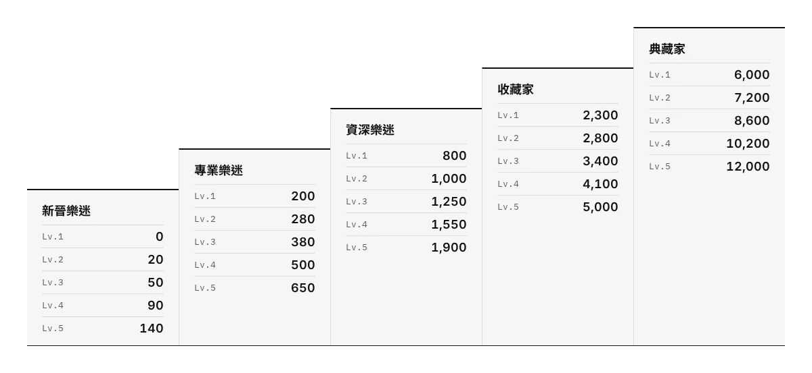
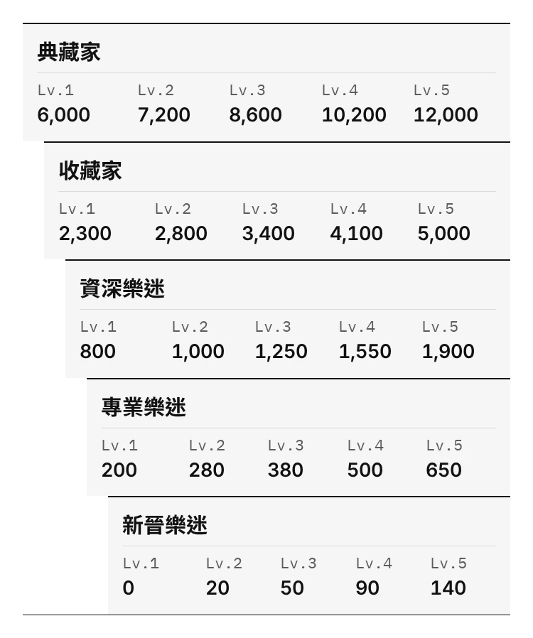
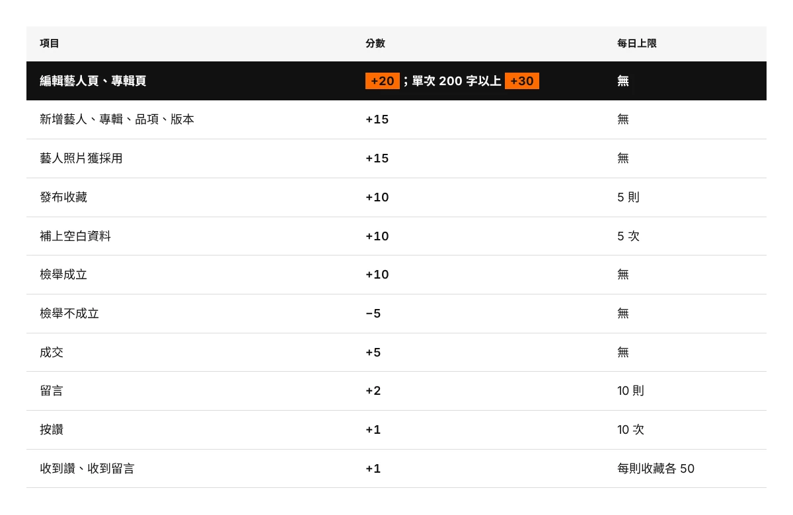
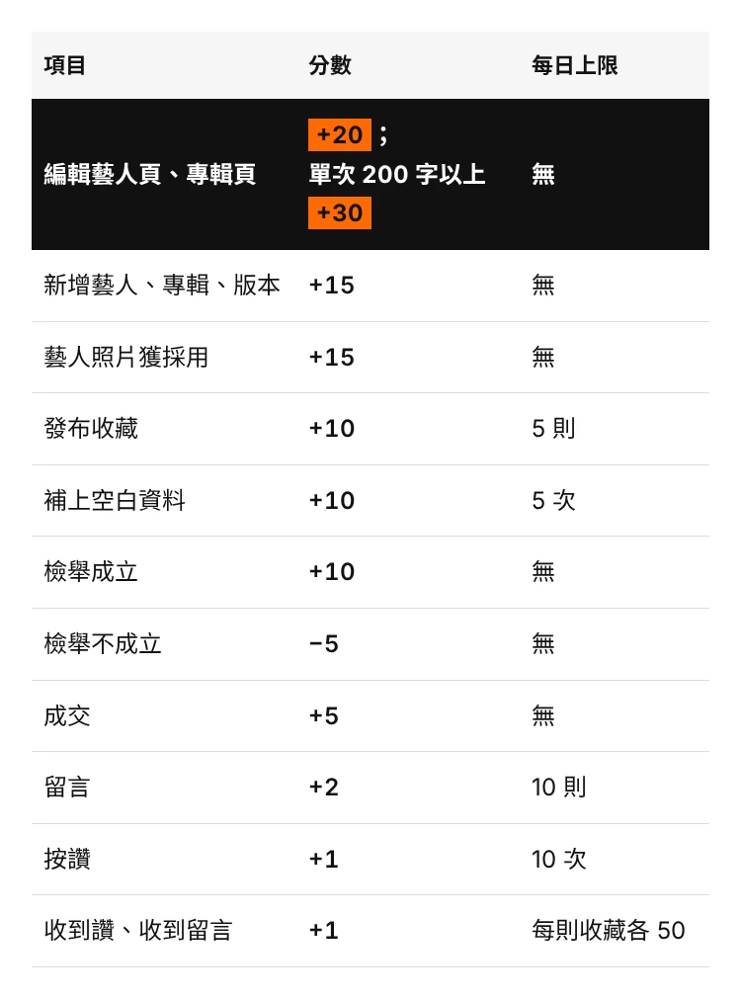
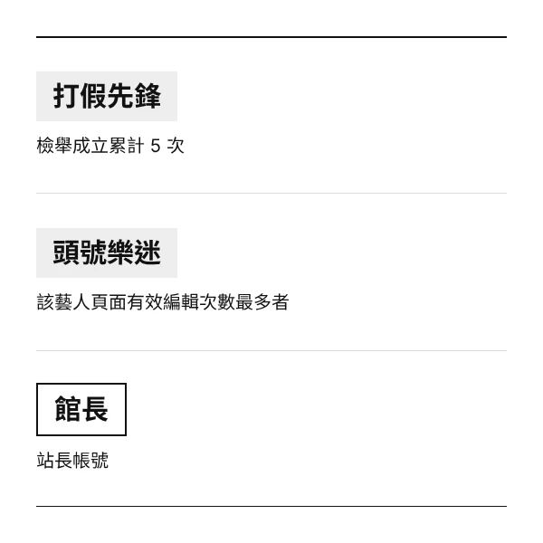
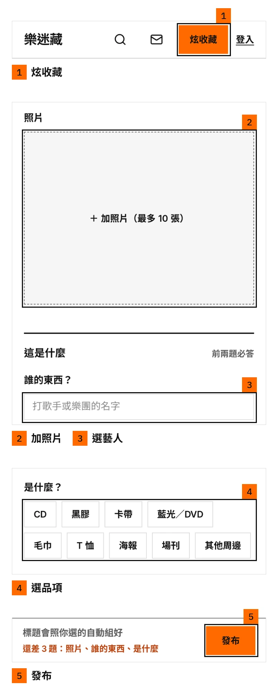
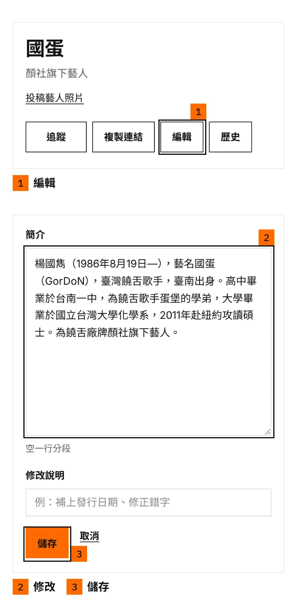
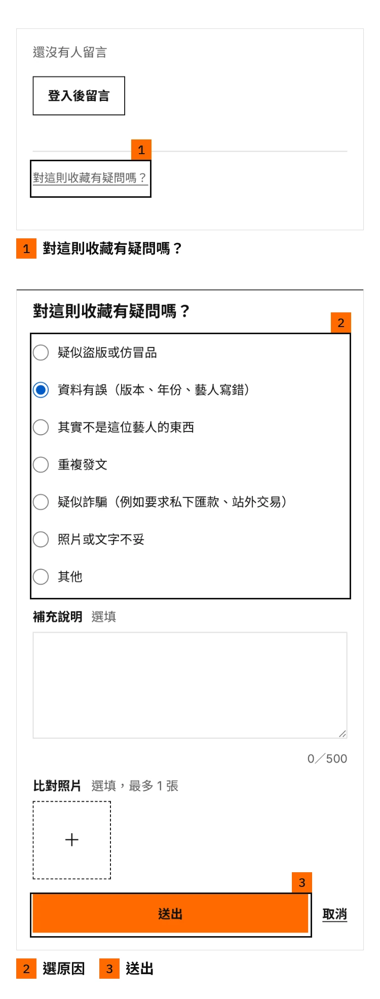

# 新手指南配圖（2026-09-29）

文字與數字照 `../文案草稿_v2.md`，視覺照 `網站/DESIGN.md`（黑白橘、直角、零陰影、零漸層，字型 Inter／Noto Sans TC／IBM Plex Mono）。圖上沒有標題、提示句或口號，只有規則、數字與介面動作名稱。設計初稿，最後由站長確認。

## 檔案

每張圖四個檔：`名稱.webp`、`名稱.png`（1x）與 `名稱@2x.webp`、`名稱@2x.png`（2x）。網頁用 WebP，`srcset` 帶 2x。

| 圖 | 1x 尺寸 | 2x 尺寸 | 用途 |
|---|---|---|---|
| `等級階梯_桌機` | 1200×553 | 2400×1106 | 等級階梯，桌機 |
| `等級階梯_手機` | 750×898 | 1500×1796 | 等級階梯，手機（直式，一階一列） |
| `得分方式_桌機` | 1200×780 | 2400×1560 | 得分方式，桌機 |
| `得分方式_手機` | 750×1012 | 1500×2024 | 得分方式，手機 |
| `特別稱號` | 600×600 | 1200×1200 | 特別稱號（方形） |
| `操作示意_發布收藏` | 750×1876 | 1500×3752 | 操作示意：發布收藏 |
| `操作示意_編輯藝人頁` | 750×1539 | 1500×3078 | 操作示意：編輯藝人頁 |
| `操作示意_回報` | 750×1970 | 1500×3940 | 操作示意：回報 |

## 預覽

### 等級階梯，桌機



### 等級階梯，手機（直式，一階一列）



### 得分方式，桌機



### 得分方式，手機



### 特別稱號（方形）



### 操作示意：發布收藏



### 操作示意：編輯藝人頁



### 操作示意：回報



## 設計決策

- **等級階梯**：五個稱號由左下往右上排成階梯（手機版由下往上、越上面越寬），每階列 Lv.1～5 的門檻。全部黑白灰，橘色 0%
- **得分方式**：三欄表格（項目、分數、每日上限），表頭 `--surface` 底、底線 1px 黑，列線 1px `--line`，與站上表格同規則。「編輯藝人頁、專輯頁」整列黑底白字，+20、+30 兩個分數用橘底黑字膠囊（同價格膠囊語彙）。手機版在「；」後換行，文字本身沒動
- **特別稱號**：打假先鋒、頭號樂迷沿用站上 `.title-chip`（`--surface2` 底、粗字），館長沿用 `.lv-tag` 的框線樣式加粗成 2px。條件句逐字取自文案，館長一行取「站長帳號」
- **操作示意**：手機 390 寬的實際畫面，以 4 倍解析度截圖後裁切。框線 3px 黑（橘色按鈕外面也看得清楚），編號是橘底黑字方塊（同主按鈕語彙），圖下只寫編號＋動作名稱
- 橘色面積（像素實量，含截圖裡站上本身的橘色按鈕）：等級階梯 0%、特別稱號 0%、得分方式 0.23～0.45%、操作示意 1.4～3.4%，都在 5% 以下

## 截圖來源

| 圖 | 畫面 | 來源 |
|---|---|---|
| 發布收藏 1 | 首頁導覽列（訪客） | 正式站 `/` |
| 發布收藏 2～5 | 炫收藏表單 | 本機，測試帳號 `r01@demo.yinzang.test`（路人01） |
| 編輯藝人頁 1 | 國蛋藝人頁（訪客） | 正式站 `/artist/gordon` |
| 編輯藝人頁 2～3 | 簡介編輯 | 本機，同一測試帳號，`/artist/gordon?edit=1#intro` |
| 回報 1 | 單則頁底部（訪客） | 正式站 `/share/3` |
| 回報 2～3 | 回報對話框（選了「資料有誤」，未送出） | 本機，同一測試帳號 |

本機畫面：截圖當下 8791 的本機伺服器是另一邊正在改的版本、靜態資產 404，所以用 `git archive HEAD`（commit `a9789c7`）在暫存區另建一份、複製本機 D1 狀態，起在 8793 截圖，截完已關閉。沒有改 `網站/` 任何檔案，也沒有對任何站送出表單。發布表單的「最近常發的」藝人清單在本機是測試資料，已裁在畫面外。

## 驗收

### 文字溢出與截斷（Playwright）

每張圖用 Range `getClientRects()` 逐一量每個文字節點：是否超出畫布、是否超出所屬元素，以及 `overflow` 非 visible 的元素是否 `scrollWidth／scrollHeight` 大於可視範圍。字型實際載入的是 Inter、Noto Sans TC、IBM Plex Mono，畫布第一順位 font-family 是 Inter。

| 圖 | 文字節點 | 溢出／截斷 |
|---|---|---|
| `等級階梯_桌機` | 55 | 0 |
| `等級階梯_手機` | 55 | 0 |
| `得分方式_桌機` | 38 | 0 |
| `得分方式_手機` | 39 | 0 |
| `特別稱號` | 6 | 0 |
| `操作示意_發布收藏` | 15 | 0 |
| `操作示意_編輯藝人頁` | 9 | 0 |
| `操作示意_回報` | 9 | 0 |

另外每張都用眼睛看過一次 1x 圖：沒有孤字行、編號沒蓋到欄位標題或按鈕。

### 數字核對（121 項，相符 121，不符 0）

做法：`_src/verify.py` 直接讀 `文案草稿_v2.md` 的兩張表，再從每張圖渲染後的 DOM 取字逐格比對（不是拿產生器的資料比）。等級 25 個門檻 × 桌機、手機兩版＝50 項；得分 11 列 × 3 欄 × 兩版＝66 項，外加兩版各確認醒目列是「編輯藝人頁、專輯頁」；特別稱號 3 項。

| 圖 | 檔案 | 項目 | 文案 | 圖上 | 結果 |
|---|---|---|---|---|---|
| 等級階梯 | 等級階梯_桌機 | 新晉樂迷 Lv.1 | 0 | 0 | 相符 |
| 等級階梯 | 等級階梯_桌機 | 新晉樂迷 Lv.2 | 20 | 20 | 相符 |
| 等級階梯 | 等級階梯_桌機 | 新晉樂迷 Lv.3 | 50 | 50 | 相符 |
| 等級階梯 | 等級階梯_桌機 | 新晉樂迷 Lv.4 | 90 | 90 | 相符 |
| 等級階梯 | 等級階梯_桌機 | 新晉樂迷 Lv.5 | 140 | 140 | 相符 |
| 等級階梯 | 等級階梯_桌機 | 專業樂迷 Lv.1 | 200 | 200 | 相符 |
| 等級階梯 | 等級階梯_桌機 | 專業樂迷 Lv.2 | 280 | 280 | 相符 |
| 等級階梯 | 等級階梯_桌機 | 專業樂迷 Lv.3 | 380 | 380 | 相符 |
| 等級階梯 | 等級階梯_桌機 | 專業樂迷 Lv.4 | 500 | 500 | 相符 |
| 等級階梯 | 等級階梯_桌機 | 專業樂迷 Lv.5 | 650 | 650 | 相符 |
| 等級階梯 | 等級階梯_桌機 | 資深樂迷 Lv.1 | 800 | 800 | 相符 |
| 等級階梯 | 等級階梯_桌機 | 資深樂迷 Lv.2 | 1,000 | 1,000 | 相符 |
| 等級階梯 | 等級階梯_桌機 | 資深樂迷 Lv.3 | 1,250 | 1,250 | 相符 |
| 等級階梯 | 等級階梯_桌機 | 資深樂迷 Lv.4 | 1,550 | 1,550 | 相符 |
| 等級階梯 | 等級階梯_桌機 | 資深樂迷 Lv.5 | 1,900 | 1,900 | 相符 |
| 等級階梯 | 等級階梯_桌機 | 收藏家 Lv.1 | 2,300 | 2,300 | 相符 |
| 等級階梯 | 等級階梯_桌機 | 收藏家 Lv.2 | 2,800 | 2,800 | 相符 |
| 等級階梯 | 等級階梯_桌機 | 收藏家 Lv.3 | 3,400 | 3,400 | 相符 |
| 等級階梯 | 等級階梯_桌機 | 收藏家 Lv.4 | 4,100 | 4,100 | 相符 |
| 等級階梯 | 等級階梯_桌機 | 收藏家 Lv.5 | 5,000 | 5,000 | 相符 |
| 等級階梯 | 等級階梯_桌機 | 典藏家 Lv.1 | 6,000 | 6,000 | 相符 |
| 等級階梯 | 等級階梯_桌機 | 典藏家 Lv.2 | 7,200 | 7,200 | 相符 |
| 等級階梯 | 等級階梯_桌機 | 典藏家 Lv.3 | 8,600 | 8,600 | 相符 |
| 等級階梯 | 等級階梯_桌機 | 典藏家 Lv.4 | 10,200 | 10,200 | 相符 |
| 等級階梯 | 等級階梯_桌機 | 典藏家 Lv.5 | 12,000 | 12,000 | 相符 |
| 等級階梯 | 等級階梯_手機 | 新晉樂迷 Lv.1 | 0 | 0 | 相符 |
| 等級階梯 | 等級階梯_手機 | 新晉樂迷 Lv.2 | 20 | 20 | 相符 |
| 等級階梯 | 等級階梯_手機 | 新晉樂迷 Lv.3 | 50 | 50 | 相符 |
| 等級階梯 | 等級階梯_手機 | 新晉樂迷 Lv.4 | 90 | 90 | 相符 |
| 等級階梯 | 等級階梯_手機 | 新晉樂迷 Lv.5 | 140 | 140 | 相符 |
| 等級階梯 | 等級階梯_手機 | 專業樂迷 Lv.1 | 200 | 200 | 相符 |
| 等級階梯 | 等級階梯_手機 | 專業樂迷 Lv.2 | 280 | 280 | 相符 |
| 等級階梯 | 等級階梯_手機 | 專業樂迷 Lv.3 | 380 | 380 | 相符 |
| 等級階梯 | 等級階梯_手機 | 專業樂迷 Lv.4 | 500 | 500 | 相符 |
| 等級階梯 | 等級階梯_手機 | 專業樂迷 Lv.5 | 650 | 650 | 相符 |
| 等級階梯 | 等級階梯_手機 | 資深樂迷 Lv.1 | 800 | 800 | 相符 |
| 等級階梯 | 等級階梯_手機 | 資深樂迷 Lv.2 | 1,000 | 1,000 | 相符 |
| 等級階梯 | 等級階梯_手機 | 資深樂迷 Lv.3 | 1,250 | 1,250 | 相符 |
| 等級階梯 | 等級階梯_手機 | 資深樂迷 Lv.4 | 1,550 | 1,550 | 相符 |
| 等級階梯 | 等級階梯_手機 | 資深樂迷 Lv.5 | 1,900 | 1,900 | 相符 |
| 等級階梯 | 等級階梯_手機 | 收藏家 Lv.1 | 2,300 | 2,300 | 相符 |
| 等級階梯 | 等級階梯_手機 | 收藏家 Lv.2 | 2,800 | 2,800 | 相符 |
| 等級階梯 | 等級階梯_手機 | 收藏家 Lv.3 | 3,400 | 3,400 | 相符 |
| 等級階梯 | 等級階梯_手機 | 收藏家 Lv.4 | 4,100 | 4,100 | 相符 |
| 等級階梯 | 等級階梯_手機 | 收藏家 Lv.5 | 5,000 | 5,000 | 相符 |
| 等級階梯 | 等級階梯_手機 | 典藏家 Lv.1 | 6,000 | 6,000 | 相符 |
| 等級階梯 | 等級階梯_手機 | 典藏家 Lv.2 | 7,200 | 7,200 | 相符 |
| 等級階梯 | 等級階梯_手機 | 典藏家 Lv.3 | 8,600 | 8,600 | 相符 |
| 等級階梯 | 等級階梯_手機 | 典藏家 Lv.4 | 10,200 | 10,200 | 相符 |
| 等級階梯 | 等級階梯_手機 | 典藏家 Lv.5 | 12,000 | 12,000 | 相符 |
| 得分方式 | 得分方式_桌機 | 第1列 項目 | 編輯藝人頁、專輯頁 | 編輯藝人頁、專輯頁 | 相符 |
| 得分方式 | 得分方式_桌機 | 第1列 分數 | +20；單次 200 字以上 +30 | +20；單次 200 字以上 +30 | 相符 |
| 得分方式 | 得分方式_桌機 | 第1列 每日上限 | 無 | 無 | 相符 |
| 得分方式 | 得分方式_桌機 | 第2列 項目 | 新增藝人、專輯、版本 | 新增藝人、專輯、版本 | 相符 |
| 得分方式 | 得分方式_桌機 | 第2列 分數 | +15 | +15 | 相符 |
| 得分方式 | 得分方式_桌機 | 第2列 每日上限 | 無 | 無 | 相符 |
| 得分方式 | 得分方式_桌機 | 第3列 項目 | 藝人照片獲採用 | 藝人照片獲採用 | 相符 |
| 得分方式 | 得分方式_桌機 | 第3列 分數 | +15 | +15 | 相符 |
| 得分方式 | 得分方式_桌機 | 第3列 每日上限 | 無 | 無 | 相符 |
| 得分方式 | 得分方式_桌機 | 第4列 項目 | 發布收藏 | 發布收藏 | 相符 |
| 得分方式 | 得分方式_桌機 | 第4列 分數 | +10 | +10 | 相符 |
| 得分方式 | 得分方式_桌機 | 第4列 每日上限 | 5 則 | 5 則 | 相符 |
| 得分方式 | 得分方式_桌機 | 第5列 項目 | 補上空白資料 | 補上空白資料 | 相符 |
| 得分方式 | 得分方式_桌機 | 第5列 分數 | +10 | +10 | 相符 |
| 得分方式 | 得分方式_桌機 | 第5列 每日上限 | 5 次 | 5 次 | 相符 |
| 得分方式 | 得分方式_桌機 | 第6列 項目 | 檢舉成立 | 檢舉成立 | 相符 |
| 得分方式 | 得分方式_桌機 | 第6列 分數 | +10 | +10 | 相符 |
| 得分方式 | 得分方式_桌機 | 第6列 每日上限 | 無 | 無 | 相符 |
| 得分方式 | 得分方式_桌機 | 第7列 項目 | 檢舉不成立 | 檢舉不成立 | 相符 |
| 得分方式 | 得分方式_桌機 | 第7列 分數 | −5 | −5 | 相符 |
| 得分方式 | 得分方式_桌機 | 第7列 每日上限 | 無 | 無 | 相符 |
| 得分方式 | 得分方式_桌機 | 第8列 項目 | 成交 | 成交 | 相符 |
| 得分方式 | 得分方式_桌機 | 第8列 分數 | +5 | +5 | 相符 |
| 得分方式 | 得分方式_桌機 | 第8列 每日上限 | 無 | 無 | 相符 |
| 得分方式 | 得分方式_桌機 | 第9列 項目 | 留言 | 留言 | 相符 |
| 得分方式 | 得分方式_桌機 | 第9列 分數 | +2 | +2 | 相符 |
| 得分方式 | 得分方式_桌機 | 第9列 每日上限 | 10 則 | 10 則 | 相符 |
| 得分方式 | 得分方式_桌機 | 第10列 項目 | 按讚 | 按讚 | 相符 |
| 得分方式 | 得分方式_桌機 | 第10列 分數 | +1 | +1 | 相符 |
| 得分方式 | 得分方式_桌機 | 第10列 每日上限 | 10 次 | 10 次 | 相符 |
| 得分方式 | 得分方式_桌機 | 第11列 項目 | 收到讚、收到留言 | 收到讚、收到留言 | 相符 |
| 得分方式 | 得分方式_桌機 | 第11列 分數 | +1 | +1 | 相符 |
| 得分方式 | 得分方式_桌機 | 第11列 每日上限 | 每則收藏各 50 | 每則收藏各 50 | 相符 |
| 得分方式 | 得分方式_桌機 | 醒目列 | 編輯藝人頁、專輯頁 | 編輯藝人頁、專輯頁 | 相符 |
| 得分方式 | 得分方式_手機 | 第1列 項目 | 編輯藝人頁、專輯頁 | 編輯藝人頁、專輯頁 | 相符 |
| 得分方式 | 得分方式_手機 | 第1列 分數 | +20；單次 200 字以上 +30 | +20；單次 200 字以上 +30 | 相符 |
| 得分方式 | 得分方式_手機 | 第1列 每日上限 | 無 | 無 | 相符 |
| 得分方式 | 得分方式_手機 | 第2列 項目 | 新增藝人、專輯、版本 | 新增藝人、專輯、版本 | 相符 |
| 得分方式 | 得分方式_手機 | 第2列 分數 | +15 | +15 | 相符 |
| 得分方式 | 得分方式_手機 | 第2列 每日上限 | 無 | 無 | 相符 |
| 得分方式 | 得分方式_手機 | 第3列 項目 | 藝人照片獲採用 | 藝人照片獲採用 | 相符 |
| 得分方式 | 得分方式_手機 | 第3列 分數 | +15 | +15 | 相符 |
| 得分方式 | 得分方式_手機 | 第3列 每日上限 | 無 | 無 | 相符 |
| 得分方式 | 得分方式_手機 | 第4列 項目 | 發布收藏 | 發布收藏 | 相符 |
| 得分方式 | 得分方式_手機 | 第4列 分數 | +10 | +10 | 相符 |
| 得分方式 | 得分方式_手機 | 第4列 每日上限 | 5 則 | 5 則 | 相符 |
| 得分方式 | 得分方式_手機 | 第5列 項目 | 補上空白資料 | 補上空白資料 | 相符 |
| 得分方式 | 得分方式_手機 | 第5列 分數 | +10 | +10 | 相符 |
| 得分方式 | 得分方式_手機 | 第5列 每日上限 | 5 次 | 5 次 | 相符 |
| 得分方式 | 得分方式_手機 | 第6列 項目 | 檢舉成立 | 檢舉成立 | 相符 |
| 得分方式 | 得分方式_手機 | 第6列 分數 | +10 | +10 | 相符 |
| 得分方式 | 得分方式_手機 | 第6列 每日上限 | 無 | 無 | 相符 |
| 得分方式 | 得分方式_手機 | 第7列 項目 | 檢舉不成立 | 檢舉不成立 | 相符 |
| 得分方式 | 得分方式_手機 | 第7列 分數 | −5 | −5 | 相符 |
| 得分方式 | 得分方式_手機 | 第7列 每日上限 | 無 | 無 | 相符 |
| 得分方式 | 得分方式_手機 | 第8列 項目 | 成交 | 成交 | 相符 |
| 得分方式 | 得分方式_手機 | 第8列 分數 | +5 | +5 | 相符 |
| 得分方式 | 得分方式_手機 | 第8列 每日上限 | 無 | 無 | 相符 |
| 得分方式 | 得分方式_手機 | 第9列 項目 | 留言 | 留言 | 相符 |
| 得分方式 | 得分方式_手機 | 第9列 分數 | +2 | +2 | 相符 |
| 得分方式 | 得分方式_手機 | 第9列 每日上限 | 10 則 | 10 則 | 相符 |
| 得分方式 | 得分方式_手機 | 第10列 項目 | 按讚 | 按讚 | 相符 |
| 得分方式 | 得分方式_手機 | 第10列 分數 | +1 | +1 | 相符 |
| 得分方式 | 得分方式_手機 | 第10列 每日上限 | 10 次 | 10 次 | 相符 |
| 得分方式 | 得分方式_手機 | 第11列 項目 | 收到讚、收到留言 | 收到讚、收到留言 | 相符 |
| 得分方式 | 得分方式_手機 | 第11列 分數 | +1 | +1 | 相符 |
| 得分方式 | 得分方式_手機 | 第11列 每日上限 | 每則收藏各 50 | 每則收藏各 50 | 相符 |
| 得分方式 | 得分方式_手機 | 醒目列 | 編輯藝人頁、專輯頁 | 編輯藝人頁、專輯頁 | 相符 |
| 特別稱號 | 特別稱號 | 打假先鋒 | 檢舉成立累計 5 次 | 檢舉成立累計 5 次 | 相符 |
| 特別稱號 | 特別稱號 | 頭號樂迷 | 該藝人頁面有效編輯次數最多者 | 該藝人頁面有效編輯次數最多者 | 相符 |
| 特別稱號 | 特別稱號 | 館長 | 站長帳號顯示「館長」 | 站長帳號 | 相符 |

## 重跑

```
cd _src
python3 render.py            # 全部重出 1x／2x PNG、WebP，並量溢出
python3 verify.py            # 數字核對
python3 capture.py <本機網址> && python3 compose.py && python3 render.py 操作示意_發布收藏 操作示意_編輯藝人頁 操作示意_回報
```

`_src/` 內：`base.css`（網站代幣）、各圖 HTML、`shots/`（4x 截圖與框線座標 `shots.json`）、`render_report.json`、`verify_result.json`。
