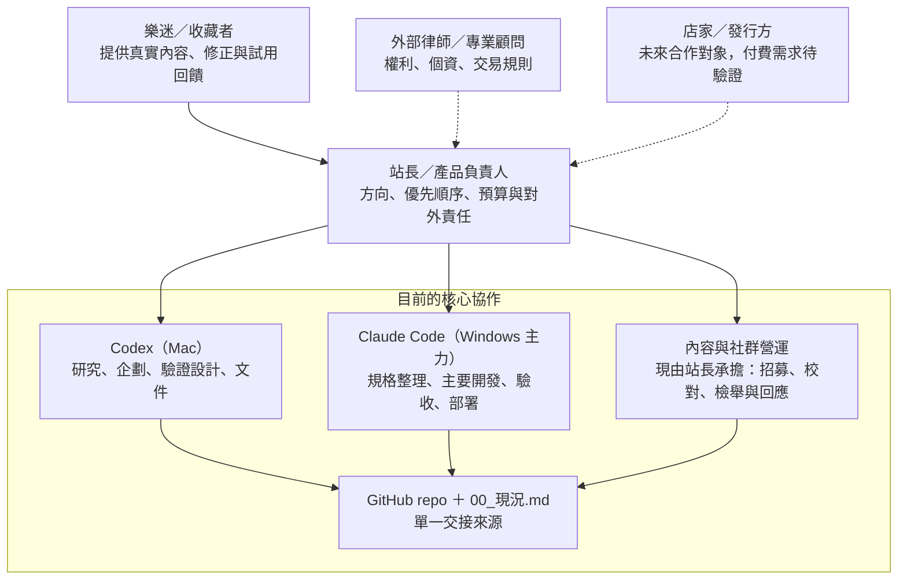
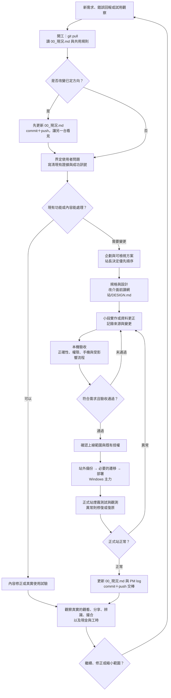

# 樂迷藏：組織架構與開發流程圖

**日期**：2026-09-30

**定位**：現階段的實際協作圖與下一段工作流程。這不是已成立公司的員工編制，也不是對外合作或新功能的授權。依據為 [產品與商業模式執行版補篇](./20260930_樂迷藏產品與商業模式執行版補篇.md)、[共用現況](../00_現況.md)及專案協作規則。

## 一、現階段組織架構

**讀圖方式**：站長保有產品和對外決策責任；Codex 與 Claude Code 是支援工作的 AI，不是員工，也不自行承諾資料真偽、收費或合作。樂迷、律師、店家與發行方不是目前的內部部門。兩台電腦靠 GitHub 和 00_現況.md 交接，一次只由一邊寫同一份工作。

### 現在誰負責什麼

| 工作 | 決定者／負責者 | 支援與交付 |
|---|---|---|
| 產品方向、品牌、收入順序、預算、對外承諾 | 站長 | Codex 整理選項與證據；Claude Code 補技術與行銷視角；定案寫入 00_現況.md |
| 訪談、試用、商業假設與企劃修訂 | 站長決定範圍並接觸對象 | Codex 設計任務、整理觀察與文件；真實受訪者提供回饋 |
| 介面、資料結構、程式、技術驗收 | 站長決定優先序 | Windows Claude Code 為現階段主要施工端；Codex 可複核企劃與風險 |
| 正式站部署、備份、事故處理 | 站長對結果負責，依已授權範圍執行 | Windows Claude Code 依部署流程執行並記錄結果 |
| 資料來源、內容審核、檢舉申訴、社群招募 | 站長營運 | AI 協助整理；收藏者提供實物與來源；涉及專業判斷時找外部協力 |
| 法律與正式權利意見 | 站長委任專業人士 | 外部律師／顧問；AI 整理待確認事項，不能取代專業意見 |

### 需要擴編時，先看工作量

| 可能補的職能 | 何時再考慮 | 目前由誰承擔 |
|---|---|---|
| 資料編輯／版本校對 | 待確認與爭議案件多到站長無法按時處理，且有穩定內容來源 | 站長＋願意提供證據的收藏者 |
| 社群與客服 | 真實會員回報、檢舉或交易詢問形成固定工作量 | 站長 |
| 工程與維運 | 部署、資料品質、資安或事故處理超過現有協作能力 | 站長決策，Claude Code 主要施工 |
| 店家與發行方合作 | 真有可交付服務、對方願意合作或付費 | 站長 |

這是**職能缺口圖**，不是現在要聘人或開立部門的計畫。

## 二、從需求到上線的開發流程

**流程重點**：

1. 先問現有網站和內容能否解決問題；目前優先取得真實使用證據，不把新增功能當成每個問題的預設解法。
2. 使用者改方向時，先同步 00_現況.md 再規劃，避免 Mac 和 Windows 按相反前提工作。每段工作開工先 pull、收工 commit＋push。
3. 網站已在 Cloudflare 測試期運作；圖中的上線是**修改既有正式站**。有資料變更時先備份、檢查遷移；部署後做正式站驗收及觀測。具體指令以現行部署腳本與最近的驗收紀錄為準，舊手冊中的「尚未首次部署」屬歷史狀態。
4. 結果正常不等於產品假設成立。最後仍要看樂迷是否看、分享、辨識成功，撮合是否有效，以及站長是否有能力處理營運工作。

## 三、下一段最小工作包

| 順序 | 工作 | 產出 | 進入下一步的判斷 |
|---|---|---|---|
| 1 | 記現況基線：真實分享／實物佐證、可見頁面、有效聯絡、現金支出與站長工時 | 一份可重複更新的基線表 | 能區分測試資料、匯入資料與會員真實貢獻 |
| 2 | 邀 5–8 位不同角色樂迷，用真實物件完成觀看、分享、辨識；有真實買賣意願者再觀察撮合 | 觀察紀錄與阻礙排序 | 看出哪些任務能獨立完成、哪些仍靠站長代做 |
| 3 | 對照首頁、資料可信度與發布負擔，排一批最小修正 | 問題、證據、修正範圍與驗收條件 | 站長確認優先順序，再進入開發流程 |
| 4 | 一週及四週回訪，連同現金／工時看是否值得擴大 | 保留、修正、縮小或延後商業化的決策紀錄 | 不以功能數或匯入條目數取代使用證據 |

本圖沒有替使用者決定 9/30 交接中的四項待辦、首頁版位、收費價格或是否解除 noindex。
