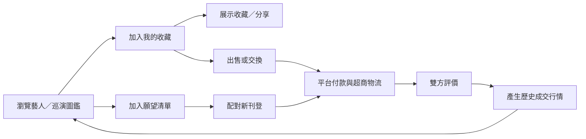
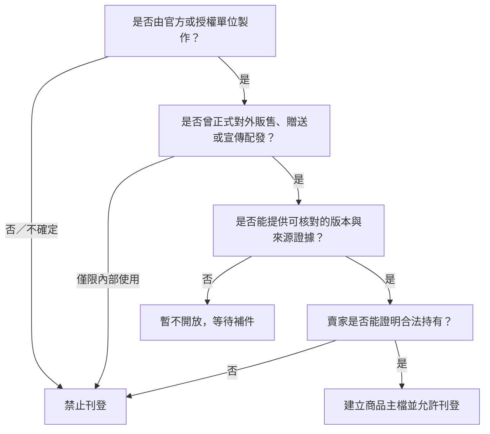
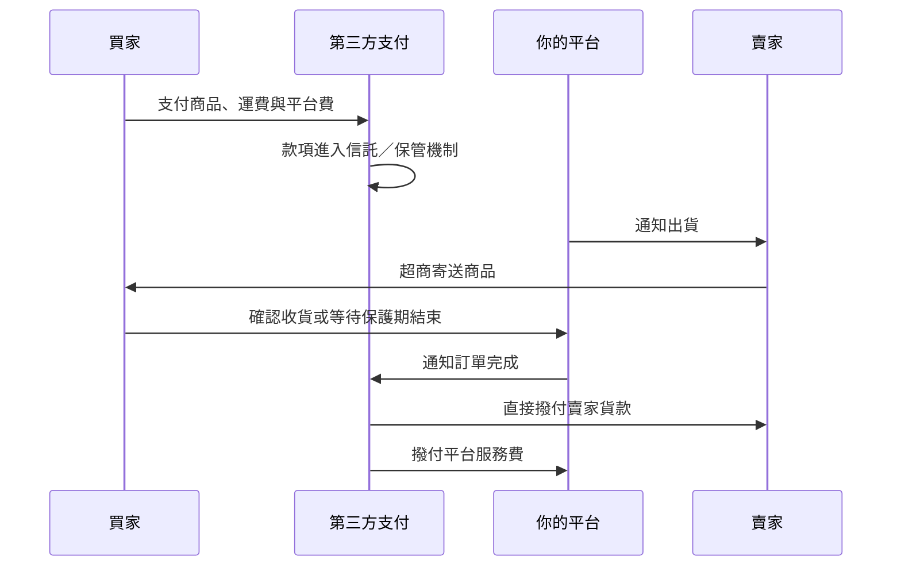
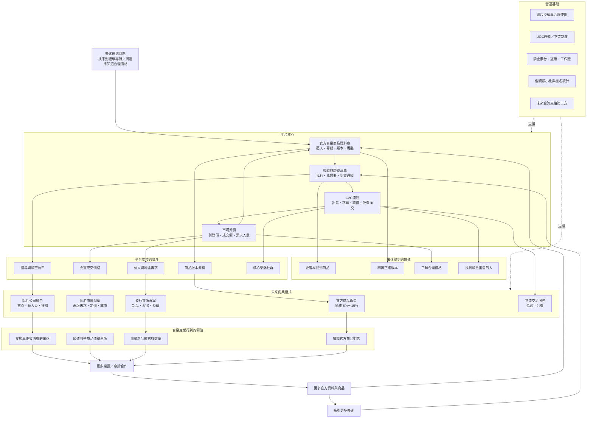
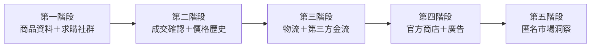

# 平台概念與可行性討論

| 欄位 | 值 |
|---|---|
| 來源 | Codex app (Mac) |
| 模型 | gpt-5.6-sol |
| thread_id | `01a0b3d2-1b1b-7e62-88c7-276fb7d690ba` |
| 時間 | 2026-09-18 17:21 ～ 2026-09-20 01:07 |
| 匯出 | 2026-09-20 11:04 by Claude Code (Mac) |

> 這是 Codex 對話的完整存檔。任何裝置的 AI 讀這份就能接續討論。
> 推理過程(reasoning)已略去，保留提問與結論。

---

## 👤 我

我想要討論項目的話 我在windows登入也看得到對話紀錄嗎

### 🤖 Codex

我會查一下 Codex 官方使用說明，確認 Windows 登入後的對話同步範圍，以及哪些本機項目內容不會跟著同步。

`$ /bin/zsh -lc "sed -n '1,240p' /Users/zukachen/.codex/skills/.system/openai-docs/SKILL.md"`

`🔍 搜尋：site:developers.openai.com Codex app conversation history sync devices Windows ...`

`🔍 搜尋：`

`🔍 搜尋：site:developers.openai.com "session history" "another computer" Codex ...`

### 🤖 Codex

要看你用哪種對話：

- **一般 ChatGPT／ChatGPT 專案對話**：登入同一個帳號與工作區，通常可以在 Windows 看到。
- **像目前這種連到 Mac 本機資料夾的 Codex 對話**：**單純在 Windows 登入不一定會自動出現**，因為對話、專案檔案與執行環境跟 Mac 主機有關。

若要在 Windows 繼續目前這類對話，可在兩台電腦的 **設定 → 連線** 中啟用「控制其他裝置」，使用同一帳號連接 Mac；Mac 需要保持開機、上線並執行 ChatGPT App。也可以用「移交」把對話及 Git 狀態轉到 Windows，但兩邊需有相同的 Git 專案。[官方遠端連線說明](https://developers.openai.com/docs/remote-connections)

另外，**對話能看到不代表 Mac 裡的專案檔案會同步到 Windows**；程式碼最好另外用 GitHub、GitLab 或雲端硬碟同步。[官方專案與對話說明](https://developers.openai.com/docs/projects)

## 👤 我

但現在這個不是專案對話嗎？ 還是這個是mac專屬？

### 🤖 Codex

我會按目前這個對話的實際類型，對照官方對「無專案聊天」和「本機專案」的定義來說明。

`🔍 搜尋：site:developers.openai.com/docs/projects "Start a chat without a project" Codex local project`

`🔍 搜尋：https://developers.openai.com/docs/projects`

`🔍 搜尋：https://developers.openai.com/es-419/docs/projects?surface=web`

### 🤖 Codex

對，**現在這個是「無專案的 Codex 對話」**，不是你建立的正式專案。

它雖然有一個 Mac 上自動產生的工作資料夾，但那只是這次對話的本機工作空間。因此：

- 對話會顯示成一個「任務／聊天」，但不隸屬於任何專案。
- 執行環境和工作檔案目前位於這台 Mac。
- 在 Windows 登入同一帳號，**不保證會直接看到或能繼續這個本機對話**。
- 若啟用「控制其他裝置／遠端連線」，Windows 才能透過仍在線的 Mac 開啟並繼續它。

如果你希望長期在 Mac、Windows 之間討論同一主題，建議建立一個 **ChatGPT 專案**；如果還需要共同修改程式或文件，再把檔案放到 GitHub／雲端儲存。官方也把「專案」和「不隸屬專案的獨立聊天」分成兩種形式。[官方專案與聊天說明](https://developers.openai.com/es-419/docs/projects?surface=web)

## 👤 我

可是我想要用codex耶

### 🤖 Codex

可以，重點不是改用一般 ChatGPT，而是替 Codex 選對跨裝置方式。我再確認一下官方對 Codex「本機專案、遠端控制、移交」的目前支援。

`🔍 搜尋：site:developers.openai.com "Transfer a chat between hosts" Codex Windows Mac ...`

`🔍 搜尋：https://developers.openai.com/es-419/docs/remote-connections`

### 🤖 Codex

可以繼續用 **Codex**。剛才容易混淆的地方是：

- **Codex**：你使用的工作模式／代理。
- **專案**：用來整理對話及連接資料夾的容器。
- **Mac 或 Windows**：Codex 實際執行的位置。

所以「使用 Codex」不代表對話一定會自動跨裝置同步。目前這個確實是 **Codex 對話**，但它執行在 Mac，而且未隸屬正式專案。

你有兩種實用方式：

1. **Windows 遠端操作 Mac 上的 Codex**  
   Mac 保持開機與上線，兩台電腦登入同一帳號，在「設定 → 連線」啟用控制其他裝置。這樣 Windows 可以繼續現在這段對話，工作仍由 Mac 執行。

2. **把 Codex 對話移交到 Windows**  
   Mac 與 Windows 都設定好同一個 Git 專案後，使用「移交／Hand off」，對話和 Git 狀態會搬到 Windows，之後由 Windows 執行。

因此，如果你的目標是「兩台電腦看到並延續同一個 Codex 對話」，最合適的是 **遠端連線或移交**，不是改用一般 ChatGPT。[Codex 官方遠端連線與移交說明](https://developers.openai.com/es-419/docs/remote-connections)

## 👤 我

真是麻煩的感覺 晚點再想辦法 我現在想要討論一個問題

### 🤖 Codex

好，先不管跨裝置。你想討論什麼問題？直接說，我們一起拆解。

## 👤 我

台灣有人做過一個app 裡面專門是樂團 獨立歌手 專輯 周邊 等販售的平台嗎？ 比如像卡拍拍這種app 然後運營的就收取中間的%數費用之類的

### 🤖 Codex

我先幫你做一輪台灣市場掃描，會分成「真的做過同類平台」、「目前仍在營運」、「只做到售票／募資／一般電商」三類，避免把看似相近但商業模式不同的服務混在一起。

`🔍 搜尋：台灣 獨立樂團 音樂人 周邊 專輯 販售 平台 App ...`

`🔍 搜尋：site:merch.streetvoice.com 我是音樂人 如何販售 商品 合作 抽成 ...`

`🔍 搜尋：iNDIEVOX 台灣 獨立音樂 平台 專輯 販售 停止 ...`

### 🤖 Codex

有，而且最接近你描述的至少有兩個；但「像卡拍拍一樣、讓大量獨立音樂人自行開店上架的 marketplace App」目前在台灣看起來**還沒有一個非常成熟、佔據市場的代表產品**。

最接近的是：

- **StreetVoice Merch**：販售獨立樂團、歌手的專輯、黑膠、服飾和周邊。StreetVoice 會協助金流、倉儲、出貨與客服，2023 年正式推出周邊販售服務。目前看起來偏向「認證音樂人＋洽談合作」，不是任何樂團註冊後就能立即開店的蝦皮式市場。[StreetVoice Merch](https://merch.streetvoice.com/)／[音樂人合作說明](https://guide.streetvoice.com/tip-merchandise/)

- **Fantimate 音樂人電商**：非常接近你的構想，販售鄭宜農、拍謝少年、A_Root、音樂祭等專輯與周邊，並提供電商、行銷、會員俱樂部、商品企劃等服務。不過它更像「經營粉絲經濟的服務公司＋選品電商」，而非完全開放、自助式平台。[Fantimate 商店](https://shop.fantimate.com/)／[官方服務介紹](https://fantimate.com/about)

其他相近案例：

- **iNDIEVOX**：2008 年開始，曾經是台灣獨立音樂的數位下載、社群與售票平台；2018 年結束數位音樂商店，目前主要做售票。它證明台灣確實有人做過「獨立音樂垂直平台」，但當時不是以實體周邊 marketplace 為主。[iNDIEVOX 歷史](https://www.indievox.com/about)
- **微樂客 WillMusic**：有購物 App，賣專輯、黑膠與周邊，但主力是日韓、西洋進口商品，比較像音樂零售商，不是台灣獨立音樂人自行上架的平台。[App Store](https://apps.apple.com/tw/app/%E5%BE%AE%E6%A8%82%E5%AE%A2-willmusic/id1453667626)
- 小白兔唱片、元氣唱片、FIGHT30、滾石購物網也有販售音樂商品，但較像唱片行、品牌商店或代理通路。

有一個重要細節：我目前沒有查到 StreetVoice Merch 或 Fantimate 對音樂人公開統一的「成交抽成％」。它們可能依倉儲、製作、物流、行銷等合作內容個別報價。StreetVoice 公開的 **20%** 是「拍拍手贊助功能」的平台服務費，不能直接當成周邊商品抽成。[拍拍手條款](https://streetvoice.com/service/tos/clap/)

所以你的構想不是完全沒人做，而是市場現況比較像：

> 有音樂人電商與代營運服務，但缺少一個真正「開放上架、官方身分驗證、集中探索、固定成交抽成」的台灣獨立音樂 marketplace App。

這個空缺可能就是機會；真正的難點恐怕不在 App，而在音樂人招募、庫存與出貨、商品真偽、退換貨，以及平台能不能帶來足夠的新客，而不只是把音樂人原本的粉絲導到另一個賣場。

## 👤 我

我想要的是 C2C 兩邊都是樂迷收藏家

### 🤖 Codex

了解，你想做的不是「樂團官方賣周邊」，而是樂迷彼此交易二手／絕版／限量收藏品。我重新用這個 C2C 定義找台灣市場，重點會看是否有音樂專屬、雙邊交易、平台抽成與交易保障。

`🔍 搜尋：台灣 樂團 周邊 二手 交易 平台 C2C ...`

`🔍 搜尋：Discogs Taiwan marketplace sellers buyer Taiwan vinyl records ...`

## 👤 我

或者是國外有人做過類似的項目嗎

### 🤖 Codex

有，國外比較容易找到真正的對照組。我會分成「仍營運的音樂收藏 C2C」、「已關閉但值得研究的案例」，以及「只做某一收藏品類」來看。

`🔍 搜尋：music collectibles C2C marketplace app vinyl CDs band merchandise fans sell to fans ...`

`🔍 搜尋：site:support.discogs.com seller fee marketplace 2026 Discogs ...`

### 🤖 Codex

有，而且國外有幾個很值得當作你的對照組。你想的模式可以定義成：

> 音樂收藏品垂直 C2C Marketplace：樂迷彼此買賣／交換專輯、限定周邊、巡演商品、簽名品等，平台提供行情、金流、物流與交易保障，並抽成交手續費。

| 案例 | 品類與模式 | 收費／狀態 |
|---|---|---|
| **Discogs** | 全球最大的唱片收藏資料庫＋C2C 市場，主要是黑膠、CD、卡帶。每一個「版本」都有獨立資料頁、成交紀錄、收藏清單及願望清單 | 刊登免費，成交後對商品與運費收 **9%**。[官方費率](https://support.discogs.com/hc/en-us/articles/360007521674-What-Are-The-Fees-For-Selling-On-Discogs) |
| **The Honey Groove** | 黑膠收藏社群＋C2C 買賣與交換；同時提供藏品管理、估值、社群動態和交易保障 | 成交抽 **6%**，低價交易最低 US$1；純交換免費。這是目前產品體驗上最接近你想法的案例。[官方網站](https://thehoneygroove.com/) |
| **Nasdisc** | 專營黑膠、CD、卡帶，以類似股票交易所的買價／賣價概念改善 Discogs 體驗 | 原定抽 **12%**，曾進入 Y Combinator，後來被收購且市場已停止。它同時證明需求存在，也提醒垂直市場的流動性很難做。[YC 公司頁](https://www.ycombinator.com/companies/nasdisc) |
| **Merchagogo** | 定位幾乎完全命中：只做音樂周邊、媒體與復古收藏品的二級市場 | 曾規劃利用 Merchbar 的樂迷資料發展 resale marketplace，但募資案後來撤回，狀態值得當失敗／未完成案例研究。[募資頁](https://republic.com/merchagogo) |
| **Music Merch Marketplace（M³）** | 企圖涵蓋巡演服飾、海報、黑膠、簽名品、鼓棒、卡片及音樂祭周邊，主打 catalog、showcase、trade | 目前仍是等待名單階段，尚未證明交易量。[官方網站](https://www.musicmerchmarketplace.com/) |
| **Sonex** | 黑膠藏品管理＋收藏家交換，甚至用 NFC 綁定唱片、品相和所有權資料 | 尚在等待名單，概念偏向「藏品身分證」。[官方網站](https://sonex-app.com/) |

我的初步判斷是：

- **國外已經證明「唱片 C2C」成立**，Discogs 是最成熟的答案。
- **跨品類的音樂周邊 C2C**——衣服、海報、簽名物、音樂祭商品、絕版小物全部放在一起——仍然沒有明顯的全球霸主。
- 台灣目前也沒有查到一個專門服務本土樂團樂迷、涵蓋多種周邊的成熟 C2C App。交易仍分散在蝦皮、旋轉拍賣、Yahoo 拍賣、Facebook 社團與私訊。
- 台灣最接近的產品模型反而是 **KOCA**，只是它主要服務 K-pop 小卡、卡牌和動漫收藏，而不是台灣樂團。[KOCA](https://koca.shop/zh-TW)

所以這個構想確實存在市場空隙，但核心不能只是「音樂版蝦皮」。真正有防禦力的部分會是：

1. 每個樂團、巡演、專輯與商品都有標準化圖鑑。
2. 使用者能建立自己的收藏櫃與願望清單。
3. 同款商品有歷史成交價與版本差異。
4. 支援出售、交換及加價交換。
5. 官方品、非官方品、簽名品有不同驗證機制。
6. 平台保管款項，買家確認品相後再撥款。
7. 樂團或創作者可對二手成交取得小額分潤——這會是比 Discogs 更有故事性的差異化，但法律與帳務要另外設計。

最值得研究的組合不是單一競品，而是：**Discogs 的資料庫＋Honey Groove 的社群與交換＋KOCA 的在地交易保障**。

## 👤 我

目前台灣都是只有 FB社團 蝦皮 旋轉拍賣之類的在賣這東西

### 🤖 Codex

對，依目前查到的情況，台灣的樂團／音樂收藏品二手交易，主要就是分散在：

- Facebook 樂團或收藏社團
- 蝦皮
- 旋轉拍賣
- Yahoo 拍賣
- Instagram、Threads 私訊
- 演出現場或樂迷之間直接交換

嚴格來說不是「完全沒有其他平台」，但確實**沒有一個以台灣音樂收藏為核心、形成規模的專屬 C2C 平台**。

這些既有管道都有明顯缺口：

- FB 社團：搜尋困難、舊貼文沉底、缺乏金流保障、詐騙風險高。
- 蝦皮：交易方便，但音樂周邊只是很小的分類，版本與真偽資料混亂。
- 旋轉拍賣：接近 C2C，但缺乏音樂收藏圖鑑、行情和樂迷社群。
- 私訊交易：沒有評價、託管與爭議處理。
- 各樂團社團彼此分散，收藏家必須加入很多群組反覆搜尋。

因此你的機會不是單純「提供刊登商品」，而是把現在分散的交易資訊結構化：

> 樂團／歌手 → 年份或巡演 → 商品系列 → 版本 → 品相 → 成交價格

例如使用者搜尋「落日飛車」時，可以看到其歷年黑膠、CD、巡演衣服、海報和限定品；每件商品下面再集中所有賣單、徵求單、交換意願及歷史行情。這才是一般電商難以取代的價值。

不過最大的風險是**市場流動性**：台灣獨立音樂收藏人口可能不夠大。若一開始收得太窄，買家找不到商品、賣家也等不到買家。比較可行的起步範圍可能是：

- 台灣樂團、歌手與音樂祭周邊
- 實體專輯、黑膠、卡帶
- 絕版／限量／簽名商品
- 海外樂團在台演出的限定周邊
- 交換與徵求功能

先用「收藏圖鑑＋徵求＋交換」累積社群和商品資料，再加入平台金流與成交抽成，可能比一開始直接打造完整交易 App 更容易驗證需求。最關鍵的第一步，是證明樂迷願意離開 FB 社團，在同一處建立收藏清單和刊登商品。

## 👤 我

對 你列給我的app 你可以分析嗎 我想要做一個適合台灣人樂迷使用的

### 🤖 Codex

我會用產品拆解的方式分析，不只列功能：比較它們如何解決「建檔、找貨、定價、信任、成交、社群」六個環節，再收斂成適合台灣市場的 MVP。這類競品比較適合用視覺化整理，我會用視覺化技能呈現關係與取捨。

`$ /bin/zsh -lc "sed -n '1,260p' /Users/zukachen/.codex/plugins/cache/openai-bundled/visualize/1.0.38/skills/visualize/SKILL.md"`

`🔍 搜尋：site:koca.shop 交易手續費 賣家 KOCA 官方 ...`

`🔍 搜尋：`

### 🤖 Codex

可以。先講結論：這個題目在台灣有機會，但不能只做「音樂版蝦皮」。真正值得做的是：

> 以收藏圖鑑為底層，結合收藏櫃、徵求、交換、行情與安全交易的樂迷社群。

交易只是最後一步；圖鑑和願望清單才是讓使用者平常願意打開 App 的原因。

## 競品拆解

| 產品 | 最值得學 | 主要缺點 | 台灣版該怎麼改 |
|---|---|---|---|
| **Discogs** | 每張唱片先有標準資料頁，不同賣家把商品掛在同一版本下；有收藏、願望清單、品相標準、歷史價格與評價 | 操作複雜，偏黑膠、CD、卡帶；對衣服、海報、簽名品等周邊不友善 | 沿用「一件收藏品一個主檔」，但改用藝人、巡演、活動、年份組織 |
| **The Honey Groove** | 把收藏、社群、買賣和交換放在一起；使用者不是只有要賣東西時才出現 | 目前聚焦黑膠，市場仍新，流動性尚未完全證明 | 學它的收藏櫃、曬收藏、交換及 ISO 徵求文化 |
| **KOCA** | 最符合台灣交易習慣：實名賣家、平台收款、超商物流、競標、跑單處理、虛擬商品規範 | 主要圍繞 K-pop 小卡與動漫卡牌，產品分類不適合台灣樂團周邊 | 金流、KYC、賣貨便、未取件處理可以直接當本地基準 |
| **Music Merch Marketplace** | 品類最完整：服飾、海報、黑膠、簽名品、樂器紀念品、卡片等 | 尚在等待上線，沒有成交量證明 | 可參考分類，但不能把它當成功案例 |
| **Nasdisc** | 曾嘗試讓唱片交易像股票市場，有買價、賣價與即時行情 | 後來被收購、停止市場服務；代表光靠更漂亮的交易介面不一定能打敗既有社群 | 最重要的反面教材：沒有供需密度，再好的交易功能也沒用 |
| **FB 社團** | 已經有社群、同好信任與自然流量 | 搜尋差、貼文沉底、無結構、無託管、詐騙和跑單 | 不要要求樂迷放棄社團；初期應讓商品容易分享到 FB、Threads |
| **蝦皮／旋轉拍賣** | 帳號、付款、物流已成熟，使用門檻低 | 無音樂收藏圖鑑、版本混亂、行情難追、推薦不理解樂迷 | 你的優勢必須是「懂收藏」，不能只比交易便利 |

Discogs 的願望清單會通知新刊登商品，也使用統一品相標準及買賣評價；這三項是收藏市場非常重要的基礎。[Discogs 願望清單](https://support.discogs.com/hc/en-us/articles/360007331594-How-Does-The-Wantlist-Feature-Work)、[品相標準](https://support.discogs.com/hc/en-us/articles/360001566193-How-To-Grade-Items)、[評價制度](https://support.discogs.com/hc/en-us/articles/360006897173-Buyer-Seller-Feedback-FAQ)

The Honey Groove 則把收藏、社群、估值、買賣和交換整合在一起，目前標示成交費為 6%。[The Honey Groove](https://thehoneygroove.com/)

KOCA 目前公開的平台費是成交商品金額的 2%，另有信用卡 2.8%、轉帳1%等金流成本；它很適合拿來研究台灣用戶可以接受的交易流程。[KOCA 費率說明](https://web-dev.koca.shop/zh-TW/help-center/platform-fee-payment-fee)

## 我建議的台灣版定位

不是：

> 台灣樂團二手商品購物 App

而是：

> 台灣樂迷的收藏資料庫與交換市場

這兩個定位的差別很大。前者只有要買賣時才使用，後者可以形成日常使用循環：



這個循環的重點是：即使今天不買東西，使用者仍能整理收藏、查版本、曬收藏及徵求商品。

## 商品資料應該怎麼組織

一般拍賣平台是一則刊登對應一件商品；你的平台應該是「商品主檔」和「賣家刊登」分開。

例如：

**拍謝少年 → 噪音公寓 → 2024 巡演 → 台北場限定毛巾**

主檔記錄：

- 官方商品名稱
- 樂團／歌手
- 專輯、巡演或音樂祭
- 發售年份與場次
- 原始售價
- 尺寸、顏色、版本
- 限定數量
- 官方／非官方／工作證或贈品
- 參考圖片及資料來源

同一主檔下面再出現：

- A 賣家：全新，NT$800
- B 賣家：使用一次，NT$550
- C 收藏家：只換不賣
- 24 人正在徵求
- 最近成交：NT$500、NT$620、NT$580

這會形成一般電商很難複製的「音樂收藏資料庫」。

## 第一階段不要收得太窄

若只收「台灣獨立樂團」，我擔心初期商品量和成交量不夠。建議第一階段定義成：

- 台灣樂團與歌手
- 台灣音樂祭商品
- 海外藝人在台灣演出的限定周邊
- CD、黑膠、卡帶
- 巡演服飾、毛巾、帽子、袋子
- 海報、票根、場刊、限定特典
- 簽名品、工作證、鼓棒等特殊收藏

先不要碰：

- 一般演唱會門票轉售
- 數位帳號或序號
- 自製盜版周邊
- 高價樂器
- 海外跨境物流

門票有黃牛與詐騙問題；高價簽名品和樂器則需要更高成本的驗證。

## 最小可行版本

第一版其實不需要先做原生 App，可以先做手機版網站或 PWA。

必要功能：

1. 藝人、巡演與商品圖鑑
2. 我的收藏
3. 願望清單與上架通知
4. 固定價出售
5. 提出交換／補差價交換
6. 商品實拍與品相欄位
7. 賣家實名驗證
8. 平台代收款
9. 7-Eleven／全家物流
10. 買賣雙方評價與檢舉
11. 歷史成交價
12. 一鍵分享至 FB、Threads、LINE

暫時不要做：

- 複雜競標
- AI 自動估價
- 完整社群動態牆
- 官方真偽鑑定
- 樂團二手交易分潤
- 原生 iOS／Android 雙版本

## 收費建議

我不建議一開始抽到 Discogs 的 9% 或 Nasdisc 原先的 12%。台灣用戶很容易改回社團私下交易。

初期可以測試：

- 刊登免費
- 賣家平台費 3%
- 買家保障費 2%
- 金流費依實際付款方式收取
- 交換交易收固定保障費，例如雙方各 NT$20～30
- 前幾百名種子賣家限期免平台費

這樣平台表面抽成約 5%，再加金流成本。是否足夠支撐客服和爭議處理，要用實際客單價驗證；如果平均商品只有 NT$200～300，百分比抽成可能養不起服務，便需要最低服務費。

## 最關鍵的冷啟動策略

不要一開始追求「很多註冊會員」，而要追求「幾個圈子的商品密度」。

例如先挑：

- 5～10 個交易活躍的台灣樂團
- 2～3 個大型音樂祭
- 20～30 位重度收藏家
- 500～1,000 筆已建好的商品主檔
- 100～200 件實際可交易商品

邀請收藏家先建立收藏櫃，即使他們暫時不出售，也會讓平台看起來有內容。當另一位使用者把商品加入願望清單，系統可以匿名通知持有者：

> 有 8 位樂迷正在尋找你收藏的這件商品；你願意出售或交換嗎？

這比等賣家主動刊登更有機會創造供給。

整體而言，我會建議你把產品核心定成：

> **Discogs 的圖鑑與行情＋Honey Groove 的收藏社群與交換＋KOCA 的台灣金流物流。**

而不是從「我要做一個二手拍賣 App」開始。真正的護城河是台灣音樂周邊的結構化資料，以及哪些樂迷擁有、想要哪些商品。

## 👤 我

但我希望是只賣官方認證的 那種工作證啊歌單啊 我都覺得不行 因為是非官方 因為杜絕盜版 對於這種售價方式比較難去定義
或者是說 電台片啊 特別的地方才有的 這種我反而覺得可以賣 只是我不知道要怎麼去定義

### 🤖 Codex

你抓到的其實是平台最重要的一條界線：不能只分「官方／非官方」，還要分清楚「官方製作、官方授權、正式流通、特殊配發、內部物品」。我先參考成熟收藏平台對宣傳片、非正式版本與來源證明的處理方式，再幫你訂一套能實際審核的規則。

`🔍 搜尋：site:support.discogs.com promo release unofficial items marketplace prohibited official ...`

### 🤖 Codex

可以，而且我認為你的方向是對的。不過平台文案不要寫「只賣官方認證商品」，因為「官方認證」容易讓人理解成每件商品都由樂團或唱片公司親自鑑定。

更準確的規則應該是：

> **僅允許由藝人、唱片公司、主辦單位或正式授權廠商製作並對外流通的實體收藏品。**

關鍵不是它當初「有沒有售價」，而是：

1. 誰製作或授權？
2. 是否有意對外流通？
3. 賣家是否合法取得？
4. 是否能識別及驗證其版本？

## 建議分成四種可販售類別

### 1. 官方販售品

最簡單、風險最低：

- 官方專輯、黑膠、卡帶
- 官方網路商店周邊
- 演唱會及巡演現場周邊
- 音樂祭官方商品
- 官方聯名商品
- 唱片行或通路限定版本

標示為：**官方販售**

### 2. 官方限定品

有正式來源，但只有特定條件才能取得：

- 預購特典
- 會員限定品
- 特定場次限定商品
- VIP 禮包
- 購票贈品
- 唱片行限定贈品
- 簽唱會、快閃店限定品

標示為：**官方限定**

這類即使當初是贈品，也有明確的對外發放機制，所以可以交易。

### 3. 官方宣傳品

這就是你提到的電台片、宣傳片，當初通常沒有公開售價，但確實由唱片公司或授權單位製作：

- 電台宣傳片、Promo CD
- White Label、Test Pressing
- 媒體試聽片
- 唱片公司宣傳合輯
- 正式媒體包中的實體物品
- DJ Promo、店頭宣傳版本
- 有編號的非賣品

標示為：**官方宣傳品／非市售**

Discogs 本身也把 Promo、White Label、Test Pressing 當成可辨識的正式版本屬性，但會禁止仿冒品、未授權音源和私製現場錄音。[Discogs 搜尋分類](https://support.discogs.com/hc/en-us/articles/47366145329421-How-To-Search-Filter-Marketplace-Listings)、[禁止販售規則](https://support.discogs.com/hc/en-us/articles/4402686008589-Why-Are-Some-Items-Blocked-In-The-Discogs-Marketplace)

### 4. 官方簽名品

底層商品必須先是前三類之一，例如：

- 官方專輯＋本人簽名
- 官方海報＋本人簽名
- 官方周邊＋本人簽名

標示為：**官方商品／簽名來源待驗證**

簽名不能只靠賣家一句話，至少要求：

- 簽名活動名稱與日期
- 購買證明或活動紀錄
- 當時照片、影片或官方公告
- 簽名細節近照

平台初期不要承諾「保證簽名為真」，除非真的有專業鑑定能力。

## 建議明確禁止的商品

即使可能有人想收藏，也可以基於平台定位直接禁止：

- 工作證、後台證、媒體證、識別證
- 工作人員服裝與內部文件
- 舞台歌單、手寫便條、私人信件
- 未公開 Demo、外流音檔
- 未授權現場錄音
- 自製燒錄 CD、卡帶
- 粉絲自製衣服、貼紙、海報
- 仿製、復刻或二次印刷商品
- 從網路下載圖片自行輸出的照片
- 剪裁或改造後冒充限定版本的商品
- 無法解釋來源的樣品或內部物品

工作證和歌單的問題不只是「非官方」——它們可能確實是官方製作——而是：

- 原本不是設計給外部持有或流通；
- 很難證明不是遺失、擅自取走或內部外流；
- 每一件差異很大，難以建立標準商品主檔；
- 很容易偽造；
- 平台幾乎無法判斷合理價格。

所以可以定義為：

> **官方製作但未經授權對外流通的內部物品，禁止刊登。**

這樣就能同時允許電台宣傳片，卻排除工作證。

## 一個簡單的審核判斷法

新商品必須通過以下四關：



## 不要讓賣家自由建立商品名稱

這點很重要。應該分成兩層：

- **商品主檔**：由平台或社群審核後建立。
- **賣家刊登**：只能選擇既有主檔，再填品相、照片、價格和來源。

如果平台還沒有該商品，賣家可以提出「新增收藏品」，但需要附上：

- 正反面及細節照片
- 版權、廠牌、貨號或壓片編號
- 官方公告、貼文或商店頁面
- 發售／發放時間與地點
- 取得方式
- 收據、信封、媒體文件等來源證明

審核通過後，才建立所有人共用的商品主檔。如此就不會出現同一張宣傳片被寫成十種不同商品名稱。

## 官方宣傳品如何定價

「沒有原始售價」不代表不能交易，只是不要虛構原價。

商品頁可以分開顯示：

- 原始取得方式：媒體配發
- 原始售價：非市售
- 最近成交價
- 近一年成交區間
- 目前最低刊登價
- 徵求人數
- 平台成交次數

賣家仍然可以自由定價，平台只提供歷史資訊，不替商品宣布「正確價格」。台灣智慧財產局的資料也指出，合法取得所有權的正版實體商品原則上存在再次轉售空間；但具體商品仍涉及取得來源及權利耗盡等問題，正式營運前要讓台灣律師審閱平台規則。[智慧財產局說明](https://www.tipo.gov.tw/tw/copyright/692-12818.html)

## 最適合你的四個標籤

我建議平台只出現這四種來源標籤：

- **官方販售**
- **官方限定**
- **官方贈品**
- **官方宣傳／非市售**

另外顯示審核狀態：

- **平台已核對商品來源**
- **賣家來源證明已提交**
- **簽名未經專業鑑定**

避免使用「100% 保證真品」或「官方認證」，因為平台能確認的是商品版本與資料是否合理，不一定能單靠照片確認賣家手上的那一件實物絕對是真品。

這套標準最核心的一句話可以是：

> **官方製作、對外流通、來源可查，才可交易。**

這會讓你的平台比 FB 社團和一般拍賣平台更可信，也能合理收納電台片、宣傳片、場次限定與非賣品，同時把工作證、歌單、盜版和來源不明物品排除。

## 👤 我

但這樣審核有點麻煩耶 國外平台是這樣做的嗎？

### 🤖 Codex

對，若每一件上架都人工審核，成本會很快失控。國外平台通常不會逐件預審，而是把「商品版本審核」和「賣家實物真偽」拆開處理；我查幾個成熟平台的實際做法後，給你一個低成本版本。

`🔍 搜尋：site:support.discogs.com add release database community submission voting marketplace seller exact release ...`

`🔍 搜尋：site:support.discogs.com/hc/en-us/articles "How To Add A Release" Discogs ...`

### 🤖 Codex

對，國外成熟平台通常**不會人工審核每一件刊登商品**。它們會把兩件事拆開：

1. **這個商品版本是否真的存在、是否為官方發行？**
2. **賣家手上的實物是否是真品？**

這兩件事不能混在一起。

## 國外常見的三種模式

| 模式 | 代表平台 | 怎麼做 | 成本 |
|---|---|---|---|
| 社群圖鑑審核 | Discogs | 使用者新增版本、上傳實物照片與資料，資深會員協助修改、投票；賣家只能對應正確版本刊登 | 低至中 |
| 刊登後管理 | eBay | 賣家自行保證真品；收到檢舉、權利人通知或買家爭議後，才要求證明或下架 | 低 |
| 每件實物鑑定 | StockX | 商品成交後先寄到鑑定中心，通過才寄給買家 | 非常高 |

### Discogs：審核「版本」，不是每一件商品

Discogs 要求新增版本的人實際持有商品，並提供實物照片；資料庫可以由其他會員修改、評論及投票。官方規則也限定資料庫原則上收錄曾經正式向公眾販售或免費發放的音樂產品。[Discogs 資料庫規則](https://support.discogs.com/hc/en-us/articles/360005006334-Database-Guidelines-1-General-Rules)

一旦「某張台灣電台宣傳片」的版本主檔成立，後面一百個賣家就直接選這個主檔刊登，不必重新審核一百次。

這非常適合你的平台。

### eBay：先上架，出問題再處理

eBay 不逐件鑑定。賣家必須自行確定商品為真並保留發票、序號或鑑定文件；買家或權利人檢舉後，平台才審查、要求證明或下架。[eBay 仿冒品政策](https://www.ebay.com/help/default/default/counterfeit-item-policy?id=4276)

成本低，但假貨風險相對高，不適合把「杜絕盜版」當核心品牌承諾的平台完全照搬。

### StockX：只在高價品做實物鑑定

StockX 的主要市場會要求商品先送往驗證中心；現在某些二手或特殊刊登也採用「買家付費選擇鑑定」，費用為固定 US$12.50，而不是所有商品免費鑑定。[StockX 驗證流程](https://stockx.com/help/articles/what-does-the-verification-process-entail-for-sellers)、[選購驗證](https://stockx.com/help/articles/can-i-get-my-listings-purchase-verified-by-stockx)

這比較適合高價簽名品，不適合 NT$300 的二手樂團毛巾。

## 適合你的低成本混合模式

### 第一層：既有商品主檔，直接上架

如果商品已經在平台圖鑑中：

- 賣家選擇商品
- 上傳實物照片
- 填寫品相、配件、價格
- 系統檢查照片不得重複使用
- 通過實名認證即可刊登

**不需要人工審核。**

例如平台已經有：

> 鄭宜農《水逆》2022 黑膠透明版

後續所有人都可以掛在同一個商品頁下出售。

### 第二層：新增商品主檔，才需要審核

平台找不到的商品，才進入「新增收藏品」流程。

一般商品可以要求：

- 正反面實拍
- Logo、版權字樣或廠牌資訊
- 發售年份
- 取得方式
- 官方貼文或商店頁面

審核可以由：

- 兩位具有貢獻資格的資深會員確認；或
- 一位平台管理員確認。

貢獻正確率高的人，逐步取得審核權。這就是簡化版的 Discogs 社群資料庫模式。

### 第三層：特殊宣傳品，提高證據門檻

電台片、媒體宣傳品、Test Pressing 可以新增，但需要更多證據：

- 唱片本身的 Promo、Not For Sale、媒體或電台標示
- 唱片公司、廠牌與貨號
- 壓片編號或其他識別資訊
- 宣傳信封、文宣、媒體資料
- 同版本的其他公開紀錄

這類商品數量不會像普通專輯那麼多，因此人工審核量應該可控。

### 第四層：只有高風險刊登人工檢查

系統自動挑出以下刊登：

- 新建立的商品主檔
- 官方宣傳／非市售品
- 簽名品
- 高價商品，例如超過 NT$10,000
- 新帳號突然大量上架
- 照片疑似從網路下載
- 價格明顯異常
- 遭多人檢舉

普通 CD、衣服、毛巾不必逐件檢查。

## 商品頁的標示要精準

不應全部標成「官方認證」，而應該分成：

- **官方版本已核對**：平台已確認這個商品版本確實存在。
- **賣家實物未經鑑定**：只確認商品主檔，沒有親手檢查賣家的物品。
- **實物已驗證**：真的經平台或合作鑑定人員檢查過。
- **來源資料待補充**：可以收藏記錄，但暫時不能販售。

這可以避免平台承擔超過能力的保證。

## 最實際的審核比例

假設平台有 10,000 筆刊登：

- 約 90～95%：選既有主檔，自動刊登
- 約 4～8%：申請新增商品主檔
- 約 1～2%：高價、簽名或異常商品，需要人工介入

因此，不需要養一大群人逐件審核。真正需要管理的是「商品資料庫」和「少數高風險交易」。

最適合你的原則可以簡化為：

> **平台先確認「這個官方商品版本存在」；賣家對實物真偽負責；高風險商品再進一步驗證。**

這就是成本、可信度和平台規模之間最合理的平衡。

## 👤 我

工具層面可以 但這種我提到的金流物流部分 要怎麼做？

### 🤖 Codex

這部分其實比商品功能更關鍵：C2C 平台不能只是把錢匯進自己的公司帳戶再轉給賣家，必須透過合規的第三方金流處理代收、KYC、退款與撥款。我會先確認台灣目前可用的「平台型金流」與超商物流串接方式，再給你一個可落地的交易流程。

`🔍 搜尋：台灣 C2C 平台 第三方支付 分潤 撥款 KYC 官方 PayUNi ...`

`🔍 搜尋：site:payuni.com.tw/docs API 平台商 子商店 撥款 C2C ...`

`🔍 搜尋：site:koca.shop PAYUNi 賣家 開通 KYC 撥款 KOCA ...`

`🔍 搜尋：site:developers.ecpay.com.tw 超商物流 遺失 賠償 上限 C2C ...`

## 👤 我

可是這樣再撥款 對於公司的審核不就更麻煩了

### 🤖 Codex

對，如果採用「買家的錢先進你公司的銀行帳戶，過幾天再由公司匯給賣家」，會變得很麻煩：

- 公司帳上出現大量不屬於公司的款項
- 必須逐筆認列應付賣家款
- 要處理退款、拒付、警示帳戶及洗錢防制
- 可能被視為實際提供代收轉付服務
- GMV、平台收入、賣家所得容易混在一起
- 會計師必須核對每一筆收款、抽成和撥款
- 若平台倒閉或帳戶凍結，賣家款項也可能受影響

所以初期**不要讓交易款進你公司的銀行帳戶**。

## 比較適合的架構

讓每位賣家都在第三方支付業者建立自己的收款帳戶：



重點是：

> 你只是告訴金流商「交易完成，可以撥款」，而不是自己拿著錢再匯給賣家。

## KOCA 基本上就是這種方向

KOCA 的賣家需要：

1. 先完成 KOCA 實名認證。
2. 再建立自己的 PAYUNi 個人會員與商店。
3. 綁定自己的銀行帳戶。
4. 由 PAYUNi 處理信用卡、轉帳和撥款。

這代表賣家的貨款不是單純匯進 KOCA 一般公司帳戶，再由 KOCA 人工轉帳。[KOCA 的 PAYUNi 開通流程](https://koca.shop/zh-TW/help-center/payuni-tutorial)

PAYUNi 公開說明其代收交易款項採全額信託，賣家款項會撥入其 UNi 帳戶，再由賣家提領至綁定銀行帳戶。[PAYUNi](https://www.payuni.com.tw/)／[撥款說明](https://www.payuni.com.tw/fee)

不過 KOCA 和 PAYUNi 之間如何拆分平台費、如何延遲撥款，屬於雙方專案合約細節，不能假設一般公開 API 一定全部提供。你需要跟業務談「平台商」方案。

## 你要向金流商詢問的功能

不能只問「可不可以刷卡」，而要直接問：

> 我們是多賣家的 C2C Marketplace，需要子賣家開戶、KYC、延遲撥款、平台費拆分、退款和爭議凍結。

具體確認：

- 是否支援個人子賣家
- 子賣家是否各自完成 KYC
- 是否能直接撥款至子賣家帳戶
- 是否能自動扣除平台服務費
- 平台費能否獨立撥給平台公司
- 能否由平台控制訂單完成時間
- 爭議發生時能否暫停撥款
- 是否支援部分退款與全額退款
- 信用卡拒付由誰承擔
- 是否提供每日對帳及撥款報表
- API 是否能以你的訂單編號對帳
- 賣家停權後如何處理未撥款
- 是否有交易額與單筆金額限制

可以優先詢問：

- PAYUNi
- 綠界平台商方案
- 藍新金流的平台／多賣家方案
- 東聯互動等代收代付業者

綠界公開文件中確實有「專案合作的平台商」及 `PlatformID`，但需要另外簽專案合約，不是註冊普通商店帳號就自動取得。[綠界平台商說明](https://developers.ecpay.com.tw/45960/)

## 公司帳務會變成什麼樣子

若合約與會計判斷都採代理人模式，公司原則上主要記錄：

- 平台服務費收入
- 行銷或刊登費收入
- 金流商向平台收取的費用
- 退款或補貼支出
- 爭議賠付

例如商品成交 NT$1,000：

- 商品款：NT$1,000
- 賣家平台費：3%，即 NT$30
- 金流費：假設 NT$29
- 賣家取得：NT$941
- 你的公司收入：NT$30
- 金流業者收入：NT$29

公司不應把完整 NT$1,000 都當成自己的商品銷售收入；但實際是列淨額收入還是總額收入，要由會計師根據合約中「誰控制商品、誰承擔履約責任」判斷，不能只靠系統畫面決定。

## 發票也要拆開理解

C2C 個人賣家的商品交易，和你的平台服務費是兩件事：

- 商品是個人賣家出售給買家。
- 平台是向賣家或買家提供媒合、保障等服務。
- 平台應針對自己收取的服務費處理發票或收據。
- 賣家是否構成營業人、是否應報稅，取決於其交易頻率與實際情況。

正式上線前，需要讓會計師與律師共同確認：

1. 使用者條款中的交易主體；
2. 平台是代理媒合者還是實際賣方；
3. 平台費發票如何開立；
4. 第三方支付合約及撥款關係；
5. 個人賣家所得與必要申報資料。

## MVP 最簡單的選擇

第一版我會建議：

- 賣家滿 18 歲並完成實名認證
- 每位賣家開通自己的第三方支付帳戶
- 買家先付款，不先提供貨到付款
- 款項由第三方支付保管
- 賣家使用超商店到店出貨
- 買家取貨後有 48 小時檢查期
- 無爭議後由金流商直接撥款
- 平台費由金流商自動拆分或扣除
- 平台公司不碰賣家本金

貨到付款可以晚一點再加，因為它會增加未取件、退件運費及撥款週期。高價收藏品也不宜單純走一般超商純配送；例如綠界的 7-ELEVEN C2C「取貨不付款」遺失理賠上限目前是 NT$4,000，而取貨付款上限才是 NT$20,000。[綠界物流理賠規則](https://support.ecpay.com.tw/34586/)

簡單說，你的公司確實還是需要審核訂單與對帳，但不需要人工匯款給每位賣家。正確做法是：

> **平台控制訂單狀態，第三方支付控制與保管金錢。**

## 👤 我

這樣來說 要解決的問題看起來很多 金流問題 物流問題 還有整個app開發的問題

### 🤖 Codex

對，這已經不是單純「開發一個 App」，而是一個完整的 C2C Marketplace，至少包含：

- 商品資料與搜尋
- 買賣雙方信用機制
- 金流與撥款
- 物流與退貨
- 爭議處理
- 盜版／違禁商品管理
- 冷啟動與供需流動性

不過這些不必一次全部自己解決。比較合理的是「核心價值自己做，基礎設施外包」。

| 項目 | 做法 |
|---|---|
| 收藏圖鑑、願望清單、商品配對 | 自己開發，這是核心競爭力 |
| 帳號、刊登、評價、訂單狀態 | 自己開發 |
| 信用卡、轉帳、KYC、撥款 | 串 PAYUNi／綠界等第三方服務 |
| 超商門市選擇、寄件單、貨態 | 串綠界或統一金流物流 |
| 地圖、推播、簡訊、圖片儲存 | 使用現成雲端服務 |
| 高價品實物鑑定 | 初期不提供 |
| 原生 iOS／Android App | 初期先不做，使用手機版網站 |

真正最大的風險，其實不是技術，而是：

> 平台做好後，有沒有足夠的收藏家同時在上面出售和尋找商品？

如果商品數量不足，搜尋十次都找不到東西，使用者就會回到 FB 社團。

## 建議分三階段

### 第一階段：先驗證需求，不碰金流

先做一個很小的手機網站，只有：

- 藝人與收藏品圖鑑
- 我的收藏
- 我想要
- 我願意出售／交換
- 新商品通知
- 等候名單

找 20～30 位真的有收藏的樂迷，請他們建立收藏櫃。先回答三個問題：

1. 大家願不願意花時間登錄收藏？
2. 有多少商品真的存在交換或出售意願？
3. 願望清單能不能成功配對買賣雙方？

這階段甚至不用處理付款。目標是累積第一批商品資料和供需訊號。

### 第二階段：人工協助小量交易

挑選 50～100 位測試會員，開放少量交易：

- 固定價格，不做競標
- 只接受台灣境內交易
- 一筆訂單只能買一位賣家的商品
- 先只支援 7-Eleven 店到店
- 不做購物車合併
- 高價商品暫時限制，例如不超過 NT$5,000
- 爭議由平台人工客服處理

這時才開始和 PAYUNi、綠界談平台商方案。早期交易量小，人工處理一些例外狀況是正常的，因為你是在學習規則。

### 第三階段：有交易量後再自動化

確認真的有持續成交後，再加入：

- 自動拆分平台費
- 全家、萊爾富及宅配
- 出價與議價
- 加價交換
- 歷史行情
- 賣家等級
- 高價品驗證
- 原生 App
- 海外買家

## 第一版應該刻意不做的東西

- 不做自己的錢包
- 不自己保管賣家款項
- 不建立自己的物流
- 不提供每件商品實體鑑定
- 不碰票券
- 不做跨境交易
- 不做直播拍賣
- 不做多賣家合併購物車
- 不做複雜社群動態牆
- 不同時開發 iOS、Android 和網站

第一版只需要完成一條最短路徑：

> 找到收藏品 → 看見有人出售 → 付款 → 超商寄送 → 確認收貨 → 撥款。

## 最值得先做的不是 App

我會先做一個「假門測試」：

1. 建立品牌名稱和簡單介紹頁。
2. 放入約 100 件真實的台灣音樂收藏品。
3. 提供「我有這件」和「我想要這件」。
4. 到相關 FB 社團、Threads 和樂迷圈招募測試者。
5. 觀察四週內有多少收藏、徵求與配對。

可以先設定驗證門檻，例如：

- 300 位註冊樂迷
- 1,000 筆收藏紀錄
- 300 筆願望清單
- 100 件有出售意願的商品
- 至少 20 組買賣配對

若達不到，問題可能是市場範圍太小或使用動機不足；若能達到，再花錢整合金流物流會安全很多。

所以沒錯，這個項目確實複雜。但你現在不需要解決「完整平台怎麼營運」，只需要先證明：

> **台灣樂迷願不願意集中到同一個地方登錄收藏、徵求和交換。**

只要這件事成立，金流和物流主要是工程與商務整合問題；如果這件事不成立，即使 App 做得完整也沒有用。

## 👤 我

藏品炫耀我也覺得很怪 這樣不就需要有大主機存這些資料

### 🤖 Codex

不需要把「炫耀收藏」做成公開社群功能，我同意那可能不符合台灣樂迷習慣，也會模糊平台定位。

可以改成兩個單純功能：

- **我想要**：願望清單，有人刊登時通知。
- **我有這件**：私人收藏紀錄，只有本人看得到，可快速轉成出售。

而且「我有這件」不需要讓每位使用者重新上傳照片。資料只是一個關聯：

```text
使用者 A → 擁有 → 商品編號 1832
使用者 B → 想要 → 商品編號 1832
```

商品圖片、名稱、年份等資料只存在商品主檔一份。即使有 10 萬人收藏同一張專輯，也只是多 10 萬筆很小的文字資料，不是儲存 10 萬份圖片。

真正占空間的是賣家上架時的實物照片，但也不需要「大主機」：

- 圖片放在 AWS S3、Cloudflare R2 或 Supabase Storage
- 後端資料庫只保存圖片網址
- 上傳時自動壓縮，例如每張控制在 300–800 KB
- 商品售出一段時間後，刪除原始大圖或轉成低解析封存圖
- 透過 CDN 顯示圖片，不讓主機直接承受流量

舉例來說，一萬筆刊登、每筆五張壓縮照片、每張約 500 KB，大約是 25 GB。對現代雲端儲存而言並不算大，也不需要自行購買伺服器。

第一版甚至可以完全不做收藏功能，只保留：

1. 商品圖鑑
2. 願望清單
3. 出售刊登
4. 到貨通知
5. 安全交易

這樣產品會更直接：

> 不是展示自己擁有什麼，而是幫樂迷找到一直找不到的官方收藏品。

我認為這比「收藏社群」更符合你目前想做的方向。收藏功能未來若真的有使用者需求，再加也不遲。

## 👤 我

這樣來說要開發這樣的系統 每個月營運成本該是多少啊

### 🤖 Codex

我會把「雲端系統費」和「真正昂貴的人工作業／交易成本」分開估算，並用三個規模情境計算。這類平台早期通常不是主機最貴，而是客服、爭議、退款與內容管理。

`🔍 搜尋：site:supabase.com/pricing Pro plan pricing 2026 ...`

`🔍 搜尋：https://supabase.com/pricing`

### 🤖 Codex

如果只算主機、資料庫和圖片儲存，成本其實不高；真正高的是**人力、客服、爭議處理、會計與持續開發**。

以下以「手機版網站、台灣境內交易、第三方金流物流、不自行鑑定實物」估算，並假設 1 美元約 NT$32。這是規劃級估算，不是廠商正式報價。

## 三種營運規模

| 階段 | 使用量假設 | 純系統費 | 含基本營運人力 |
|---|---:|---:|---:|
| 驗證版 | 500～2,000 位會員，尚未正式交易 | NT$0～3,000／月 | NT$3,000～15,000／月 |
| 小型正式平台 | 5,000～15,000 MAU、每月100～500筆訂單 | NT$5,000～15,000／月 | NT$40,000～120,000／月 |
| 成長期 | 30,000～100,000 MAU、每月1,000～3,000筆訂單 | NT$15,000～60,000／月 | NT$200,000～500,000／月 |

「含營運人力」差距很大，主要取決於創辦人是否自己負責客服、商品管理和開發。

## 小型正式平台的成本拆解

### 系統基礎設施

| 項目 | 每月估算 |
|---|---:|
| 網站部署與 API | NT$600～2,000 |
| 資料庫、登入、備份 | NT$800～3,000 |
| 圖片儲存與 CDN | NT$0～1,000 |
| Email 通知 | NT$0～1,000 |
| 錯誤監控、日誌 | NT$0～1,500 |
| 網域、DNS 等攤提 | NT$100～300 |
| 測試及備援環境 | NT$500～2,000 |
| 合計 | 約 NT$2,000～10,800 |

例如 Supabase Pro 目前從 US$25／月起，包含 8GB 資料庫、100GB 檔案儲存及10萬 MAU，早期通常已足夠。[Supabase 價格](https://supabase.com/pricing)

Cloudflare R2 每月免費額度包含 10GB，超過後標準儲存為 US$0.015／GB，而且對外傳輸不收 egress 費，因此圖片本身通常不是最大的開銷。[Cloudflare R2 價格](https://developers.cloudflare.com/r2/pricing/)

Vercel Pro 目前為 US$20／月，包含 US$20 使用額度。[Vercel Pro](https://vercel.com/docs/plans/pro-plan)

所以你擔心的「需要大主機」，初期通常不會發生。

### 真正昂貴的固定成本

| 項目 | 每月估算 |
|---|---:|
| 兼職客服／內容管理 | NT$15,000～35,000 |
| 工程維護 | 自己做為零；外包約 NT$30,000～100,000 |
| 會計記帳、對帳 | NT$3,000～10,000 |
| 法律文件攤提 | NT$2,000～10,000 |
| 客服電話、簡訊、雜項 SaaS | NT$1,000～5,000 |
| 詐騙、退款、補償準備 | 依交易量提列 |
| 行銷 | NT$0～100,000 以上 |

如果你自己開發並親自客服，小型平台可能壓在 **每月 NT$10,000～30,000**。

如果需要一位外包工程師持續維護，再加兼職客服，比較現實的是 **每月 NT$60,000～150,000**。

## 每筆交易的變動成本

以商品價格 NT$800、運費另付為例：

- 平台費5%：平台收入 NT$40
- 信用卡費約2.8%：約 NT$23
- 超商運費：由買家或賣家負擔
- 退款、拒付及客服：另計
- 賣家實際收入：依平台費、金流費負擔方式而定

PAYUNi 公開費率及 KOCA 現行做法顯示，信用卡金流約2.8%，ATM轉帳約1%；實際平台專案費率仍要個別洽談。[KOCA／PAYUNi 費率說明](https://web-dev.koca.shop/zh-TW/help-center/platform-fee-payment-fee)

金流費和運費最好在訂單中透明列出，不要由平台收入吸收，否則5%的平台抽成很快就會被吃掉。

## 損益平衡會比主機成本困難

假設：

- 平均商品價格：NT$800
- 平台抽成：5%
- 每筆平台收入：NT$40
- 暫不計廣告、稅和退款

那麼：

| 每月訂單 | 平台抽成收入 |
|---:|---:|
| 100筆 | NT$4,000 |
| 500筆 | NT$20,000 |
| 1,000筆 | NT$40,000 |
| 2,500筆 | NT$100,000 |
| 5,000筆 | NT$200,000 |

如果每月固定營運成本是 NT$100,000，理論上要約 **2,500筆訂單**才碰到 NT$100,000 抽成收入，而且這還沒扣客服補償、行銷、稅務和其他成本。

這表示只靠5%成交抽成，早期不容易養活完整團隊。

## 可以增加的收入來源

除了成交抽成，可以考慮：

- 商品置頂或曝光費
- 專業賣家月費
- 高價商品加購驗證費
- 安全交易保障費
- 品牌或活動合作
- 唱片行／官方商店專區
- 匿名化市場行情報告
- 特殊包裝材料銷售

但第一階段不宜收太多種費用，否則樂迷會直接回 FB 私下交易。

## 初期開發費另計

如果你自己開發，主要是時間成本。

若委外製作可交易的網站 MVP，包含帳號、商品、搜尋、刊登、訂單、金流、物流和管理後台，粗略可能落在：

- 精簡版：NT$300,000～600,000
- 比較完整：NT$600,000～1,200,000
- 原生 iOS、Android 加完整後台：更高

因此最務實的財務規劃是：

> 前期開發預算約 NT$30萬～60萬，正式上線後先準備每月 NT$5萬～10萬元、至少12個月的營運資金。

如果創辦人能自己開發與客服，可以把現金成本降很多；若全部委外並聘人營運，第一年資金需求很可能超過 NT$200萬。

最重要的結論是：**資料儲存和主機並不貴，昂貴的是讓每筆交易安全完成的人力與責任。**

## 👤 我

如果我只有一人 然後全程都可以用ai輔助 我只希望是系統必要成本要付的話呢

### 🤖 Codex

如果只有你一人、開發與客服都自己處理，並大量用 AI 輔助，**正式可用的第一版固定系統成本，大約可以控制在每月 NT$1,500～4,000**。

甚至在還沒正式交易的驗證期，可以壓在每月 **NT$100～1,000**。

## 最精簡的技術組合

| 系統 | 建議方案 | 驗證期 | 正式營運 |
|---|---|---:|---:|
| 網站前端與 API | Cloudflare Pages／Workers | 免費 | NT$160～500 |
| 資料庫與會員登入 | Supabase | 免費 | 約 NT$800 |
| 商品與刊登圖片 | Cloudflare R2 | 幾乎免費 | NT$0～300 |
| Email 通知 | Resend等 | 免費額度 | NT$0～500 |
| 錯誤監控 | Sentry等 | 免費 | NT$0～500 |
| 網域 | `.com`或`.tw` | 攤提約NT$50～100 | NT$50～100 |
| 備份與雜項服務 | 初期免費 | NT$0 | NT$300～1,000 |
| 固定系統合計 |  | **NT$50～1,000** | **NT$1,300～3,700** |

Supabase Pro 目前是 US$25／月，包含10萬 MAU、8GB 資料庫、100GB檔案空間與每日備份，對早期平台綽綽有餘。[Supabase 價格](https://supabase.com/pricing)

Cloudflare R2 每月前10GB免費，超過後每GB每月 US$0.015，而且不收對外傳輸費。[Cloudflare R2 價格](https://developers.cloudflare.com/r2/pricing/)

## 不要同時買重複服務

例如：

- 使用 Cloudflare Workers，就不一定需要 Vercel Pro。
- 使用 Supabase Storage，就不一定要同時使用 R2。
- 使用 Supabase 登入，就不需要另外購買 Auth0。
- Email 通知先取代手機簡訊。
- 先做 PWA，不上 App Store。

我會選：

- Cloudflare：前端、API、CDN、圖片
- Supabase：PostgreSQL資料庫、會員登入、後台權限
- PAYUNi或綠界：金流
- 綠界或PAYUNi：物流
- Resend：Email

這樣一個人比較容易管理。

## 金流與物流不是固定月費

它們主要跟著訂單發生，因此可以轉嫁給交易雙方。

假設商品 NT$800：

- 信用卡金流2.8%：約 NT$23
- 平台費5%：NT$40
- 超商運費：約 NT$38～60，依合約與通路而定
- 提領或退款費：視金流方案而定

可以設計為：

- 買家負擔運費
- 賣家負擔金流費
- 平台收取5%服務費

如此平台不需要從自己的 NT$40 收入裡再支付運費和信用卡費。

PAYUNi 公開標示免設定費、免年費，交易發生後才收手續費；不過 Marketplace 所需的延遲撥款與費用拆分，仍須談專案合約。[PAYUNi](https://www.payuni.com.tw/)

## 使用人數增加後的成本

如果架構正常，系統成本不會隨使用者人數線性增加。

| 規模 | 每月固定系統成本估算 |
|---|---:|
| 測試版，500人以下 | NT$100～1,000 |
| 正式初期，5,000 MAU | NT$1,500～4,000 |
| 10,000～30,000 MAU | NT$3,000～8,000 |
| 約100,000 MAU | NT$8,000～25,000 |

交易圖片經過壓縮，且商品主檔圖片共用，儲存費不會太高。真正可能增加的是：

- Email與通知量
- 圖片讀取次數
- 資料庫效能
- 訂單與物流 API 呼叫
- 備份和監控
- AI客服或圖片辨識用量

## AI費用

如果把 AI 開發工具也算進去：

- 基本方案：約 NT$700～1,000／月
- 高用量開發：約 NT$2,000～6,000／月
- 自動審核圖片或商品資料的 API：依使用量另計

初期不要讓 AI 自動審核每一張圖片。先讓 AI 協助：

- 產生商品標題與欄位
- 找出疑似重複商品
- 整理客服回覆草稿
- 標記高風險刊登給你檢查

最終是否下架仍由你決定，可以避免昂貴的模型用量與誤判。

## App Store費用也可以先避開

先做 PWA：

- 手機瀏覽器可直接使用
- 可以加到手機主畫面
- 不需同時維護 iOS與Android
- 不需處理應用商店審核
- 不必支付Apple開發者年費
- 功能更新可以直接上線

等市場成立，再把相同後端包成原生App。

因此，若只算你無法避免的系統成本，我會抓：

> **開發測試期：每月NT$500～2,000**  
> **正式營運初期：每月NT$2,000～5,000**  
> **另加每筆交易產生的金流與物流費，但由交易雙方負擔。**

換句話說，一個人確實可以把它啟動起來。真正需要控制的不是主機費，而是不要在需求尚未驗證前，同時開發原生App、複雜社群、競標、鑑定和跨境交易。

## 👤 我

這樣來說 假設產生交易費用 然後只有貨到付款方式 不開放刷卡的話 這種平台手續費該收多少

### 🤖 Codex

我會按「超商取貨付款、買家付運費、賣家收到款項後才扣費」來試算，重點是分清楚物流代收費與你真正能留下的平台收入。

`🔍 搜尋：site:payuni.com.tw/fee 超商取貨付款 手續費 2026 7-ELEVEN ...`


*— 此處 Codex 壓縮過上下文 —*

### 🤖 Codex

如果初期只有「超商貨到付款」，我會建議：

**平台手續費：成交商品金額的 5%，每筆最低 NT$15。**  
運費與超商代收費另外計算，而且**不要對運費抽成**。

例如商品售價 NT$800：

- 買家付款：商品 NT$800＋運費 NT$65＝NT$865
- 平台費：NT$800 × 5%＝NT$40
- 超商代收費：約 NT$4～7
- 賣家實收：約 NT$753～756
- 平台收入：NT$40

目前公開費率大致是：

- PAYUNi：7-ELEVEN 店到店 NT$65，貨到付款代收費 0.5%，最低 NT$1。[PAYUNi 費率](https://www.payuni.com.tw/fee)
- 綠界：7-ELEVEN、全家運費 NT$65，貨到付款代收費 0.75%，最低 NT$3；萊爾富運費 NT$55。[綠界物流費率](https://support.ecpay.com.tw/15275/)
- KOCA 作為收藏品平台，目前平台費是商品金額的 2%，不含運費。[KOCA 平台費說明](https://koca.shop/zh-TW/help-center/platform-fee-payment-fee)

但我不建議你一開始學 KOCA 收 2%。因為低價交易會幾乎沒有收入：

| 商品金額 | 2%收入 | 5%收入 |
|---:|---:|---:|
| NT$200 | NT$4 | 最低收 NT$15 |
| NT$500 | NT$10 | NT$25 |
| NT$1,000 | NT$20 | NT$50 |
| NT$3,000 | NT$60 | NT$150 |

假設每月系統固定成本 NT$5,000、平均客單 NT$800：

- 收 2%：每單收入 NT$16，需要約 **313筆成交**
- 收 5%：每單收入 NT$40，需要約 **125筆成交**

而且這還沒算客服、爭議處理、退款、公司會計和你自己的工時。

我認為初期最合理的規則是：

> 商品成交服務費 5%，最低 NT$15；買家負擔運費，賣家負擔超商代收費。只有成功取貨才收平台費。

不過「只做貨到付款」真正的問題不是手續費，而是**買家不取貨**。買家沒先付款，平台事後也很難追收損失。因此至少需要：

- 第一次未取貨：警告並記錄
- 第二次：暫停貨到付款權限
- 多次未取：停權
- 高價商品暫時限制在 NT$3,000～5,000 以下
- 賣家寄件前能看到買家的成功取貨率

如果將來交易量穩定，再把費率調成「一般賣家5%、高成交賣家3%～4%」會比一開始就收2%安全。實際簽約費率仍可能依平台交易量與商業模式調整，上面的公開費率適合拿來做初期預算。

## 👤 我

還有問題是面交選項 這樣就收不到費用了

### 🤖 Codex

對，**如果平台允許雙方自由私訊約面交，平台抽成交百分比幾乎一定會被繞過**。買賣雙方只要交換 LINE，平台就無法確認成交，更無法穩定收費。

所以面交不能單純複製一般刊登平台的做法。你有三種選擇：

### 1. 初期完全不開放面交

這是我最推薦的 MVP 方案。

只提供超商取貨付款，優點是：

- 能確認訂單是否成交
- 能自動計算平台費
- 有物流單號及取貨紀錄
- 爭議相對有證據
- 不需要處理面交放鳥及人身安全

缺點只是高價黑膠、簽名品或大型周邊不方便。

### 2. 面交收固定刊登／解鎖費

例如賣家刊登時可以選面交，但：

- 買家按下「我要購買」
- 支付 NT$20～30 的平台服務費
- 付款後才解鎖聊天、地點與聯絡方式
- 商品標記為預約中

這比成交抽5%合理，因為平台無法驗證最後成交價格，也不應聲稱保障實體交易。

問題是買賣雙方仍可能在公開內容暗示聯絡方式，因此需要禁止刊登 LINE ID、電話、IG帳號、QR Code和導流文字。

### 3. 平台內先付款，再自行面交

商品費用先透過第三方金流支付，面交時由買家輸入取貨碼或掃描QR Code，完成後再由金流商撥款給賣家。

這樣依然能收5%，也能保留交易紀錄；但已經不是你目前設定的「只有貨到付款」，而且會增加：

- 信用卡或轉帳金流
- 賣家實名驗證
- 延後撥款
- 面交爭議與退款流程

因此不適合第一版。

我的實際建議是：

> 第一版不提供正式面交選項；交易一律走超商取貨付款。使用一段時間後，如果確定面交需求很高，再加入「每筆NT$20～30解鎖費」，而不是對無法驗證的成交金額抽成。

另外可以允許使用者把大型商品標成「僅限面交展示」，但這種刊登改採**付費刊登**，例如每件上架7天收NT$30。這樣你的商業模式會變成：

- 物流訂單：成交抽5%
- 面交商品：刊登或聯絡解鎖費NT$20～30
- 不論有沒有成交，平台至少取得一次收入

不過我會先驗證使用者是否真的願意支付面交解鎖費；如果不願意，面交比較適合留在FB社團，而你的平台專心解決「官方商品辨識＋可追蹤交易」這個核心問題。

## 👤 我

可以再幫我計算 假設要多少人使用 才有可能回收？

### 🤖 Codex

可以。先把「回收」定義成：**每月平台手續費收入能支付每月系統成本**，暫時不算你的薪水、公司會計及行銷費。

假設：

- 平均客單價：NT$800
- 平台費：5%，每筆平均收入 NT$40
- 運費由買家負擔
- 超商代收費由賣家負擔
- 每月系統成本：NT$2,000～5,000
- 成交才收平台費

### 只回收系統成本

| 每月系統成本 | 每月需要成交 | 每月交易總額 |
|---:|---:|---:|
| NT$2,000 | 50筆 | NT$40,000 |
| NT$3,000 | 75筆 | NT$60,000 |
| NT$5,000 | 125筆 | NT$100,000 |
| NT$10,000 | 250筆 | NT$200,000 |

因此，平台初期只要能做到**每天約2～4筆成功取貨**，理論上就能支付基本系統成本。

### 換算成需要多少使用者

「註冊人數」沒有太大意義，真正重要的是每月活躍使用者（MAU）及成交率。

假設每月有10%的活躍使用者成交一次：

| 每月成交數 | 需要的月活躍使用者 |
|---:|---:|
| 50筆 | 約500人 |
| 75筆 | 約750人 |
| 125筆 | 約1,250人 |
| 250筆 | 約2,500人 |

假設只有30%的註冊會員每月會打開App，那麼支付NT$5,000系統成本大約需要：

- 約1,250名月活躍使用者
- 約4,200名累積註冊會員
- 每月125筆成功交易
- 每月交易總額約NT$100,000
- 平台收入約NT$5,000

所以我會把你的第一個生存目標定為：

> **4,000名註冊會員、1,000～1,300名月活躍使用者、每月100～125筆成功交易。**

### 如果開放免費面交

假設原本每月應有125筆交易，但有20%改成私下免費面交，平台只剩100筆可收費：

- 平台收入：100 × NT$40＝NT$4,000
- 每月系統成本若為NT$5,000，就還差NT$1,000
- 需要把使用者或交易量再增加約25%

如果有40%交易被面交繞過，原本需要1,250名月活躍使用者，可能會上升到約2,100人。

這也是為什麼初期不應該開放無限制私訊與交換聯絡方式。

### 如果要連你的基本薪資一起養活

假設：

- 系統成本：NT$5,000
- 會計、公司、客服工具等：NT$5,000
- 你的基本月收入：NT$40,000
- 每月總需求：NT$50,000

以每筆平台收入NT$40計算：

- 每月需要1,250筆成功交易
- 每月交易總額約NT$1,000,000
- 若10%月活躍使用者成交一次，需要約12,500名MAU
- 若每名交易者平均每月買1.5次，則約需要8,300名MAU

所以規模可以分成三個階段：

1. **驗證期**：200～500名MAU，每月20～50筆，尚未損益平衡。
2. **系統自給期**：1,000～1,500名MAU，每月100～150筆，負擔基本伺服器。
3. **一人公司生存期**：8,000～13,000名MAU，每月約1,250筆，才可能支付你的基本收入與營運開支。

結論是：**系統費不難回收，難的是養活一個全職經營者。** 你最初不用追求幾萬人；先找到約500名真正會買賣台灣樂團周邊的核心樂迷，觀察他們能不能穩定產生每月50筆以上交易，會是比較合理的第一個驗證點。

## 👤 我

可是現行情況 就是因為要面交部分才有些人會議價 或者省運費 省平台費用 我覺得是可以開放

### 🤖 Codex

可以開放，而且你的判斷比較符合台灣二手交易習慣。只是商業模式不能再完全依賴「成交抽成」，因為面交價格與是否成交都很難驗證。

比較適合的是做成「物流抽成＋面交功能收費」的混合模式。

### 建議方案

#### 超商貨到付款

- 商品成交費：5%
- 運費買家負擔
- 代收費賣家負擔
- 成功取貨才收費
- 平台提供訂單、物流追蹤、評價及爭議紀錄

#### 面交

讓雙方免費瀏覽與議價，但真正建立面交訂單時：

- 收取固定服務費 NT$10～20
- 由買家支付，或買賣雙方各付 NT$10
- 付款後才能查看精確地點、建立取貨碼及完成評價
- 面交時掃描QR Code或輸入四位數取貨碼，標記交易完成
- 不對商品金額抽成

例如商品NT$800：

| 方式 | 買家支出 | 賣家實收 | 平台收入 |
|---|---:|---:|---:|
| 超商貨到付款 | 約NT$865 | 約NT$756 | NT$40 |
| 面交 | NT$810～820 | NT$800 | NT$10～20 |

這樣買家還是省下約NT$45～55，賣家也不用支付5%及代收費，雙方都有選擇面交的理由；平台則至少取得一筆小額收入。

不過面交服務費很容易被繞過。與其強硬封鎖所有聯絡方式，我會把免費與付費功能分開：

**即使私下成交也能使用：**

- 商品目錄
- 搜尋與追蹤
- 基本聊天
- 公開面交區域，例如「台北車站」
- 自行協調成交

**建立平台面交訂單才有：**

- 雙方評價
- 成交紀錄
- 收藏履歷
- 預約時段
- 面交確認碼
- 放鳥申訴
- 官方商品資料核對
- 交易完成徽章

如此你不是強迫大家付費，而是在賣「可信任的交易紀錄」。

### 但不一定要一開始收面交費

小額支付本身就有金流成本。若為了收NT$10，還要處理付款失敗、退款及對帳，未必划算。

第一版我反而建議：

> 面交免費，但只有在平台建立訂單並由雙方確認完成，才可互相評價；平台主要從超商訂單取得收入。

免費面交可以幫你累積使用者、商品量、成交紀錄和口碑。等平台具有流量後，再加入：

- 每月NT$99～149的專業賣家方案
- 商品置頂NT$20～50
- 商店頁面與銷售統計
- 批量上架
- 面交預約管理
- 熱門商品曝光

這會比想辦法從每一筆面交強制抽成自然。

因此最適合你的定位可能不是「所有交易都要抽成的交易所」，而是：

> **物流成交收5%；面交免費帶流量；靠訂閱、曝光及專業賣家工具補足收入。**

需要接受一個現實：如果開放面交，先前估算的損益平衡人數會提高。不過面交免費也可能使成長速度更快，所以未必比較差；它比較像是你的獲客渠道，而不是直接收入來源。

## 👤 我

不對 我不用養活 不靠這賺錢 但就覺得是一個很好的突破口

未來目標是 可以變成官方授權的販售平台 可以拿一些公關票看表演
或者是幫忙官方賣產品等

### 🤖 Codex

那整個策略就不一樣了，而且更合理：你不是要靠C2C抽成賺錢，而是用C2C建立「台灣音樂收藏品資料庫＋核心樂迷社群」，最終取得樂團、廠牌與主辦單位的合作資格。

你的真正資產不是平台手續費，而是：

- 有多少真實樂迷
- 哪些樂團與商品受到關注
- 哪些收藏品存在需求但市場缺貨
- 新品上架後能帶來多少瀏覽與轉換
- 能不能證明平台確實替官方帶來銷售

因此，面交應該可以開放，而且可以免費。即使平台沒有從該筆交易獲利，你仍然得到商品熱度、成交區間、地區需求和活躍使用者等資料。

### 建議重新定位收費方式

**C2C部分以維持成本為目標：**

- 面交：免費
- 私訊議價：免費
- 超商貨到付款：平台費2%～3%，或每筆固定NT$10～20
- 運費及代收費由交易雙方負擔
- 付費置頂可以晚一點再做

例如平均客單NT$800、收2%：

- 每筆收入NT$16
- 每月系統成本NT$3,000，需要約188筆物流成交
- 免費面交不計收入，但可以增加平台活躍度

前期即使每月自行補貼NT$2,000～5,000，只要在你的可接受範圍，其實就相當於在經營一個音樂企劃，而不是承受創業公司的生存壓力。

### 通往官方合作的路線

```text
官方商品資料庫
      ↓
樂迷刊登、面交與物流交易
      ↓
累積真實搜尋、追蹤、願望清單資料
      ↓
向樂團證明商品需求與銷售能力
      ↓
協助官方寄售、預購或清庫存
      ↓
成為官方授權販售及宣傳平台
```

第一階段先服務樂迷，不急著向樂團收費。等你可以拿出具體數據，例如：

- 某樂團有800名追蹤者
- 某張絕版專輯有120人加入願望清單
- 某城市有200名潛在購買者
- 新商品通知後有18%的使用者點擊
- 過去三個月完成150筆相關交易

這時就能向官方提出：

> 平台已經聚集一批會實際購買的樂迷，我可以協助你們做新品預購、限量品販售、庫存出清與活動宣傳。

### 官方販售才是未來真正的收入來源

官方合作可以採取：

- 銷售抽成5%～15%
- 每檔活動固定上架費
- 預購代營運費
- 限量聯名商品分潤
- 售票導購分潤
- 廣告與新品置頂
- 倉儲包貨費

官方商品的抽成通常可以比C2C高，因為你提供的是精準樂迷流量、宣傳和銷售服務。

至於公關票，不適合寫成主要商業目標，但它很可能自然出現在合作關係裡。對外應該定位成「需要實際參與活動，才能製作平台內容、拍攝商品、採訪及宣傳」，公關票就會成為工作資源，而不是索取福利。

所以我會把這個項目的核心敘述改成：

> 建立台灣音樂官方商品的收藏與流通平台，先讓樂迷安全交換官方商品，長期協助音樂人與主辦單位直接接觸真正具有消費意願的核心樂迷。

按照這個方向，免費面交不是漏洞，反而是你吸引第一批使用者的重要入口。C2C只是建立市場與信任的工具，未來的價值在官方合作、數據與分發能力。

## 👤 我

然後更大的目的是 可以賣給個家音樂公司 可以賣他們擺位讓他們打廣告

### 🤖 Codex

對，這樣你的核心商業模式就更清楚了：

> **免費或低收費的C2C吸引樂迷 → 累積精準音樂受眾 → 把宣傳版位、官方販售與行銷服務賣給音樂公司、廠牌、主辦方。**

這比依賴C2C抽成更適合你的目標。

### 你真正能賣的不是普通廣告

音樂公司不缺一般曝光，它們更在意能不能接觸到「會買專輯、周邊和門票的人」。你可以提供：

- 首頁新專輯／新周邊焦點位
- 特定樂團頁面的官方新品推薦
- 搜尋結果贊助排序
- 新品上市推播
- 演唱會、簽唱會活動曝光
- 官方帳號與官方商店認證
- 限量商品預購頁
- 願望清單使用者的到貨通知
- 特定音樂類型或地區的宣傳活動

例如使用者追蹤某個樂團、收藏其專輯或把商品加入願望清單，官方有新品時就能精準通知。這種曝光比在一般社群平台投放更有價值。

### 初期可以設計的合作價格

這不是既定市場行情，而是適合小型平台測試的定價：

| 合作項目 | 初期測試價格 |
|---|---:|
| 首頁推薦7天 | NT$2,000～5,000 |
| 新品／活動推播一次 | NT$2,000～5,000 |
| 專輯發行宣傳組合 | NT$5,000～15,000 |
| 官方商店進駐 | 免費或成交抽成 |
| 協助官方販售 | 商品成交額5%～15% |
| 預購活動完整頁面 | NT$10,000起＋成交抽成 |
| 長期品牌專區 | 每月NT$5,000～20,000 |

初期平台規模小時，可以免費替幾個獨立樂團做案例，換取：

- 官方授權商品資料與圖片
- 在樂團社群協助宣傳平台
- 獨家商品或預購合作
- 合作成效可以公開作為案例
- 演出採訪、攝影或內容製作資格

這比直接要求對方買廣告容易很多。

### 音樂公司會看哪些數字

單純說有一萬名註冊會員不夠。他們更想看到：

- 每月活躍樂迷人數
- 各藝人追蹤人數
- 願望清單數量
- 新品通知點擊率
- 商品頁瀏覽量
- 導向官方商店的轉換率
- 實際售出的專輯、周邊和票券數量
- 使用者喜歡的樂團、類型與城市分布

例如你可以向唱片公司提案：

> 平台上有1,200名使用者追蹤貴公司旗下藝人，其中230人收藏過實體專輯、86人正在尋找相關商品。我們可以對這批樂迷進行新品宣傳及預購。

這就是具有商業價值的廣告受眾。

### 必須維持平台信任

因為你同時負責「官方認證」和「廣告推薦」，兩者必須明確分開：

- 官方認證＝確認帳號或商品來源
- 贊助推薦＝對方付費取得曝光
- 熱門排行＝根據真實數據產生
- 不要讓付費商品偽裝成自然熱門
- 廣告必須清楚標示「贊助」或「官方合作」

否則樂迷會懷疑平台的收藏價值與排行都能花錢購買。

因此，你的長期收入結構可以是：

- **C2C交易：**免費面交，物流交易低抽成，主要負擔系統成本
- **B2C官方販售：**5%～15%抽成
- **B2B音樂公司合作：**廣告版位、宣傳專案、官方專區
- **活動合作：**售票導購、媒體合作、限定商品
- **進階服務：**置頂、專業賣家工具及數據報告

這樣你需要的不是數十萬一般使用者。即使只有5,000～10,000名高度精準、真的會買音樂商品的活躍樂迷，對音樂公司也可能比大量泛娛樂流量更有吸引力。

最核心的產品定位可以濃縮成一句：

> **先成為台灣樂迷尋找、交換與購買官方音樂商品的入口，再成為音樂產業接觸核心消費者的行銷與販售渠道。**

## 👤 我

這個平台甚至可以賣數據 讓別的音樂公司知道 有多少人在使用 且有多少人有興趣哪些產品之類

### 🤖 Codex

這確實可能成為高價值的收入來源，但我會把它定義成「匿名化市場洞察」，不是出售會員資料。我先確認台灣個資法的界線，再幫你把可賣與不可賣的項目分清楚。

`🔍 搜尋：site:law.moj.gov.tw 個人資料保護法 特定目的 蒐集 處理 利用 去識別化 ...`

### 🤖 Codex

對，這甚至可能比廣告版位更有價值。但商業上應稱為**音樂市場洞察服務**，不要說「販售會員資料」。

你可以賣的是：

- 某藝人有多少追蹤者、收藏者與願望清單
- 哪些絕版商品需求最高
- 各城市對某場演出的興趣程度
- 不同價格下的購買意願
- 哪些樂團的粉絲高度重疊
- 新品曝光、點擊、收藏到購買的轉換率
- 哪些舊專輯值得再版
- 哪種周邊最受歡迎
- 二手成交價與官方定價之間的差距

例如你可以告訴唱片公司：

> 某張絕版黑膠近90天有420次搜尋、138人加入願望清單，願意接受的價格中位數為NT$1,500，其中62%使用者位於北部。

這種資料可以直接支援再版數量、演出城市、商品定價與宣傳預算。

### 最好的販售形式

不要把原始資料檔交給音樂公司，而是提供：

1. **一次性研究報告**  
   某藝人、專輯或活動的需求分析，初期可定價NT$5,000～30,000。

2. **公司數據儀表板**  
   每月訂閱NT$3,000～20,000，查看旗下藝人的搜尋、追蹤、願望清單與商品趨勢。

3. **新品上市成效報告**  
   搭配廣告活動，提供曝光、點擊、收藏和成交轉換。

4. **匿名受眾投放**  
   公司提出「宣傳給喜歡A、B、C樂團的人」，由你的平台負責推播；公司不會取得會員名單。

第三種尤其重要，因為你可以同時賣廣告和數據能力。

### 不能直接賣的東西

不要提供：

- 姓名、電話、Email、地址
- 個別會員的收藏清單
- 「某個帳號喜歡哪些藝人」
- 可供公司自行鎖定使用者的會員ID
- 小到足以推測特定人士的地區或族群資料
- 雜湊後的電話或Email名單

台灣個資法涵蓋可直接或間接識別個人的資料；即使刪掉姓名，如果仍能和其他資料組合辨識會員，也可能仍然屬於個資。官方也明確指出，單純遮蔽或雜湊不代表完成匿名化。[個資法條文與解釋](https://www.pdpc.gov.tw/News_Html/100/)、[個資會關於雜湊資料的函釋](https://www.pdpc.gov.tw/News_Content/102/1056/)

### 平台從一開始就要這樣設計

- 隱私政策明確告知會將使用行為製作成匿名統計與市場洞察
- 報告只顯示群體數據，不顯示個人
- 少於30人的群體不輸出，避免小樣本被反推
- 地區以縣市或大區域呈現，不提供精確位置
- 音樂公司只能看自己的報表，不能下載全站原始資料
- 使用者可關閉個人化廣告
- 「收藏」「想買」「看過」必須分開，不能把點擊直接解釋成購買意願

通過某種去識別化流程，也不代表資料必然脫離個資法；仍要看能不能直接或間接辨識個人。[個資會去識別化函釋](https://www.pdpc.gov.tw/News_Content/102/360/)

所以這個平台其實可能形成三層價值：

```text
C2C交換與面交
    ↓ 產生真實需求訊號
廣告與官方商品販售
    ↓ 產生轉換結果
匿名市場洞察
    ↓ 幫助公司決定再版、定價、城市與商品數量
```

而你最有競爭力的資料，不是「多少人看過廣告」，而是：

> **哪些樂迷真的收藏過、正在尋找，而且最後願意用多少錢購買。**

這是Facebook或一般售票平台不一定能完整提供的資料，也是你未來和音樂公司談合作時最有分量的籌碼。

## 👤 我

但這種來說 初期應該是要現作網站 再來 同步開發成APP嗎

### 🤖 Codex

對，但我會建議**先做可安裝的手機版網站（PWA），不要一開始同時開發網站、iOS、Android三套產品**。

你的使用情境雖然偏App——拍照上架、私訊、通知、面交——但初期最大的風險不是技術，而是：

- 有沒有足夠樂迷願意刊登
- 商品分類與官方認證規則是否好用
- 大家願不願意從FB、蝦皮轉過來
- 音樂公司是否在意你累積的需求數據

### 建議開發順序

#### 第一階段：手機優先網站

先完成最小版本：

- 登入與會員資料
- 藝人、專輯、周邊資料庫
- 商品搜尋與篩選
- 商品刊登與照片
- 收藏／願望清單
- 面交與超商寄送選項
- 站內私訊
- 成交確認與評價
- 管理員審核、檢舉與停權
- 基本統計事件

網站要以手機操作為主，並製作成PWA，讓使用者可以「加入主畫面」，外觀和使用方式接近App。

好處是：

- 一套程式支援手機與電腦
- 不需要等待App Store、Google Play審核
- 修改商品規則後可以立即更新
- FB、Instagram、LINE分享連結能直接開啟商品頁
- 搜尋引擎能找到樂團與商品頁
- 維護成本最低

對你的平台而言，**可分享的網頁連結非常重要**。單純App反而會要求新使用者先安裝，降低早期成長速度。

#### 第二階段：PWA強化

確認有人使用後再加入：

- 推播通知
- 相機直接拍照
- QR Code面交確認
- 離線暫存
- 首頁捷徑
- 快速重新刊登

這時使用感已經會相當接近App。

#### 第三階段：包裝成App

交易量與留存穩定後，可使用相同網站技術，透過 Capacitor 包裝成iOS／Android App，不一定需要全部重寫。

進入App商店的合理時機可以設定為：

- 累積2,000～5,000名註冊會員
- 至少500～1,000名月活躍使用者
- 每月有100筆以上刊登或交易
- 使用者經常回訪，而不是只從搜尋進來一次
- 推播、掃碼及拍照明顯能提高使用率
- 商品規則和交易流程已經穩定

### 技術結構

```text
第一階段
響應式網站/PWA
        │
        ├── 共用後端與資料庫
        ├── 管理後台
        └── 數據分析

第二階段
同一套網站/PWA
        │
        ├── iOS包裝
        └── Android包裝
```

不要建立三套獨立系統。無論網頁或App，都應共用：

- 會員帳號
- 商品資料
- 訂單與聊天
- 收藏與願望清單
- 官方認證紀錄
- 分析事件
- 管理後台

一人開發的情況下，我會採取：

> **先做手機版網站＋PWA，驗證市場；再用共用程式包成App。**

唯一需要從第一天就為App預留的是資料庫與後端API設計。介面可以重做，但會員、商品、交易、收藏及行為數據不應該日後再搬一次。這條路開發成本最低，也最適合你先累積可對音樂公司展示的使用數據。

## 👤 我

總結來說你可以建議我整體方向內容嗎

### 🤖 Codex

可以。綜合前面討論，我認為這個項目值得做，但不應把自己定位成另一個蝦皮或旋轉拍賣，而是：

> **台灣音樂官方商品的收藏、流通與需求情報平台。**

C2C只是吸引樂迷進入的平台入口；長期價值是官方販售、精準宣傳與匿名市場洞察。

## 一、平台要解決的問題

目前台灣樂迷交易分散在FB社團、蝦皮、旋轉拍賣及私人群組，存在幾個問題：

- 商品名稱與分類混亂
- 不容易分辨官方、非官方與盜版
- 絕版品難搜尋
- 樂迷不知道合理價格
- 同一商品的交易紀錄無法累積
- 音樂公司不知道哪些舊商品仍有需求
- 官方新品難以精準接觸真正會購買的樂迷

你的平台應該把這些分散資訊整理起來。

## 二、商品範圍

平台原則是「只收官方來源商品」，但不要求每一件都經官方逐件認證。

### 可以刊登

- 正式發行的CD、黑膠、卡帶
- 官方演唱會及巡演周邊
- 官方會員商品
- 唱片公司宣傳品
- 電台宣傳片、試聽片
- 店鋪、活動或特定通路贈品
- 官方簽名商品
- 官方票券附贈品
- 有明確來源的非賣品

### 不開放

- 仿製品與盜版
- 自製照片、海報和小卡
- 未授權二創商品
- 工作證、後台證件
- 私下取得的工作文件
- 非公開歌單、流程表
- 來源不明且無法驗證的物品
- 涉及個資或進出權限的物品

商品可以標記為：

- 官方零售品
- 官方限定品
- 官方贈品
- 官方宣傳品
- 官方非賣品

由平台建立「商品主檔」，賣家只是在既有商品頁下刊登自己的品項。這會比讓每個人自由輸入商品名稱更有價值。

## 三、第一版交易模式

### 面交

- 免費開放
- 允許議價
- 顯示大概面交區域，不公開精確位置
- 雙方建立面交訂單
- 完成後確認成交並互相評價
- 初期不強制收費

面交雖然沒有直接收入，但能降低使用門檻、增加刊登量並累積成交與市場需求資料。

### 超商貨到付款

- 買家負擔運費
- 賣家負擔超商代收費
- 平台收商品金額2%～3%，或每筆固定NT$10～20
- 只有成功取貨才收費
- 不對運費抽成
- 未取貨累積警告，重複未取者停用貨到付款

因為你不靠C2C養活自己，不必一開始收5%。低費率可以成為相對於蝦皮與其他平台的優勢。

但要明確說明：貨到付款不等於完整履約保證，也不保證商品真偽。平台提供的是交易紀錄、物流追蹤與信用機制。

## 四、不要把C2C抽成當主要收入

整體商業模式可以分成四層：

### 1. C2C交易

目的主要是：

- 吸引核心樂迷
- 建立官方商品資料庫
- 累積市場價格
- 觀察真實需求
- 建立會員信用紀錄

收入只需協助支付物流整合與基本系統成本。

### 2. 官方商品販售

未來與樂團、廠牌或音樂公司合作：

- 官方新品上架
- 限量商品
- 預購
- 絕版商品再版
- 庫存出清
- 平台限定商品
- 活動現場取貨

可以收取5%～15%銷售分潤，或收固定專案費。

### 3. 廣告與宣傳

可以販售：

- 首頁焦點位
- 新品推薦
- 特定藝人頁贊助位
- 搜尋結果贊助
- 新品推播
- 演出與售票宣傳
- 官方品牌專區
- 專輯發行整合宣傳

付費內容必須清楚標示「贊助」或「官方合作」，不能混入自然熱門排行。

### 4. 匿名市場洞察

向音樂公司提供：

- 藝人追蹤人數
- 商品搜尋趨勢
- 願望清單數量
- 可接受價格區間
- 地區需求
- 粉絲重疊程度
- 再版需求
- 宣傳到購買的轉換結果

但不能出售姓名、電話、Email、地址、個別會員收藏或原始行為資料。應販售匿名統計報告、公司儀表板與精準投放服務。

## 五、產品開發順序

### 第一階段：手機版網站／PWA

不要同時製作網站、iOS、Android三套系統。

第一版只需要：

- 會員登入
- 藝人與商品資料庫
- 搜尋與分類
- 商品刊登
- 照片上傳
- 收藏與願望清單
- 面交／超商選項
- 私訊與議價
- 成交確認
- 評價與檢舉
- 管理審核後台
- 基本行為數據

網站必須以手機操作優先，並可加入手機主畫面。

### 第二階段：交易與數據

有實際使用者後再加入：

- 超商物流串接
- 貨到付款
- 推播通知
- 面交QR Code
- 商品價格紀錄
- 官方帳號
- 贊助版位
- 音樂公司數據儀表板

### 第三階段：App

達到約500～1,000名月活躍使用者，並確認推播、拍照、掃碼具有明顯價值後，再用同一套後端包裝成iOS與Android App。

## 六、最重要的數據設計

從第一天就應記錄：

- 搜尋了什麼
- 看了哪個商品
- 加入收藏或願望清單
- 出價與議價區間
- 選擇面交或物流
- 是否成功成交
- 成交價格
- 商品所在城市
- 廣告曝光與點擊
- 官方商品轉換率

同時要分清楚：

- 看過
- 收藏
- 想買
- 已擁有
- 曾經擁有
- 實際購買

只有「實際購買」才能被視為確定消費；不能把一次點擊包裝成強烈購買意願。

## 七、初期應觀察的指標

第一階段不需要追求營收，先驗證：

- 是否能找到200～500名核心樂迷
- 每月是否有50筆以上新刊登
- 是否有20～50筆交易或面交
- 願望清單是否持續增加
- 使用者是否會再次回來
- 是否有樂團願意提供官方商品資料
- 是否能產生一個成功的官方合作案例

第一個重要里程碑可以設為：

> 500名月活躍樂迷、1,000件官方商品資料、每月50筆交易、至少1個樂團或廠牌合作。

達到這個階段，你就不再只有概念，而是開始擁有可以對外談合作的證據。

## 八、主要風險

最需要注意的不是開發，而是：

- 平台剛開始沒有商品也沒有買家
- 官方與非官方商品界線不清
- 面交成交無法完全驗證
- 貨到付款不取貨
- 假貨與來源爭議
- 聊天導流到平台外
- 過早蒐集太多敏感資料
- 為了廣告傷害樂迷信任
- 後台審核工作超過一個人能處理的範圍

因此第一版應限制商品類型、地區與功能，不要一次涵蓋所有娛樂收藏品。可以先從你最熟悉的台灣獨立樂團、實體音樂與官方周邊開始。

## 最後的整體方向

我建議把項目分成三個角色：

> 對樂迷：找到、收藏、交換和購買官方音樂商品。  
> 對音樂人：直接接觸真正支持自己的核心樂迷。  
> 對音樂公司：取得匿名需求洞察，並精準販售與宣傳商品。

最終它不是單純二手交易App，而是：

> **以官方音樂商品資料庫為核心，結合樂迷交易、官方販售、廣告投放與音樂市場情報的平台。**

先用免費面交和低成本C2C建立供需，再把真正的商業價值放在官方合作、廣告與匿名數據服務上。這條路和你的目的最一致，也不需要一開始就背負「每筆交易都必須賺錢」的壓力。

## 👤 我

但我很好奇為什麼台灣沒人做這件事情？

### 🤖 Codex

這個問題很關鍵。比較可能不是「沒人想到」，而是供給、交易頻率、平台責任與變現時間很難同時成立；我先查一下台灣是否曾出現接近的服務，避免把「沒做起來」誤判成「從未有人做」。

`🔍 搜尋：台灣 獨立音樂 二手 唱片 周邊 交易 平台 ...`

### 🤖 Codex

我認為答案不是「沒人想到」，而是：**這個需求真實存在，但單靠二手交易抽成，很難撐起一家公司。**

目前台灣已經有人分別做了其中幾塊：

- StreetVoice Merch：官方音樂人周邊與金物流，但偏向官方B2C，不是樂迷C2C。[StreetVoice Merch](https://merch.streetvoice.com/)
- 二手唱片行：懂商品、能鑑定，但多半採店家收購再販售，不是平台模式，例如[鳳姐嚴選二手唱片](https://usedcd.tw/)。
- 蝦皮、旋轉、露天：有買賣流量，但不建立音樂商品資料庫，也不特別處理官方認證；旋轉目前就有大量CD刊登。[旋轉拍賣CD分類](https://tw.carousell.com/cd/q/)
- FB社團：社群信任和議價很方便，但搜尋、成交紀錄和數據無法結構化。

換句話說，不是完全沒人做，而是**每家公司只做了最容易變現的部分，沒有人把全部拼在一起**。

## 為什麼一直沒有完整平台？

### 1. 市場有需求，但交易頻率不高

樂迷可能一年只買幾次專輯或周邊，不像服飾、生活用品可以頻繁消費。

假設：

- 平均客單NT$800
- 平台只收2%
- 每筆收入NT$16
- 每月成交1,000筆

平台收入也只有NT$16,000，卻要處理刊登、客服、假貨、未取貨、爭議和系統維護。因此若把它當純C2C商城，投資報酬率不漂亮。

### 2. FB、蝦皮已經「夠用」

現有方式雖然混亂，但使用者不必重新建立帳號，也不必等待新平台累積商品。

新平台面臨典型問題：

- 沒賣家，所以買家不來
- 沒買家，所以賣家不上架
- 沒交易，所以沒有價格資料
- 沒數據，所以音樂公司不合作

真正困難的不是寫出網站，而是把第一批供需搬過來。

### 3. 商品資料庫很難建立

同一張專輯可能有：

- 初版、再版、簽名版
- 台壓、日版、海外版
- 通路限定贈品
- 演唱會限定版
- 宣傳片、電台片
- 不同特典或包裝

如果讓使用者自由輸入，資料很快變亂；如果由平台整理，一個人又要投入大量時間。這其實是一項長期的編目工作。

但反過來說，**一旦整理完成，這也是最難被複製的資產**。

### 4. 「官方商品」沒有一條簡單界線

正版CD很好判斷，但電台片、宣傳品、店鋪贈品、簽名物、非賣品就需要來源證明。

平台若完全不管，便失去特色；如果每件都人工審核，又會產生巨大成本。因此以前的業者更容易選擇：

- 只賣自己取得的官方商品
- 自己收購、自己鑑定
- 或像一般拍賣平台一樣不做深度分類

### 5. 面交會破壞抽成模式

台灣二手交易很習慣面交、私訊和議價。這對樂迷是合理需求，對純交易平台卻意味著：

- 無法確認成交
- 無法驗證成交價
- 無法收平台費
- 無法完整處理爭議

如果平台只靠交易抽成，面交是漏洞；如果平台靠社群、廣告、官方合作與市場洞察，面交反而能增加活躍和資料。

你的想法正好繞過這個問題。

### 6. 大公司不一定想做，小公司又未必撐得到變現

蝦皮、旋轉這類平台沒有必要為音樂商品建立複雜的專用目錄，因為音樂收藏對它們只是很小的分類。

StreetVoice則更適合服務音樂人與官方商品，甚至由它處理金流、物流與交易內容；它沒有強烈理由承擔二手糾紛與真偽爭議。[StreetVoice交易條款](https://merch.streetvoice.com/about/terms)

另一方面，小型創業者即使了解樂迷，也可能撐不到使用者和數據具有商業價值的階段。

## 這代表你的構想不可行嗎？

不，反而表示你不能把它當成一般商城。

真正可行的飛輪是：

```text
官方商品資料庫
      ↓
免費面交＋低成本C2C
      ↓
收藏、搜尋、願望清單與成交資料
      ↓
官方新品販售與精準宣傳
      ↓
匿名市場洞察
      ↓
吸引更多音樂公司提供資料與商品
      ↓
商品資料與使用者繼續增加
```

如果只做「音樂版蝦皮」，我會覺得成功機率不高；因為蝦皮已經有流量、物流和金流。

但如果做成：

> **Discogs式商品目錄＋樂迷交換＋台灣音樂官方合作＋需求情報**

那就具有差異化，而且資料會隨時間累積成護城河。

## 真正需要驗證的一件事

不是「大家喜不喜歡這個想法」，而是：

> 樂迷是否願意為了更好的商品資料、願望清單和可信任紀錄，離開部分FB交易習慣，固定回到你的平台。

最適合的起步方式不是一次收錄全台灣音樂，而是選一個密度最高的切口，例如：

- 台灣獨立樂團
- 近十年的實體專輯
- 演唱會官方周邊
- 絕版專輯與限定版本

先手工建立50個藝人、500～1,000個官方商品，找100～200名核心樂迷測試。假如這些人會持續新增收藏、願望清單和刊登，即使交易量不高，方向仍然可能成立。

所以「以前沒人完整做起來」是警訊，但也是機會。警訊是純交易收入太弱；機會是你不要求它立即養活你，可以花時間建立別人嫌慢、嫌麻煩，卻具有長期價值的音樂商品資料與樂迷需求網路。

## 👤 我

我覺得對於樂迷來說最困難的是 不知道要去哪裡找絕版專輯 周邊等東西 以及價格浮動太大

### 🤖 Codex

對，我認為你現在抓到最核心的痛點了：

> **樂迷不是沒有購買管道，而是不知道商品在哪裡、哪個版本、價格是否合理。**

所以第一版不必急著成為完整交易平台，應先成為「絕版音樂商品搜尋與價格情報平台」。

## 樂迷真正需要的功能

### 1. 統一商品資料庫

每件商品建立唯一頁面，而不是讓賣家各自亂取名稱：

- 藝人／樂團
- 商品名稱
- 發行年份
- CD、黑膠、卡帶或周邊
- 初版、再版、限定版
- 發行公司
- 官方定價
- 特典及內容物
- 官方／贈品／宣傳品標記
- 辨識版本的方法

例如同一張專輯的初版、再版、簽名版，必須是不同版本，否則價格會被混在一起。

### 2. 全站求購與到貨通知

找不到商品時，使用者可以：

- 加入願望清單
- 設定願意接受的價格
- 設定商品狀況要求
- 發布求購
- 有人刊登時收到通知

這會形成非常重要的需求資料：

> 有多少人想買、願意出多少錢、商品多久才出現一次。

即使一開始沒有大量賣家，願望清單本身也能先產生價值。

### 3. 價格歷史，而不是平台隨便估價

商品頁應分開顯示：

- 官方原始售價
- 目前刊登價格
- 已確認成交價格
- 最近成交日期
- 過去30／90／365天價格區間
- 商品狀況
- 是否完整附配件
- 面交或物流成交

例如：

| 指標 | 金額 |
|---|---:|
| 官方原價 | NT$500 |
| 目前最低刊登 | NT$1,200 |
| 近90天成交中位數 | NT$950 |
| 近90天成交區間 | NT$800～1,100 |
| 最近成交 | NT$1,000 |

這樣樂迷就能知道NT$1,500究竟是合理稀有價，還是賣家單方面開價。

### 4. 價格必須連同品況判斷

不能把所有成交混在一起。至少要分：

- 全新未拆
- 近全新
- 正常使用痕跡
- 明顯瑕疵
- 缺件
- 親簽
- 是否附特典
- 是否有購買證明

否則缺歌詞本的NT$300和完整未拆的NT$1,500放在同一張圖上，價格資訊反而會誤導。

## 第一版其實可以更小

最初的MVP只需要：

1. 商品與版本資料庫  
2. 搜尋  
3. 願望清單／求購  
4. 使用者刊登出售  
5. 面交或自行聯絡  
6. 成交後回報價格  
7. 價格歷史  
8. 新刊登通知  

金流、貨到付款、官方商店、廣告後台都可以晚一點再做。

因為你首先要驗證的不是「能不能處理付款」，而是：

> 使用者是否會為了找絕版商品、接收到貨通知和查看合理價格，固定回到平台。

## 價格資料初期會遇到的問題

剛上線時成交量少，不能假裝有一個準確的「行情價」。應該標示：

- 樣本數只有幾筆
- 刊登價不等於成交價
- 私下成交由雙方回報
- 異常價格不納入統計
- 樣本不足時不顯示推薦價格

可以顯示「目前資料不足」，而不是用AI猜價格。等同版本累積至少5～10筆可信成交，再顯示區間或中位數。

也不要一開始大量爬取蝦皮、FB或旋轉資料，除了資料品質問題，也可能涉及平台條款。早期可以由使用者提供歷史購買紀錄，經遮蔽個資後登錄，慢慢建立自己的第一方資料。

## 這會形成真正的護城河

蝦皮的優勢是交易方便，FB的優勢是社群集中；你的優勢應該是：

> **知道某件東西究竟是什麼、哪裡有人出售、過去真正賣多少，以及現在有多少人想買。**

只要把這四件事做好，即使使用者最後選擇面交、去實體店或向官方購買，仍會先到你的平台查資料。

那時平台就不只是交易場所，而是台灣音樂收藏品的「價格與供需入口」；這也正是未來音樂公司最可能願意購買的數據。

## 👤 我

還有問題是 我想知道國外他們的APP是怎麼運行 多久了 有多少註冊會員

### 🤖 Codex

我會以「最接近你構想的音樂收藏平台」為主，查它們的成立時間、運作方式、規模，以及哪些數字是官方公布、哪些只是估算。Discogs會是核心對照，另外再看幾個不同模式的平台。

`🔍 搜尋：site:discogs.com/about Discogs users marketplace database statistics 2025 ...`

`🔍 搜尋：site:discogs.com 2025 database million releases users collection wantlist statistics ...`

`🔍 搜尋：Discogs database statistics users releases marketplace items site:discogs.com 2026 ...`

`🔍 搜尋：https://www.discogs.com/stats`

`🔍 搜尋：site:discogs.com official mobile app launched 2016 Discogs ...`

`🔍 搜尋：'Reverb had'`

### 🤖 Codex

可以。目前和你的構想最接近的是 **Discogs**，其次是 CDandLP；另外 MusicBrainz 與 Reverb 分別可以參考「資料商業化」和「官方品牌合作」。

先提醒一點：很多私人公司不公開最新註冊會員數。因此我會把「註冊會員、月活躍使用者、年度活躍買家、App下載數」分開，不把它們混成同一個數字。以下截至2026年9月。

## 國外平台比較

| 平台 | 成立時間 | 運作模式 | 可確認規模 |
|---|---:|---|---:|
| Discogs | 2000；Marketplace約2005 | 音樂資料庫＋收藏＋願望清單＋C2C | 歐盟約300萬月活躍使用者；全球註冊數未公開 |
| CDandLP | 2002 | 黑膠、CD專業交易平台 | 管理數百萬筆商品；會員數未公開；Android App 5,000+下載 |
| MusicBrainz | 2000 | 非營利開放音樂資料庫 | 會員數未公開；資料被大量第三方服務使用 |
| Reverb | 2013 | 樂器與音樂設備C2C／B2C | 2024年78.5萬活躍買家、22.1萬活躍賣家 |
| Depop | 2011 | 泛時尚C2C，社群式刊登 | 2024年4,350萬註冊、510萬活躍買家 |

Depop不是音樂平台，但能用來觀察C2C平台中「註冊人數遠高於真正交易者」的現象。

## 1. Discogs：最值得研究

Discogs最初不是購物網站。2000年創辦人先從自己的約250張唱片開始，讓樂迷共同建立電子音樂唱片資料；最初甚至放在家中的舊伺服器上。後來才逐步擴大類型，約2005年加入Marketplace。[Discogs資料庫發展歷史](https://localization.discogs.com/the-evolution-of-the-database-submission-guidelines/)

### 它的核心結構

```text
藝人
  └── 作品
       ├── 台灣初版
       ├── 日本版
       ├── 再版
       └── 特別版
             ├── 收藏人數
             ├── 想要人數
             ├── 出售刊登
             └── 成交價格歷史
```

每個不同國家、年份、格式和版本都建立獨立資料。使用者可以依封面、條碼、目錄編號及唱片刻字辨認版本。Discogs規則也要求不同格式建立不同版本。[Discogs版本規則](https://support.discogs.com/hc/en-us/articles/360005006654-Database-Guidelines-6-Format)

賣家不能只是輸入「某某專輯」。流程通常是：

1. 先找到資料庫中正確版本。
2. 點擊出售。
3. 選擇唱片與封套品況。
4. 填寫價格、缺件和備註。
5. 刊登會出現在該版本商品頁。
6. 買家能比較同版本的賣家、品況與價格。

如果沒有任何人販售，使用者可以加入Wantlist；有人上架後收到通知。[Discogs購買流程](https://support.discogs.com/hc/en-us/articles/360001573434-How-To-Buy-Music-On-Discogs)

它也提供：

- 我的收藏
- 願望清單
- 有多少人擁有／想要
- 最低、中央與最高成交價
- 最近成交紀錄
- 賣家評價
- 藝人、廠牌與版本關聯
- 條碼掃描

### 怎麼賺錢？

目前刊登免費，成交後收取商品和運費合計的9%，最低US$0.10、最高US$150；平台也禁止透過站內訊息繞過交易。[Discogs費率](https://support.discogs.com/hc/en-us/articles/360007521674-What-Are-The-Fees-For-Selling-On-Discogs)

不過Discogs能收9%，是因為它已經累積二十多年資料與全球買家。台灣新平台不能直接複製這個費率。

### 有多少人？

Discogs沒有公開可信的最新全球註冊總數。能確認的是，2025年3月至8月，其歐盟地區平均每月活躍服務使用者約300萬；這是訪客／服務使用者，不等於註冊會員。[Discogs歐盟活躍使用者聲明](https://support.discogs.com/hc/en-us/articles/12730436158349-EU-Digital-Services-Act-Statement)

公開資料顯示其資料庫目前已經超過1,900萬個發行版本，但這項數字來自持續變動的社群資料，不宜視為固定官方年報數字。

## 2. CDandLP：比較傳統的唱片商城

CDandLP在2002年成立，專門媒合收藏者、唱片行和買家，販售新舊黑膠與CD，已經營約24年。[CDandLP公司介紹](https://synchro.cdandlp.com/en/about-us/)

它更接近「專業唱片商城」：

- 固定價格刊登
- 個人與專業店家都可以出售
- 願望清單與到貨通知
- 平台支付
- 多語客服與交易爭議處理
- 大量唱片目錄
- 幫唱片行同步商品到其他銷售渠道

它甚至提供Synchro工具，讓專業唱片行把庫存同步到eBay等渠道。[CDandLP Synchro](https://synchro.cdandlp.com/en/synchro-en/)

它沒有公開可靠的註冊會員總數，只表示管理數百萬筆唱片資料。Android App目前顯示5,000+下載，但這不能代表平台規模，因為它長期主要以網站運作，App是後來的介面。[CDandLP Android App](https://play.google.com/store/apps/details?id=com.appCdandlp.app)

這也支持我們前面討論的方向：**先把網站和商品資料做好，App不必一開始就存在。**

## 3. MusicBrainz：資料也能形成事業

MusicBrainz於2000年成立，是社群維護的開放音樂資料庫，不負責交易。[MusicBrainz介紹](https://musicbrainz.org/doc/About)

它的模式很值得你參考：

- 社群免費補充藝人、作品、版本和廠牌資料
- 核心資料開放使用
- 商業公司可以購買即時同步資料服務
- 商業授權收入支持資料庫與開發人員

也就是說，它不是出售會員隱私，而是把整理過的音樂資料和更新能力提供給企業。[MusicBrainz資料授權](https://musicbrainz.org/doc/About/Data_License)

你的平台將來也可能提供：

- 台灣音樂商品API
- 官方版本資料
- 商品需求趨勢
- 再版機會報告
- 廠牌自己的數據儀表板

## 4. Reverb：官方合作的參考

Reverb主要交易吉他、效果器、合成器等樂器，不是專輯周邊，但它展示了專業市場如何從C2C走向品牌合作。

截至2024年底，Reverb有：

- 78.5萬名年度活躍買家
- 22.1萬名年度活躍賣家
- 年度交易總額約9.179億美元

它也與Fender推出官方認證二手商品，並加強價格比較與專業店家工具。[Etsy 2024年報中的Reverb資料](https://investors.etsy.com/sec-filings/all-sec-filings/content/000167025425000017/etsy-20241231.htm)

這和你的遠期方向很接近：

```text
最初：收藏者彼此交易
後來：唱片行／專業賣家進駐
再後來：樂團和廠牌官方進駐
最終：官方認證、廣告、販售與市場數據
```

## 國外平台共同的發展規律

它們幾乎都不是先做漂亮App，再等待使用者出現，而是：

1. 先解決某個非常窄的收藏問題。
2. 由創辦人和早期社群建立資料。
3. 累積商品目錄和願望清單。
4. 有穩定供需後才擴充交易。
5. 網站成熟後才推出App。
6. 最後加入專業賣家、品牌合作與企業資料服務。

Discogs最值得注意的是：**它花了大約5年，才從資料庫發展到Marketplace；整個系統則累積了二十多年。**

## 你應該複製與避免的部分

### 可以學Discogs

- 每個版本建立唯一商品頁
- 收藏與願望清單
- 有多少人擁有／想要
- 賣家掛在既有商品頁下
- 分開顯示刊登價與實際成交價
- 社群協作補充資料
- 完整的修改歷史
- 找不到商品時也有使用價值

### 不應完全照搬

- Discogs主要處理音樂載體，不擅長台灣樂團周邊
- 它對非官方發行與特殊版本的收錄尺度，不一定符合你的「只接受官方商品」
- 國際郵寄模式不適合直接套用台灣超商與面交
- 9%費率對台灣初期平台太高
- Discogs介面和資料提交規則對一般使用者偏複雜

## 對你的項目最重要的結論

國外成功案例證明，使用者真正離不開的不是付款功能，而是：

> **完整目錄＋精確版本＋願望清單＋到貨通知＋可信成交價格。**

因此你的開發順序應該調整為：

1. 台灣音樂人與官方商品資料庫  
2. 收藏、想要與求購功能  
3. 到貨通知  
4. 刊登、面交及價格紀錄  
5. 超商物流交易  
6. 官方帳號和官方商品  
7. 廣告及匿名需求數據  
8. 最後才是原生App  

你的構想可視為：

> **把Discogs的資料結構，改造成適合台灣樂團、絕版專輯、官方周邊、超商物流與面交文化的版本。**

而且你不需要達到Discogs數百萬人的規模。若能掌握台灣幾千名高活躍收藏者，並讓主要獨立樂團的商品資料集中在這裡，便已經可能對廠牌和音樂公司產生實際價值。

## 👤 我

可以理解有點像是 做一個FB社群 的那種 然後後來才開始開放其他功能嗎

### 🤖 Codex

對，可以這樣理解，但不是先做一個「聊天動態牆」，而是先做一個**有結構的樂迷社群**，再逐步增加交易功能。

FB社團的核心是「人先聚集，再產生買賣」；你的平台則應該是：

> **先用商品資料、求購與絕版品情報聚集樂迷，再從這些需求延伸出交易、官方販售和產業合作。**

## 初期形態

第一階段甚至不需要處理金流物流，只提供：

- 藝人與官方商品頁
- 商品版本資料
- 「我有這件」
- 「我想要這件」
- 求購貼文
- 出售貼文
- 價格與品況
- 面交地區
- 留言或簡單私訊
- 新刊登通知
- 樂迷協助補充、修正資料

流程會像：

```text
搜尋「某樂團絕版專輯」
          ↓
查看不同發行版本與歷史資料
          ↓
標記想要／設定接受價格
          ↓
有人刊登或回應求購
          ↓
雙方自行議價、面交
          ↓
回平台確認成交與價格
```

這很像FB社團，但資訊不會隨時間沉下去。每筆刊登、求購和討論都連結到固定商品頁，因此半年後仍然能被搜尋及統計。

## 與FB社團最重要的差別

| FB社團 | 你的平台 |
|---|---|
| 貼文按照時間排列 | 按藝人、商品、版本整理 |
| 舊貼文很難搜尋 | 每個商品都有永久頁面 |
| 求購容易沉下去 | 願望清單持續有效 |
| 開價無法比較 | 顯示刊登與成交價格 |
| 同一商品重複發文 | 所有賣家集中在同一頁 |
| 無法辨認版本 | 初版、再版、限定版分開 |
| 資料屬於Facebook | 平台自行累積第一方資料 |
| 公司看不到需求全貌 | 可形成匿名需求報告 |

因此社群只是啟動方式，商品資料庫才是長期核心。

## 建議的發展階段

### 第一階段：社群與資料

- 由你先建立50個藝人、500～1,000項商品
- 邀請100～200名核心樂迷
- 允許收藏、想要、求購和出售
- 暫時讓雙方自行面交或安排寄送
- 觀察哪些商品最常被搜尋和求購

這時成本最低，也不需要先解決複雜金流。

### 第二階段：信用與交易紀錄

使用者開始穩定活動後，再加入：

- 成交確認
- 成交價格
- 買賣評價
- 未赴約／失約紀錄
- 商品品況標準
- 檢舉和停權
- 新刊登即時通知

此時平台開始產生可信的價格資料。

### 第三階段：平台交易

確認每月有足夠交易後，再加入：

- 超商物流
- 貨到付款
- 平台內訂單
- 物流追蹤
- 少量交易費
- 交易爭議流程

面交依然可以保留免費。

### 第四階段：官方合作

當平台已有足夠樂迷和需求數據：

- 樂團／廠牌官方帳號
- 官方商品販售
- 新品預購
- 絕版品再版調查
- 官方贊助版位
- 新品推播
- 市場洞察報告

## 可以借用既有FB社團，不一定自己重建社群

你不需要一開始就要求大家離開Facebook。比較實際的方法是：

- 在FB社團分享平台上的商品資料頁
- 求購貼文附上願望清單連結
- 每週發布「本週最多人尋找的絕版品」
- 分享成交價格趨勢
- 邀請社團管理員成為早期顧問
- 讓平台負責整理資料，Facebook繼續負責討論和傳播

也就是：

> **FB負責流量和聊天，你的平台負責保存、搜尋、配對與累積資料。**

等使用者習慣在平台查版本、看價格和設定通知後，再逐步把私訊、評價、物流與官方販售搬進來。

所以你的第一步不必是「打造完整商城」，而是打造一個比FB社團更容易找東西的樂迷工具。只要「找絕版品」這件事真的比FB方便，使用者就有明確理由留下來。

## 👤 我

是不是有點像中國的閒魚？

### 🤖 Codex

有一部分像閒魚，但你的構想是**垂直、資料化的音樂收藏版閒魚**，不是完整複製閒魚。

最接近的描述是：

> **閒魚的社群交易方式＋Discogs的音樂商品資料庫＋台灣的面交與超商物流。**

### 相似的部分

- C2C個人對個人交易
- 使用者可以議價
- 支援面交與寄送
- 賣家拍照快速刊登
- 私訊溝通
- 收藏、追蹤與推薦
- 信用評價及檢舉
- 社群內容帶動交易
- 平台後來加入官方與專業賣家

### 最大的差別

| 閒魚 | 你的平台 |
|---|---|
| 什麼二手商品都賣 | 只做官方音樂商品 |
| 每篇刊登是獨立商品 | 刊登連結到既有商品版本 |
| 以演算法推薦商品 | 以搜尋、願望清單、版本資料為核心 |
| 商品名稱由賣家自由填寫 | 使用統一的藝人與商品資料庫 |
| 價格資訊比較零散 | 累積同版本成交價及價格區間 |
| 大型綜合交易平台 | 台灣音樂樂迷的垂直社群 |
| 核心是促成交易 | 核心是「找到商品＋判斷版本和價格」 |

例如有人要賣某張絕版專輯：

**閒魚模式：**

賣家拍照、自己輸入商品名稱及敘述，產生一篇新刊登。

**你的模式：**

賣家先搜尋並選擇正確版本：

```text
某樂團／某專輯
├── 2018台灣初版
├── 2020再版
├── 日本巡演限定版
└── 簽名預購版
```

再於該版本下面刊登品況、價格和照片。買家可以直接看到：

- 目前有哪些人出售
- 有多少人想要
- 原始官方售價
- 過去成交價格
- 哪些內容物應該存在
- 怎麼辨認不同版本

這部分是閒魚沒有特別替音樂商品解決的。

### 你也可以借鑑閒魚的社群感

Discogs的資料很強，但操作比較像工具；閒魚的使用方式更自然、比較容易讓一般使用者上手。你可以採用：

- 拍照快速刊登
- 即時議價
- 「想要」按鈕
- 賣家個人頁面
- 同城面交
- 追蹤賣家
- 降價通知
- 最近瀏覽
- 個人信用與完成交易數
- 分享到LINE、Facebook及Instagram

但我不建議第一版加入類似社群動態牆。動態牆需要大量內容才能避免看起來空蕩，而且會把開發範圍放大。

首頁初期可以很直接：

- 最近有人出售
- 最近有人求購
- 最多人想要
- 本週價格變動
- 新增官方商品
- 依追蹤藝人推薦

這些內容都是由商品和需求自然產生，不必額外經營大量社群貼文。

### 平台的核心定位

它不是單純的「台灣閒魚」，而是：

> **專為台灣樂迷設計的官方音樂商品搜尋、收藏、求購與交易平台。**

閒魚值得學的是低摩擦的刊登、議價和面交；Discogs值得學的是商品版本、願望清單與價格歷史。兩者結合，才是你的差異化。

## 👤 我

這樣有點像是 音樂資料庫概念嗎 但這種台灣應該有了吧

### 🤖 Codex

對，底層確實是音樂資料庫；但要分清楚「作品／錄音資料庫」和你需要的「實體商品版本＋市場供需資料庫」。我查一下台灣現有服務實際收錄到哪一層。

`🔍 搜尋：台灣 流行音樂 資料庫 專輯 發行 版本 官方 ...`

### 🤖 Codex

對，台灣已經有音樂資料庫，而且不只一個。可是它們主要回答的是：

> 「這首歌是誰唱、誰創作、何時發行？」

你想做的平台要回答的則是：

> 「這個實體版本是什麼、哪裡買得到、多少錢合理、現在有多少人想要？」

兩者是不同層級。

## 台灣現有的音樂資料庫

### 臺灣流行音樂資料庫

由臺北流行音樂中心營運，收錄歌曲、專輯、歌手、詞曲作者和製作人，定位偏向文化保存、研究與歷史資料。[臺灣流行音樂資料庫](https://pmdb.taipei/about?siteid=TP)

它比較接近：

- 藝人資料
- 專輯資料
- 歌曲資料
- 幕後工作人員
- 台灣流行音樂歷史

但它不是收藏和交易平台，通常不處理：

- 同張專輯的初版、再版、限定版
- 每個版本的包裝差異
- 是否附海報、小卡、特典
- 二手品況
- 有多少人想要
- 哪裡有人出售
- 實際成交價格

### 國家圖書館ISRC資料庫

ISRC用來識別「錄音作品」，可以查曲名、演唱者、詞曲作者、專輯與發行公司。[ISRC查詢系統](https://isrc-web.ncl.edu.tw/)

政府也有提供部分ISRC開放資料，包含專輯名稱、曲目、表演者、製作人和發行公司等欄位。[政府開放資料](https://data.gov.tw/dataset/36940)

但ISRC識別的是錄音，不等於實體商品版本。例如同一份錄音可能出現在：

- 首版CD
- 再版CD
- 黑膠版
- 豪華版
- 精選合輯
- 演唱會限定包裝

它們可能共享相同錄音，卻是不同收藏商品。

### 智慧財產局音樂資訊整合查詢

主要用來查歌曲、演唱人、詞曲作者、專輯與權利管理相關資訊。[音樂資訊整合查詢系統](https://musicsearch.tipo.gov.tw/)

它偏向著作權和權利管理，不處理二手市場與實體收藏。

### 臺灣音樂群像／臺灣音樂館

比較偏向人物、歷史、傳統音樂和文化典藏。[臺灣音樂群像資料庫](https://musiciantw.ncfta.gov.tw/)

同樣不是商品版本及交易資料庫。

## 你真正需要的是「商品版本資料庫」

可以把資料分成四層：

```text
藝人
  └── 音樂作品
       └── 發行版本
            └── 實體商品
                 └── 市場供需與交易
```

例如：

```text
樂團：某樂團
作品：首張專輯
發行版本：
├── 2018台灣首版CD
├── 2019日本版CD
├── 2021再版CD
└── 2024十週年黑膠版
```

每個版本下面再記錄：

- 封面與背面照片
- 發行日期
- 條碼
- 唱片公司目錄編號
- 官方原價
- 包裝內容
- 特典
- 是否限量
- 如何辨認首版／再版
- 有多少人收藏
- 有多少人想買
- 目前出售價格
- 歷史成交價格

周邊則可能是：

```text
某樂團／2024巡迴演唱會
├── 台北場限定T恤
├── 巡演毛巾
├── 官方海報
├── VIP入場贈品
└── 場地限定徽章
```

現有音樂資料庫通常完全沒有這一層。

## 所以不需要重做既有資料庫

最聰明的方式是把現有資料當成基礎來源：

- 藝人、歌曲、詞曲資料：參考臺灣流行音樂資料庫
- 錄音識別：連結ISRC
- 國際發行資料：參考MusicBrainz、Discogs
- 實體版本、特典與周邊：由你的平台補充
- 出售、願望清單及成交價格：由你的平台自行產生

資料使用仍要看各來源的授權條款，不能直接把整個網站內容和圖片複製過來；政府開放資料則可依其標示授權使用。

## 真正的市場空缺

台灣已經有：

- 歌曲資料庫
- 著作權資料庫
- 文化典藏資料庫
- 音樂人介紹平台
- 官方商品商城
- 一般二手交易平台

但目前較缺少的是：

> **以台灣音樂實體版本、官方周邊、收藏狀態、求購需求與成交價格為核心的資料庫。**

所以你的優勢不是「台灣第一個音樂資料庫」，而是：

> **把現有音樂資料進一步整理成樂迷實際找得到、買得到，也能判斷價格的收藏品市場資料庫。**

這個定位更準確，也能避免與政府或既有音樂資料庫正面重複建設。你補的是它們沒有、但樂迷最需要的最後一公里。

## 👤 我

但這件事情我有法律問題 比如說 我第一個選的周杰倫 但是他的照片我不能夠使用吧？

### 🤖 Codex

你擔心得對。藝人名稱、專輯事實資料與藝人照片不是同一種權利；照片通常同時涉及攝影著作權、肖像／人格權，若做成商業平台還可能讓人誤認為官方合作。我先依台灣現行規範把安全邊界整理清楚。

`🔍 搜尋：site:tipo.gov.tw 藝人 照片 著作權 肖像權 網站 使用 ...`

### 🤖 Codex

對，**不能因為周杰倫的照片在網路上公開，就直接抓來放在你的平台**。

一張藝人照片至少可能同時涉及：

1. 攝影師或唱片公司的攝影著作權  
2. 藝人本人的肖像／人格權  
3. 若搭配平台名稱、廣告或商品，可能造成「官方合作」的誤認  
4. 照片中的服裝設計、Logo或其他美術著作  

智慧財產局也明確說明，把明星照片放到網站上通常涉及「重製」與「公開傳輸」，原則上應先取得著作財產權人授權；另外還可能涉及明星本人的肖像權。[智慧財產局明星照片說明](https://www.tipo.gov.tw/tw/copyright/692-16877.html)、[肖像權Q&A](https://www.tipo.gov.tw/tw/copyright/774-5048.html)

## 哪些資料可以先使用？

### 風險相對較低

- 「周杰倫」這個姓名，以純文字作為藝人識別
- 專輯名稱
- 發行日期
- 曲目名稱
- 唱片公司
- 產品規格
- 公開可核實的事實資料

單純姓名和簡短名稱通常不是著作權保護的作品，但仍要注意商標及誤導問題。

例如可以寫：

> 周杰倫｜范特西｜2001年發行

但不要把頁面設計成「周杰倫官方商城」，也不要擅用官方Logo。頁面可明確標示：

> 本頁為收藏資料及使用者交易資訊，非藝人或唱片公司官方頁面。

### 不適合直接使用

- Google圖片搜尋找到的藝人照片
- Instagram、Facebook上的照片
- 新聞媒體照片
- 粉絲拍攝的演唱會照片
- 唱片公司宣傳照
- 官方網站上的照片
- 圖片加上來源連結就直接轉載

「有註明來源」不等於取得授權，裁切、縮小或加字通常也不會因此自動合法。

## 專輯封面比較特殊

專輯封面同樣受到著作權保護，但若目的是辨識、介紹或販售正版商品，確實有較大的合理使用空間。

智慧財產局曾引用法院判決指出：網路上為了販售正版唱片而顯示唱片封面，若使用目的在協助消費者辨認商品、沒有取代封面本身的市場，可能成立合理使用。[智慧財產局商品封面說明](https://www.tipo.gov.tw/tw/copyright/692-14255.html)

但這不是全面豁免，仍須個案判斷。安全設計應該是：

- 只用辨識商品所需的尺寸
- 不提供高解析原圖下載
- 不拿封面印製其他商品
- 圖片只出現在相應商品資料或交易頁
- 標示唱片公司、年份等來源資訊
- 建立權利人申訴及下架機制
- 官方要求移除時能迅速處理

## 第一版最安全的做法

藝人頁先不要使用肖像，而是用文字識別：

```text
┌─────────────┐
│     周杰倫 JAY      │
│ 專輯 15｜商品 128件 │
└─────────────┘
```

可以使用：

- 姓名首字或文字頭像
- 平台自行設計的抽象色塊
- 無人物的中性背景
- 已取得授權的官方圖片
- 合作藝人主動提供的素材

商品頁則在合理、必要範圍內顯示低解析封面；使用者出售實物時，要求上傳**自己拍攝的商品實拍照**。

平台條款也應要求賣家：

- 只能上傳自己拍攝或有權使用的圖片
- 不得盜用其他賣家的照片
- 授權平台在刊登、搜尋和交易功能中顯示照片
- 收到權利通知時，平台可以先行下架

要注意：使用者自己拍攝專輯，雖然照片是他拍的，畫面內仍包含專輯封面作品。因此利用範圍應限於商品辨識和交易，不要拿去製作平台廣告。

## 最推薦的啟動方式

法律和合作策略上，我不建議第一個就選周杰倫。大型藝人的照片、商標和官方素材管理通常更嚴格，而且你很難在初期取得正式授權。

比較好的方法是：

1. 找5～10組你能直接聯絡的獨立樂團。
2. 說明你在建立官方商品資料及絕版品需求平台。
3. 請對方提供可使用的藝人照、Logo、專輯封面與商品照片。
4. 用Email或簡單授權書確認使用範圍。
5. 把他們標示為「創始合作音樂人」。
6. 周杰倫等非合作藝人先以文字和必要的商品辨識資訊呈現。

簡單授權至少應包含：

- 哪些圖片可以使用
- 可用於網站、App及社群宣傳
- 是否可以裁切、縮圖
- 授權期間
- 是否免費
- 對方保證有權提供素材
- 終止合作後如何下架

所以答案是：

> 你可以建立周杰倫的文字資料頁，但不要任意抓一張周杰倫照片作為頭像。專輯封面若只用於辨識正版商品，可能有合理使用空間，但仍應低解析、限縮用途並提供下架管道。

正式公開營運前，最好讓熟悉台灣著作權、商標與平台責任的律師審閱圖片政策、使用者條款和權利申訴流程。這會比平台做完後收到下架要求再補救安全得多。

## 👤 我

我最想解決的問題只是很單純 但看起來複雜程度非常高？ 所以才沒有人願意去做嗎

### 🤖 Codex

對。你的問題本身非常單純：

> **我想找某件絕版音樂商品，哪裡買得到？現在合理價格是多少？**

但要可靠地回答這兩句話，背後至少牽涉：

```text
商品辨識
→ 版本分類
→ 圖片授權
→ 刊登供給
→ 成交價格
→ 品況差異
→ 官方／非官方判斷
→ 交易信用
```

所以確實可能是沒有人完整做起來的原因之一。但重點不是「這個想法做不了」，而是過去可能有人把它想成一個必須一次完成的大商城。

## 複雜是因為混合了四種產品

你前面描述的完整願景，其實同時包含：

1. **音樂商品資料庫**  
   藝人、專輯、版本、周邊、特典。

2. **C2C交易平台**  
   刊登、議價、面交、物流、金流、評價及爭議。

3. **音樂社群**  
   收藏、願望清單、討論、追蹤及通知。

4. **產業數據平台**  
   廣告、官方販售、需求分析及公司儀表板。

任何一個都可以單獨做成公司。若一人第一版全部做，複雜程度當然非常高。

## 但你最想解決的問題不需要全部功能

第一版可以只做：

> **使用者輸入商品名稱，看到正確版本、目前哪裡有人出售，以及公開或使用者回報的價格資訊。**

甚至不用先做：

- 平台金流
- 超商物流
- 原生App
- 站內聊天
- 會員評價
- 官方商店
- 廣告系統
- AI估價
- 收藏展示牆

### 最小版本只需要六個功能

1. 搜尋藝人或商品  
2. 商品版本頁  
3. 我要找／我有  
4. 求購與出售刊登  
5. 外部聯絡或面交  
6. 價格回報與到貨通知  

這本質上是「資料＋配對工具」，還不是完整交易平台。

## 可以先避開最麻煩的法律問題

第一階段：

- 藝人頁不使用藝人肖像
- 使用純文字和中性圖示
- 商品照片由使用者上傳實拍
- 先找願意授權的獨立樂團合作
- 不複製新聞、社群或官方宣傳照
- 權利人可以申請修正或下架
- 不經手付款
- 不宣稱保證真偽
- 不出售個人資料

如此就暫時不用承擔完整金流、物流和大量圖片授權問題。

## 真正困難的是資料冷啟動

技術可能不是最難的。最大問題是第一天網站上什麼都沒有：

- 沒有商品資料
- 沒有出售者
- 沒有求購者
- 沒有成交價格
- 沒有官方合作

因此要先選一個很小的範圍。比如：

- 10組台灣獨立樂團
- 近十年的實體專輯
- 約100～300件官方商品
- 邀請50名真正收藏的樂迷

這樣才能由你一個人整理完成，也能快速知道使用者是否真的會使用。

## 為什麼大公司沒有做？

對蝦皮、旋轉而言，音樂收藏市場太小，不值得建立複雜的版本資料；對唱片公司而言，它們主要關心新品銷售，不一定希望投入二手市場；對政府音樂資料庫而言，使命是文化保存，不是協助交易。

而真正懂收藏的樂迷通常沒有平台開發、法務、金流和營運資源。因此這個需求一直落在各方工作的交界：

> 大平台覺得太小，小團隊覺得太複雜，音樂公司覺得不是核心業務。

這可能正是它沒有被完整解決的原因。

## 你的優勢也來自這件事

如果功能簡單、資料困難，別人很容易抄介面，卻很難抄走：

- 商品版本資料
- 真實成交紀錄
- 願望清單需求
- 收藏者社群
- 樂團和廠牌關係
- 長時間累積的官方授權素材

因此「麻煩」同時也是護城河。

你現在不需要決定怎麼完成終極平台。只需要驗證：

> 如果有一個網站能讓人搜尋絕版音樂商品、發布求購並收到上架通知，樂迷會不會使用？

若答案是會，再逐步增加價格、信用、物流與官方合作；如果答案是否定的，你也只投入了一個小型網站，而不是一整套Marketplace。

所以我的判斷是：**完整願景確實很複雜，但第一個有價值的版本不複雜。** 最危險的不是沒人願意做，而是你在確認需求以前，就試圖把所有問題一次解決。

## 👤 我

我覺得邏輯問題應該還好 重點是法律問題

### 🤖 Codex

我同意。功能可以逐步做，但法律架構如果一開始設錯，後面資料、圖片與會員內容都可能要重做。我會把法律問題分成「第一版就必須處理」和「做到交易後才會出現」，這樣比較不會被所有法規一次壓垮。

`🔍 搜尋：site:tipo.gov.tw 網路服務提供者 著作權法 90之4 免責 下架 通知 台灣 ...`

`🔍 搜尋：site:moc.gov.tw 文化創意產業發展法 第10條之1 黃牛票 票券 加價 販售 ...`

### 🤖 Codex

對，我同意你的判斷：**這個項目真正的門檻不是程式，而是權利邊界。**

不過法律問題不是「完全不能做」，而是要把第一版設計成低風險模式。你不需要先取得所有唱片公司的全面授權，才能建立一個搜尋與求購工具。

最關鍵的原則是：

> **可以整理事實，但不要任意複製別人的創作內容；可以讓使用者刊登，但平台必須有處理侵權的制度。**

## 第一版可以安全處理的內容

相對低風險的資料包括：

- 藝人姓名
- 專輯名稱
- 發行日期
- 唱片公司
- 商品類型
- 條碼、目錄編號
- 官方原始售價
- 商品尺寸、顏色、內容物
- 使用者自己提出的求購價格
- 平台內實際成交資料
- 有多少人標記想要或擁有

這些主要是事實資訊。你不能直接照抄其他資料庫的整體編排、說明文字或圖片，但可以從公開來源逐項查證後，用自己的資料結構整理。

例如：

> 周杰倫《范特西》，2001年發行，發行公司為BMG。

這類基本事實和直接複製一篇專輯介紹、官方文案或照片不同。

## 第一版應避免的內容

- 網路下載的藝人照片
- 官方Logo
- 未經授權的宣傳照片
- 新聞圖片
- 完整歌詞
- 掃描歌詞本
- 高解析專輯封面
- 演唱會影片或音樂檔
- 未公開的工作文件
- 工作證、後台證件
- 來源不明的簽名物
- 公關票或演唱會票券轉售

特別是票券，台灣目前禁止藝文票券高於票面價格轉售，平台若明知並協助相關行為，也可能產生共同違規風險。[文化部黃牛票函釋](https://www.moc.gov.tw/News_Content.aspx?n=9170&s=241429) 公關票、貴賓票等特殊票券同樣存在判定問題，所以第一版最好完全排除票券。

## 使用者上傳圖片不代表平台不用負責

你可以要求使用者只能上傳：

- 自己拍攝的實體商品照片
- 自己有權使用的照片
- 不含個資、證件或票券條碼的照片

但平台還是要準備：

1. 著作權政策  
2. 侵權通知信箱  
3. 通知／下架表單  
4. 回復通知機制  
5. 重複侵權者停權規則  
6. 每次申訴與處理紀錄  

台灣著作權法對資訊儲存平台有通知取下機制；符合條件並在收到有效通知後迅速處理，才比較有機會主張平台免責。[著作權法第90條之4](https://www.tipo.gov.tw/tw/copyright/694-17498.html)、[智慧財產局通知取下說明](https://www.tipo.gov.tw/tw/copyright/768-4914.html)

不能只在條款寫一句「圖片責任由使用者負責」就認為平台完全沒事。

## 法律風險最低的MVP

我建議第一版採取以下限制：

### 可以做

- 純文字藝人頁
- 商品與版本資料
- 使用者標記「我有／我想要」
- 求購與出售刊登
- 自行面交
- 使用者自己的商品實拍
- 願望清單與上架通知
- 使用者回報成交價格
- 權利人申請認領、修正或下架

### 暫時不做

- 藝人肖像
- 官方Logo
- 票券交易
- 平台代收付款
- 平台判定百分之百真品
- 高價商品保障
- 自動抓取其他平台圖片
- 出售會員個人資料
- 未授權官方商店
- 工作證與非公開物品

這個版本仍然可以解決：

> 哪裡有人出售、誰正在求購、有哪些版本，以及合理價格是多少。

## 名稱和商標問題

平台可以用藝人名稱來描述商品，例如「周杰倫專輯」，但不能讓使用者誤以為平台是周杰倫官方經營或授權。

因此需要：

- 不以藝人姓名作為平台品牌
- 不擅用藝人Logo裝飾網站
- 不把非合作頁面標成「官方」
- 清楚標示「非官方資料頁」
- 官方合作頁使用不同認證標章
- 對外宣傳不寫「周杰倫指定平台」之類文字

商標法容許以符合商業交易習慣的方式描述商品名稱、性質或用途，但不得造成來源混淆。[智慧財產局商標說明](https://www.tipo.gov.tw/tw/trademarks/568-7607.html)

## 法律問題可以分階段解決

| 階段 | 主要法律工作 |
|---|---|
| 資料庫與求購 | 圖片、著作權、商標、使用者條款、下架制度 |
| 私訊與面交 | 詐騙、禁止物品、個資、檢舉與停權 |
| 平台物流交易 | 買賣契約、消費爭議、賣家身分、稅務 |
| 平台代收款 | 第三方支付、退款、撥款及身分驗證 |
| 官方販售 | 圖片授權、商標授權、銷售與退換貨責任 |
| 數據服務 | 個資告知、匿名化、用途限制、企業合約 |

不要在第一版碰金流，就可以暫時避開最複雜的款項保管與撥付問題；未來需要金流時，應串接合規的第三方支付業者，不要自己收款後再匯給賣家。

## 最值得花錢處理的部分

在公開上線前，找台灣律師做一次「平台架構審查」，範圍只需要包括：

- 服務條款
- 隱私權政策
- 圖片與商品資料政策
- 著作權通知／下架流程
- 禁售商品清單
- 平台免責範圍
- 是否需要公司或商業登記

不要一開始請律師處理所有未來功能。先拿你的MVP流程圖，請律師回答「目前這一版哪些地方必須修改」。

我的結論是：

> 法律確實是這個項目的第一門檻，但只要第一版定位為「商品資料＋求購配對」，不使用未授權藝人肖像、不經手金流、不碰票券，風險可以大幅縮小。

真正會讓法律複雜度暴增的，是你同時加入藝人圖片、票券、平台代收、真偽保證與個人數據販售。這些都可以等平台證明有人需要之後，再逐項取得授權與建立制度。

## 👤 我

但這樣也很怪啊 如果我今天是消費者 他想要找 Ａ專輯 他沒有 他當然網路上找圖 然後上傳

### 🤖 Codex

你說得對。若要求「想找專輯的人必須自己上傳圖片，還要確認著作權」，產品根本不會有人用。

問題不是禁止使用者找圖，而是**不應把建立商品主圖的責任交給普通使用者**。要把兩種圖片分開：

## 1. 商品資料庫主圖

用途是辨識「A專輯是哪一個版本」。

這應由平台統一管理：

- 低解析封面縮圖
- 只出現在該商品資料頁、搜尋結果和願望清單
- 不開放下載原圖
- 標示發行公司及資料來源
- 權利人可以申請修正或下架
- 有授權時換成官方圖片
- 尚未確認圖片時顯示預設封面

使用者找不到商品時，只需要提供：

- 藝人
- 專輯名稱
- 大約發行年份
- CD／黑膠／卡帶
- 版本線索
- 參考網址，可選填

不必自己下載圖片再上傳。

平台收到後先建立：

```text
周杰倫
A專輯
2001年／台灣版／CD
圖片待確認
```

管理員或社群編輯再補充經確認的資料和圖片。

## 2. 賣家的實物照片

賣家聲稱自己擁有商品並要出售時，才要求拍照：

- 商品正面
- 商品背面
- 條碼或目錄編號
- 內容物
- 瑕疵
- 可加入手寫帳號和日期，證明持有

這些照片是用來證明「賣家真的有這一件」和「實際品況」，不是商品資料庫的永久主圖。

因此流程應該是：

```text
買家搜尋A專輯
    ↓
找到平台統一商品頁
    ↓
按「我想要」
    ↓
不需要上傳任何圖片

賣家選擇A專輯
    ↓
按「出售這個版本」
    ↓
拍攝自己持有的實物
```

## 如果資料庫還沒有A專輯

可以讓使用者建立「待確認商品」：

- 輸入名稱
- 選擇藝人
- 選擇類型
- 貼上參考連結
- 可不附圖片
- 提交平台審核

參考連結只供管理員核對，不要自動下載並重新上傳裡面的圖片。

平台也可以允許使用者拍攝自己手上的專輯，提供作為資料庫參考圖；但要另外勾選：

> 我拍攝了這張照片，並同意平台將其用於商品辨識及資料庫展示。

即使如此，照片中仍含有封面作品，所以平台用途仍應限縮在商品辨識、收藏與交易。

## 專輯封面不必極端到完全不能使用

唱片商城、拍賣網站和Discogs都必須顯示封面，否則無法辨認商品。台灣法院也曾認為，為販售正版唱片而在網頁顯示封面，可能具有合理使用空間；但這仍是個案判斷，不是無條件授權。[智慧財產局相關說明](https://www.tipo.gov.tw/tw/copyright/692-14255.html)

因此實務上可以採取較平衡的方式：

- 封面只用於辨識相對應的正版商品
- 使用適當縮圖，不放原始高解析檔
- 不把封面拿去做平台品牌或廣告
- 不任意裁切、改色、加Logo
- 提供權利人聯絡與下架管道
- 優先使用唱片公司或合作藝人提供的素材

真正風險比較高的是拿周杰倫宣傳照做首頁大Banner，讓人誤以為他代言平台；不是在《范特西》的資料頁顯示一張必要的封面縮圖。兩者的利用目的、範圍與誤認風險完全不同。

所以正確設計不是要求消費者理解著作權，而是：

> **消費者只負責告訴平台他在找什麼；平台負責建立並管理可供辨識的商品資料。**

這也代表商品主檔不能讓每個使用者任意新增圖片後立即公開，而應經過待審核狀態。這會增加一些管理工作，但能同時改善法律風險、資料品質和版本重複問題。

## 👤 我

但如果這件事情丟給消費者呢 比如說他們買賣 自己發文 就跟平台關無關了吧？

### 🤖 Codex

不會完全無關。只要照片與貼文是上傳到你的網站、App或伺服器，你仍然是「資訊儲存服務提供者」。使用者是第一侵權者，但平台在某些情況下也可能被主張共同侵權或負擔民事責任。

平台不能只寫：

> 使用者上傳內容與本平台無關。

就完全免責。

## 什麼情況下平台風險較低？

如果你的平台只是中立提供刊登功能：

- 內容由使用者決定
- 平台不知道內容侵權
- 沒有主動參與或鼓勵侵權
- 有清楚的著作權政策
- 公告侵權通知窗口
- 收到合格通知後迅速下架
- 通知上傳者並提供回復程序
- 重複侵權者會被停權
- 保存處理紀錄

比較有機會適用網路服務提供者的民事免責機制。

智慧財產局也說明，網拍平台屬於資訊儲存服務提供者，須符合著作權法第90條之4及相關規定，才可能對使用者侵權主張免責。[智慧財產局網拍平台說明](https://www.tipo.gov.tw/tw/copyright/770-4922.html)

## 什麼情況下風險會變高？

假設使用者從Google下載一張圖片後上傳，你又進一步：

- 把圖片選為平台官方商品主圖
- 放到首頁推薦
- 製作社群廣告
- 裁切後加上平台Logo
- 收到唱片公司通知仍不處理
- 明知是盜圖仍持續讓它刊登
- 刊登結束後仍永久放進平台資料庫
- 主動鼓勵使用者去網路找圖上傳

這時平台就不再只是被動儲存內容，而可能被認為主動利用該圖片。免責空間也會縮小。

最大的界線是：

> 使用者的「交易刊登照片」可以是暫時UGC；平台的「永久商品資料庫主圖」則比較像平台自己的內容。

不能因為最初由使用者上傳，就自動永久變成平台可以自由使用的圖片。

## 可以採取的實際模式

### 買賣刊登

允許使用者自行發文和上傳照片，但規定：

- 優先上傳自己拍攝的實物
- 不得盜用官方照或其他賣家照片
- 使用者保證有權刊登
- 授權平台只在刊登、搜尋和交易流程中顯示
- 刊登刪除後，圖片不自動成為平台永久素材
- 被檢舉時可以先行隱藏

### 求購貼文

求購者沒有實物，應允許：

- 不附圖片
- 選擇現有商品資料
- 只輸入藝人、名稱與版本
- 貼參考網址，但平台不自動複製圖片

若使用者仍自行上傳網路圖片，平台可以先讓它作為UGC刊登，但必須有申訴和下架制度；不能再把它轉作官方資料庫圖片。

### 商品資料庫

永久主圖應採用：

- 已獲官方授權的圖片
- 合作藝人提供的素材
- 平台自行取得使用權的照片
- 在必要且合理範圍內使用的低解析商品封面
- 未取得適合圖片時使用預設圖

## 平台條款至少要包含

- 使用者只能上傳合法擁有或有權使用的內容
- 使用者對其刊登內容負責
- 授權平台為提供服務而重製、縮圖及公開顯示
- 平台得因申訴先行移除內容
- 三次侵權可以終止服務
- 權利人通知及使用者回復通知流程
- 平台不會因刊登照片而取得商品或藝人的官方授權地位

台灣的免責制度也要求平台告知著作權保護措施、建立重複侵權終止規則並公告聯繫窗口。[著作權法第90條之4](https://www.tipo.gov.tw/tw/copyright/694-17498.html)

所以結論是：

> 可以把發文與圖片上傳交給使用者，這會降低平台自行製作內容的成本；但不會讓平台完全沒有法律責任。

最合理的架構是把使用者圖片限制在「該筆買賣貼文」，平台建立完整通知下架制度；永久商品資料庫則由平台使用另一套經審核的素材。這樣最接近FB社團或一般C2C平台的運作方式，也比讓使用者上傳圖片後直接收編為平台資產安全。

## 👤 我

總結一下我現在討論的 幫我一想一下做這件是情的可行性 以及背後邏輯 台灣法律問題等
同時也幫我找台灣有沒有類似平台做差不多的事情

### 🤖 Codex

我會把這次整理成一份「可行性判斷＋產品邏輯＋台灣競品地圖＋法律風險分級」。競品部分會區分真正相似、只做其中一段，以及看似相似但商業模式不同，避免把蝦皮或StreetVoice直接當成同類。

`🔍 搜尋：台灣 收藏品 C2C 平台 KOCA 官方 平台費 交易 ...`

`🔍 搜尋：site:cpc.ey.gov.tw 網路交易平台 業者 消費者保護法 C2C 揭露 交易對象 ...`

### 🤖 Codex

整體判斷：**可行，但最適合先做成「台灣音樂收藏品搜尋＋求購社群」，而不是第一天就做完整交易平台。**

你的核心價值不是金流，而是解決兩件事：

> 1. 絕版專輯、官方周邊到底去哪裡找？  
> 2. 同一件商品合理價格是多少？

如果先把範圍限制好，法律風險可以管理；如果一開始同時加入藝人圖庫、平台代收款、票券、真偽保證、物流、廣告和數據販售，複雜度就會突然暴增。

---

## 一、這個項目的底層邏輯

平台不是單純「音樂版蝦皮」，而是三層結構：

```text
官方音樂商品資料庫
        ↓
收藏、願望清單、求購與出售
        ↓
成交價格、供需與市場趨勢
```

例如使用者搜尋某張專輯，不只看到一堆賣場貼文，而是看到：

- 有哪些版本
- 初版、再版、限定版如何區分
- 官方原價
- 現在有誰出售
- 有多少人求購
- 最近實際成交價格
- 商品是否缺件
- 價格差異是否來自品況、簽名或特典

你真正建立的是：

> **台灣官方音樂商品的身分資料、供需資料與價格資料。**

這些資料累積後，才可能發展成官方販售、廠牌廣告與市場洞察。

---

## 二、台灣有沒有類似平台？

我目前找到的是「各自完成其中一部分」，尚未找到完全整合下列四項的平台：

1. 台灣音樂實體商品版本資料庫  
2. 收藏／願望清單  
3. 樂迷C2C求購交易  
4. 成交價與需求情報  

### 最接近：KOCA

KOCA目前是台灣最接近你構想的案例，主打KPOP小卡、卡牌和動漫收藏品：

- 收藏圖鑑
- 隨拍隨賣
- 商品探索
- C2C下單
- 金流、物流
- 賣家KYC
- 競標
- 成交資料

它目前收取商品金額2%的平台費，金流另計。[KOCA官方網站](https://web-dev.koca.shop/zh-TW)、[KOCA費率](https://web-dev.koca.shop/zh-TW/help-center/platform-fee-payment-fee)

KOCA證明了「收藏圖鑑＋C2C交易」在台灣是可以運作的，但它的核心偏向KPOP小卡、卡牌和動漫，而不是台灣樂團、實體專輯與演出周邊。

這是很重要的訊號：

> 你的商業結構不是沒有人驗證過，而是「台灣音樂收藏」這個垂直領域還沒有明顯領導者。

### StreetVoice Merch

StreetVoice已有官方音樂人商品、付款與物流能力，合作許多台灣獨立音樂人。[StreetVoice Merch](https://merch.streetvoice.com/)

但它偏向：

- 官方新品
- 音樂人直接販售
- B2C
- 官方庫存

它不是：

- 樂迷C2C
- 絕版品求購
- 二手成交價
- 收藏版本資料庫

它將來可能是競爭者，也可能是合作或導購來源。

### 臺灣流行音樂資料庫

臺北流行音樂中心營運的資料庫，收錄歌曲、專輯、歌手、詞曲作者和製作人，重點是文化保存及研究。[臺灣流行音樂資料庫](https://pmdb.taipei/about?siteid=TP)

它不處理：

- 商品現在在哪裡出售
- 實體版本差異
- 周邊商品
- 願望清單
- 二手品況
- 成交價格

### ISRC資料庫

國家圖書館提供錄音作品、曲目、演唱者、詞曲作者與發行公司資料。[ISRC查詢](https://isrc-web.ncl.edu.tw/)、[ISRC開放資料](https://data.gov.tw/dataset/36940)

但ISRC辨識的是錄音，不是收藏商品。相同錄音可能同時出現在初版CD、再版、黑膠、限定版和精選輯。

### FB、蝦皮、旋轉拍賣

它們有最多現成買賣活動，但缺乏：

- 統一商品主檔
- 版本關聯
- 可靠成交價
- 永久有效的求購資料
- 官方與非官方分類
- 音樂產業需求報告

### 二手唱片行

例如鳳姐嚴選、Pop Killer等店家有收購、估價和販售能力，但屬於店家收購後轉售，不是開放式C2C資料平台。[鳳姐嚴選](https://usedcd.tw/)

### 其他收藏平台

PopChill做的是二手精品C2C與中間鑑定，證明平台可以靠品類專業及驗證建立價值，但其成本結構和音樂收藏不同。[PopChill](https://www.popchill.com/zh-TW)

### 競品結論

目前台灣的缺口不是「完全沒有音樂網站」，而是：

> **沒有明顯平台把台灣音樂商品版本、絕版品求購、C2C刊登與成交價格整合在一起。**

KOCA是產品結構上最接近的參考，Discogs則是資料邏輯上最接近的國際案例。

---

## 三、可行性評估

| 面向 | 判斷 |
|---|---|
| 使用者痛點 | 強，找絕版品與判斷價格確實困難 |
| 技術可行性 | 高，第一版不需要複雜技術 |
| 冷啟動難度 | 高，需要先建立商品和早期社群 |
| 法律可行性 | 可管理，但必須從產品設計處理 |
| 純交易營收 | 偏弱，面交與低頻交易會限制抽成 |
| 長期B2B價值 | 有潛力，前提是累積足夠真實需求 |
| 一人經營 | MVP可行，完整Marketplace不適合一次完成 |
| 被大平台複製 | 介面容易，長期商品資料與社群不容易 |

最大的風險不是「網站做不出來」，而是：

- 第一批商品誰建立
- 第一批收藏者為什麼留下
- 成交價格如何變得可信
- 圖片與使用者內容如何合法管理
- 資料量還小時，平台是否仍有價值

---

## 四、建議的第一版

第一版應是「有結構的FB音樂交易社群」，而不是商城。

### 核心功能

- 藝人純文字頁
- 專輯與官方周邊資料
- 版本分類
- 搜尋
- 我有／我想要
- 求購貼文
- 出售貼文
- 價格與品況
- 面交地區
- 到貨／新刊登通知
- 成交後雙方回報價格
- 檢舉及管理後台

### 暫時不做

- 平台代收付款
- 信用卡
- 超商物流串接
- 原生iOS／Android App
- 藝人肖像圖庫
- 官方真偽保證
- 票券交易
- 自動估價
- 個人化廣告
- 對外出售數據

技術上先做手機優先網站／PWA即可。FB、LINE及Instagram負責分享和導流，你的平台負責保存、搜尋、願望清單及價格資料。

---

## 五、圖片與著作權

這是第一版最重要的法律問題。

### 藝人照片

不能因為照片可以在Google、Facebook或新聞網站找到，就直接下載放進平台。

藝人照片可能同時涉及：

- 攝影師或公司的著作權
- 藝人肖像權
- 經紀與商業利用
- 誤認官方合作

智慧財產局認為，把明星照片放到網站可能涉及重製、公開傳輸及肖像權問題。[智慧財產局說明](https://www.tipo.gov.tw/tw/copyright/692-16877.html)

所以初期藝人頁採：

- 純文字名稱
- 中性預設圖
- 姓名縮寫
- 合作藝人提供的授權照片

### 專輯封面

專輯封面同樣受保護，但在正版商品介紹、辨識與交易脈絡中，可能有合理使用空間。智慧財產局曾引用法院見解，認為為販售正版音樂唱片而顯示封面，可能構成合理使用；但仍然是個案判斷。[智慧財產局說明](https://www.tipo.gov.tw/tw/copyright/692-14255.html)

比較安全的作法：

- 只用辨識商品所需的縮圖
- 不提供高解析下載
- 不拿封面做平台形象廣告
- 不任意改作
- 標示相關發行資訊
- 建立權利人下架機制
- 合作後換成正式授權素材

### 使用者刊登照片

賣家應上傳自己拍攝的實物：

- 正面
- 背面
- 條碼
- 內容物
- 瑕疵

求購者沒有商品時，不強迫上傳照片，可以：

- 選擇平台既有商品
- 純文字建立待確認商品
- 附參考網址，僅供審核

---

## 六、平台不能把責任全部推給使用者

使用者自行發文，不代表平台完全無關。

只要內容儲存在你的服務上，你可能屬於資訊儲存服務提供者。平台需要：

- 著作權政策
- 禁止侵權條款
- 公告侵權聯繫窗口
- 通知／下架程序
- 使用者回復通知程序
- 重複侵權者停權規則
- 申訴處理紀錄

符合著作權法的相關條件並在收到通知後迅速處理，平台才比較有機會主張民事免責。[著作權法第90條之4](https://www.tipo.gov.tw/tw/copyright/694-17498.html)、[通知取下說明](https://www.tipo.gov.tw/tw/copyright/768-4914.html)

此外：

- 使用者刊登照片只能用於該筆刊登
- 不要自動收編成平台永久主圖
- 不要拿使用者照片製作廣告
- 收到侵權通知要能先隱藏處理

---

## 七、商標與「假官方」問題

可以用藝人名稱描述商品，例如「周杰倫專輯」，但不能造成消費者以為平台受到周杰倫或唱片公司授權。

需要明確區分：

- 非官方資料頁
- 已認領官方帳號
- 正式官方合作商品
- 贊助廣告

平台不能：

- 用藝人姓名作為自己的平台品牌
- 擅用藝人Logo
- 寫「官方指定」但沒有授權
- 讓付費廣告偽裝成官方認證

商標法允許符合誠信商業習慣的描述性使用，但不能造成來源混淆。[智慧財產局商標說明](https://www.tipo.gov.tw/tw/trademarks/568-7607.html)

---

## 八、商品範圍與禁售規則

### 初期可以開放

- 正版CD、黑膠、卡帶
- 官方演唱會周邊
- 官方會員商品
- 官方店鋪或活動贈品
- 唱片公司宣傳片、電台片
- 有來源證明的官方非賣品
- 官方簽名商品

### 初期禁止

- 仿製與盜版
- 未授權自製周邊
- 工作證、後台證件
- 內部工作文件
- 未公開歌單與流程表
- 個資文件
- 來源不明的簽名品
- 未發表或外洩錄音
- 演唱會及藝文票券

台灣禁止藝文票券超過票面價格轉售，平台若故意共同協助也可能有責任；特殊票、公關票也存在複雜判定。[文化部相關函釋](https://www.moc.gov.tw/News_Content.aspx?n=9170&s=241429)

所以票券應該和收藏品完全分開，第一版直接禁止最安全。

---

## 九、個資與數據

平台初期可能蒐集：

- Email或手機
- 暱稱
- 大概面交地區
- 私訊
- 交易紀錄
- 收藏和願望清單
- IP及裝置資訊

必須明確告知：

- 蒐集者是誰
- 蒐集哪些資料
- 用於什麼目的
- 保存多久
- 提供給哪些對象
- 使用者如何查閱、修正及刪除

依個資法，非公務機關蒐集及處理個資須有特定目的與適法基礎；蒐集時也有告知義務。[個資法](https://law.pdpc.gov.tw/LawContent.aspx?id=FL010627)

未來可以販售的是：

- 匿名趨勢報告
- 群體需求
- 商品熱度
- 價格分布
- 行銷活動成效

不能直接出售：

- 姓名、電話、Email
- 個人收藏清單
- 個別會員行為
- 可反推出特定會員的小樣本資料

---

## 十、交易與消費者保護

純粹個人間偶發的C2C交易，與專業賣家對消費者的B2C責任不同。但是平台上可能有人表面是個人、實際上持續進貨販售。

因此未來加入平台交易時，至少要區分：

- 一般個人賣家
- 專業／營業賣家
- 官方商家

並揭露：

- 實際賣方是誰
- 平台扮演什麼角色
- 退貨退款規則
- 爭議處理
- 費用
- 商品與品況責任

政府的電子商務政策也要求平台充分揭露企業、交易與爭議處理資訊。[行政院消保會電子商務綱領](https://cpc.ey.gov.tw/Page/960E744883E6A75D)

---

## 十一、稅務與金流

### 稅務

平台如果正式收取服務費、廣告費或官方販售分潤，就會產生自身營業收入與稅務問題。

平台也可能依法有保存、提示會員交易紀錄的協力義務。財政部已要求提供他人網路銷售的平台業者保存交易紀錄。[財政部說明](https://www.etax.nat.gov.tw/etwmain/tax-info/network-transaction-taxtation-area/press/gDqWW2g)

一般賣家如果只是偶爾出售自用收藏，和持續進貨營利不同；若以營利為目的且達到相關起徵標準，則可能要辦理稅籍登記。[網路交易課稅Q&A](https://www.etax.nat.gov.tw/etwmain/tax-info/network-transaction-taxtation-area/q-and-a)

### 金流

初期不要由公司帳戶先收買家款項，再自行撥給賣家。

未來加入交易時應使用第三方金流：

- 金流商驗證賣家
- 金流商代收及撥款
- 平台依約抽服務費
- 平台不自行長期保管用戶款項

如此可大幅降低支付監管、洗錢防制、對帳與挪用款項風險。

---

## 十二、商業模式

你不需要依靠它養活自己，因此可以採用更有利於社群成長的設計：

### 初期

- 面交免費
- 求購免費
- 商品資料免費
- 超商交易尚未開放，或未來只收2%～3%
- 自行負擔每月基本系統費

### 中期

- 超商物流交易費
- 商品置頂
- 專業賣家工具
- 官方帳號
- 新品導購

### 長期

- 官方商品銷售抽成
- 廠牌首頁與藝人頁廣告
- 新品推播
- 發行宣傳專案
- 匿名市場洞察
- 絕版商品再版調查
- 品牌／唱片公司數據儀表板

C2C不是主要獲利來源，而是建立供需資料與樂迷入口。

---

## 十三、最合理的執行順序

### 第一步：驗證需求

範圍限制為：

- 10～20組台灣獨立樂團
- 100～300項專輯與官方周邊
- 50～100名早期樂迷
- 純文字藝人頁
- 求購、出售、願望清單、通知
- 免費面交或自行聯絡

### 第二步：建立可信價格

加入：

- 品況標準
- 成交確認
- 雙方價格回報
- 異常價格排除
- 最低樣本數
- 刊登價與成交價分開

資料不足時顯示「目前樣本不足」，不要用AI猜價格。

### 第三步：建立平台信用

加入：

- 評價
- 檢舉
- 放鳥紀錄
- 使用者驗證
- 重複侵權停權
- 官方帳號認領

### 第四步：才做金流物流

確定每月有穩定交易後，再串：

- 超商店到店
- 貨到付款
- 第三方金流
- 訂單狀態
- 退貨與爭議流程

### 第五步：官方與B2B

有實際數據後，才向樂團與公司提案：

- 官方資料認領
- 新品上架
- 預購
- 贊助曝光
- 需求調查
- 匿名趨勢報告

---

## 最終結論

這件事不是法律上不可行，而是**必須用法律邊界來設計產品**。

最可行的初始定位是：

> **台灣樂迷尋找、求購與交換官方音樂商品的結構化社群。**

不是：

> 一開始就保證真偽、代收款項、販售所有圖片和處理所有交易的完整商城。

我會給這個方向以下評價：

- 作為小型搜尋／求購社群：**可行**
- 作為一人維護的MVP：**可行**
- 作為立即完整金物流Marketplace：**暫時不建議**
- 作為未來官方販售、廣告與市場情報入口：**有潛力**
- 最大成功條件：**商品資料品質與核心收藏者密度**
- 最大非技術風險：**圖片著作權、平台UGC處理及商品邊界**

正式公開以前，建議找熟悉台灣著作權與電商平台的律師，針對第一版審查服務條款、隱私政策、圖片規範、禁售清單及通知下架流程。這是必要的上線成本，但不需要一開始就為所有未來功能取得全面法律意見。

## 👤 我

像這樣的商業模式 你可以畫圖給我看嗎

### 🤖 Codex

我會用視覺化技能把它整理成一張「平台飛輪＋收入來源＋發展階段」的商業模式圖，讓你能一眼看出C2C為什麼不是終點，而是累積官方合作與數據價值的入口。

`$ /bin/zsh -lc "sed -n '1,240p' /Users/zukachen/.codex/plugins/cache/openai-bundled/visualize/1.0.38/skills/visualize/SKILL.md"`

`$ /bin/zsh -lc "sed -n '241,520p' /Users/zukachen/.codex/plugins/cache/openai-bundled/visualize/1.0.38/skills/visualize/SKILL.md"`

### 🤖 Codex



這張圖的核心可以濃縮成：

> **免費或低成本的樂迷交易不是主要收入，而是建立商品、價格與需求資料的入口。**

整個商業飛輪是：

```text
樂迷找商品
→ 建立願望清單與交易
→ 平台累積供需和價格
→ 音樂公司購買廣告、販售及洞察服務
→ 更多官方資料與商品進入
→ 吸引更多樂迷
```

發展順序則是：



最重要的是，第一階段只需證明「樂迷會不會為了找絕版商品與看價格而使用」，不必先完成整套商城。法律制度則從第一天建立，但金流、官方販售與數據服務可以在需求成立後逐步加入。

## 👤 我

不是正常有那種 商業模式的圖嗎

`📝 改檔：/Users/zukachen/.codex/visualizations/2026/09/18/01a0b3d2-1b1b-7e62-88c7-276fb7d690ba/music-platform-business-model.html`

## 👤 我

什麼關鍵夥伴等等的

`$ /bin/zsh -lc "test -f /Users/zukachen/.codex/visualizations/2026/09/18/01a0b3d2-1b1b-7e62-88c7-276fb7d690ba/music-platform-business-model.html && sed -n '1,12p'`

### 🤖 Codex

對，你說的是 **商業模式圖／商業模式畫布（Business Model Canvas）**，就是包含：

- 關鍵合作夥伴
- 關鍵活動
- 關鍵資源
- 價值主張
- 顧客關係
- 通路
- 顧客族群
- 成本結構
- 收益來源

我已依照你的音樂收藏平台內容整理成標準畫布：

visualize{"path":"/Users/zukachen/.codex/visualizations/2026/09/18/01a0b3d2-1b1b-7e62-88c7-276fb7d690ba/music-platform-business-model.html","mode":"wide","title":"台灣音樂收藏平台商業模式畫布"}

## 👤 我

還有一個問題是 樂迷為什麼要使用？ 比如說他收藏很多絕版專輯 可是自己朋友圈子很小 就算發在ＩＧ上也沒有人有反饋 自己圈子看不懂的就是看不懂
但如果發在這平台上 看得懂的人非常多 或許可以滿足這些樂迷的虛榮心？ 可是又沒有那種排行榜 或者什麼可以給他們稱號之類的？ 對於想要來使用可能誘因有限&#x20;
到最後可能就黃牛內卷

### 🤖 Codex

你抓到另一個真正的核心了：平台不能只解決「買賣」，還要解決樂迷的兩種需求：

> **被懂的人看見，以及找到同好。**

這不一定只是虛榮心，也包含身份認同、品味表達和專業被肯定。收藏者不只是擁有商品，他通常還知道版本故事、取得方式、稀有原因和時代背景；放在IG上，一般朋友很可能只看到「一張舊CD」，同好卻知道它代表什麼。

但如果直接做「誰收藏最多、誰收藏最貴」排行榜，確實很容易變成：

```text
炫耀稀有品
→ 價格被炒高
→ 黃牛進場
→ 真正樂迷買不到
→ 平台只剩投機交易
```

所以平台應提供「同好認同」，但不能把金錢與稀有度變成唯一地位來源。

## 樂迷為什麼願意使用？

應該同時提供五種誘因。

### 1. 工具價值

就算平台完全沒有人按讚，也仍然有用：

- 建立自己的收藏清單
- 掃描條碼快速加入
- 記錄版本、品況與購入日期
- 建立願望清單
- 絕版品上架通知
- 追蹤市場成交價
- 避免重複購買
- 知道自己的版本是否完整

這叫做「單人價值」。如果平台必須等很多人互動後才有用，冷啟動會非常困難。

### 2. 被懂的人看見

收藏者可以選擇公開部分收藏，讓真正理解的人看到：

- 某樂團完整歷年專輯
- 某次巡演全套周邊
- 某張專輯的不同國家版本
- 如何取得這件絕版品
- 商品背後的故事
- 初版與再版的辨識方式

互動可以是：

- 喜歡
- 收藏這篇
- 我也有
- 我正在找
- 提問
- 補充版本資訊

這比IG的普通愛心更有意義，因為互動者是看得懂商品的人。

### 3. 收藏身份

使用者可以建立自己的收藏頁：

```text
zukachen 的音樂收藏

主要收藏：
台灣獨立樂團／實體CD／巡演限定品

收藏 186件
完整系列 7組
協助建立 32筆商品資料
提供 18次版本修正
完成 12次交易
```

重點不一定要顯示「收藏總價值」，而是呈現收藏方向、完整度、知識與故事。

### 4. 專業被肯定

稱號可以有，但不要只獎勵花錢最多的人。

適合的稱號：

- 初代收藏家
- 版本考據員
- 商品資料貢獻者
- 專輯資訊校對者
- 某藝人收藏嚮導
- 台灣獨立音樂檔案員
- 可信賴賣家
- 熱心解答者
- 早期社群成員
- 官方認證貢獻者

例如：

> 完成某樂團80%官方發行收藏，可以取得「某樂團收藏家」。

但不要直接授予「全台第一」「最有錢收藏家」這種競爭性稱號。

### 5. 實際機會

收藏與貢獻最後可以換來實際權益：

- 官方新品優先通知
- 預購資格
- 限量商品抽選
- 樂團活動邀請
- 專輯再版投票
- 小型交流活動
- 收藏展策展機會
- 協助官方整理歷史資料
- 合作內容署名

這會讓平台不只是讓人「展示」，而是讓資深樂迷真的參與音樂文化保存及官方活動。

## 不要做財富排行榜

以下排行榜風險很高：

- 收藏總價值最高
- 擁有最多稀有商品
- 買最多商品
- 本月消費最高
- 某商品只有幾個人擁有
- 價格漲幅最快

它們會把收藏變成投資標的，引來炒作者、黃牛和假收藏。

更健康的公開排行是：

- 本月最多資料貢獻
- 最多有效版本修正
- 最多幫助其他會員
- 最受歡迎收藏故事
- 最完整的資料條目
- 本月新發現的歷史商品
- 社群票選策展主題

也可以不用永久排行榜，改成編輯精選：

> 本週收藏櫃、某張專輯的五個版本、樂迷的十年追團故事。

這樣仍能獲得認同，但比較不會形成軍備競賽。

## 把收藏展示做成「策展」

不要只有一面牆顯示商品數量，可以讓會員建立主題收藏：

- 我參加過的十場演唱會
- 台灣獨立樂團首張專輯
- 已消失Live House的紀念物
- 只在現場販售的限定CD
- 一張專輯的所有發行版本
- 2000年代台灣搖滾收藏

使用者不是在說「我比你有錢」，而是在說：

> 這是我喜歡的音樂，以及我為什麼收藏它。

這比較容易形成有內容的社群。

## 黃牛內卷要從產品機制控制

完全避免黃牛不可能，但可以避免平台主動鼓勵炒作：

- 刊登價和成交價分開
- 行情只採已確認成交資料
- 不把最高價當代表行情
- 主要顯示中位數及價格區間
- 樣本不足不顯示漲跌幅
- 不做「今日暴漲」「投資潛力」提示
- 同商品短期大量買賣標記為異常
- 專業賣家和一般收藏者分開
- 新帳號限制大量刊登
- 官方商品優先顯示原價
- 可疑高價交易不納入行情
- 禁止票券、綁物與未授權商品
- 顯示「高於近年成交區間」提醒

「有多少人想要」也可能刺激炒作，因此不一定要顯示精確數字。可以顯示：

- 少量需求
- 熱門求購
- 高度需求

音樂公司後台可以看匿名精確數字，一般市場只看區間，降低黃牛直接拿需求數據炒價的機會。

## 平台應獎勵什麼？

平台設計會決定最後吸引哪一類人：

| 獎勵的行為 | 最後吸引的人 |
|---|---|
| 高價成交、收藏總值 | 黃牛、炒作者 |
| 商品數量 | 大量囤貨者 |
| 按讚與粉絲數 | 網紅式炫耀 |
| 資料貢獻與校對 | 資深收藏者 |
| 收藏故事與策展 | 真正樂迷 |
| 幫助別人找版本 | 社群型使用者 |
| 可靠交易紀錄 | 誠信買賣雙方 |

所以我建議平台的社群地位建立在三件事：

> **懂得多、幫助多、交易可靠。**

而不是：

> **買得多、藏得貴、賣得高。**

最適合你的產品定位可能是：

> **讓樂迷管理收藏、找到絕版品，也讓自己的收藏被真正看得懂的人看見。**

這個理由比單純「來這裡買東西」更有黏性，也能避免平台最後只剩下一群賣家互相抬價。真正需要小心的是，不要把稀有度、價格漲幅和收藏總值設計成平台最醒目的數字。

## 👤 我

哦？有點像維基百科那樣？

### 🤖 Codex

對，資料層確實可以做得像維基百科，但整個平台不只是維基百科。

更準確地說：

> **維基百科式共編資料庫＋Discogs式收藏與價格資料＋閒魚式C2C互動。**

## 像維基百科的部分

商品資料不是只由你一個人建立，而是讓樂迷共同補充：

- 新增遺漏的專輯版本
- 補充發行年份
- 提供條碼、目錄編號
- 說明初版與再版差異
- 補充官方特典
- 修正錯誤資料
- 提供可信來源
- 回報重複條目
- 建立藝人與巡演商品關聯

每次修改都保留紀錄：

```text
2026/09/20
使用者A：新增台灣初版條碼

2026/09/21
使用者B：補充首批附贈海報

2026/09/22
管理員：依唱片公司資料確認
```

這會把資深樂迷腦中的知識保存下來。

## 但不能完全照維基百科自由編輯

你的資料會影響商品價格與交易，所以修改必須更謹慎。

可以設計不同權限：

- 新會員：提交修改建議
- 一般會員：新增待確認資料
- 資深貢獻者：審核基礎資料
- 該藝人收藏嚮導：協助判斷版本
- 官方帳號：確認官方發行資訊
- 平台管理員：處理爭議與最終決定

重要欄位不能隨便修改，例如：

- 是否官方商品
- 官方定價
- 限量數量
- 首版／再版認定
- 簽名真偽
- 商品是否被禁止
- 已完成的成交價格

這些需要證據或較高權限。

## 貢獻者為什麼願意幫忙？

這正好可以解決你剛才提到的使用誘因。

資深收藏者可能不想賣東西，但他會希望：

- 自己的知識被看見
- 修正網路上的錯誤資料
- 展示自己懂得分辨版本
- 幫喜歡的樂團保存歷史
- 成為某個藝人的收藏專家
- 在同好圈獲得可信度

可以給予的身份包括：

- 商品建檔者
- 版本校對員
- 可信資料貢獻者
- 某藝人收藏嚮導
- 官方資料協作者
- 台灣音樂檔案員

每個商品頁也可以顯示：

> 本頁由12名樂迷共同建立，主要貢獻者：A、B、C。

這種榮譽比「收藏總價最高」健康，也不會直接鼓勵炒價。

## 一個商品頁的結構

```text
某樂團《某專輯》

【百科資料】
發行日期、唱片公司、曲目、版本、條碼、內容物

【版本辨識】
初版與再版差異、封面及包裝特徵

【收藏社群】
326人擁有、84人想要、收藏故事

【市場資料】
目前刊登、近期成交區間、品況差異

【共同編輯】
修改紀錄、參考來源、貢獻者
```

這四層結合後，單純想查資料、管理收藏、展示收藏或買賣商品的人，都有使用理由。

因此，這個平台最有特色的地方可能不是「商城」，而是：

> **由台灣樂迷共同建立的官方音樂商品百科，並在每個商品條目上自然長出收藏、求購與交易。**

交易會是資料庫上的功能，而不是整個平台唯一的核心。這也比較不容易最後只剩黃牛，因為沒有買賣的人依然能透過建檔、校對、策展與收藏獲得價值。

## 👤 我

但是這樣需要龐大的資料庫數據嗎？ 營運的成本不就更高了

### 🤖 Codex

不一定。**文字型音樂資料庫其實很省，真正昂貴的是圖片流量、審核人力與客服，不是資料筆數。**

PostgreSQL之類的普通資料庫，存放幾萬甚至幾十萬筆商品資料都不算龐大。

## 資料到底會有多大？

假設第一版有：

- 2,000項商品
- 每項一張300KB封面縮圖
- 2,000筆出售刊登
- 每筆四張500KB實拍照
- 會員、願望清單、修改紀錄及價格資料

大約會是：

| 資料 | 粗估容量 |
|---|---:|
| 商品文字資料 | 不到100MB |
| 會員、收藏、願望清單 | 不到100MB |
| 修改與成交紀錄 | 不到100MB |
| 2,000張封面縮圖 | 約0.6GB |
| 8,000張刊登照片 | 約4GB |
| 備份及縮圖 | 約2～5GB |
| 合計 | 約7～10GB |

這對現在的雲端服務而言非常小。

即使成長到：

- 20,000項商品
- 50,000筆刊登
- 每筆四張照片

圖片可能約100～150GB，文字資料仍然可能不到幾GB。

所以「像維基百科」不代表一開始就要維基百科等級的伺服器；它指的是共同編輯方式，不是資料規模。

## 初期每月成本仍可控制

粗略估算：

| 服務 | 每月預算 |
|---|---:|
| 網站與後端 | NT$500～1,500 |
| 管理式資料庫 | NT$500～1,500 |
| 圖片儲存與流量 | NT$200～1,000 |
| Email、通知、監控 | NT$0～500 |
| 備份與其他服務 | NT$200～500 |
| 合計 | 約NT$1,400～5,000 |

如果初期流量很小，甚至可能低於這個範圍。真正到每月數萬名使用者、大量圖片瀏覽後，才需要明顯增加預算。

## 圖片不要直接放進資料庫

技術上應分開：

```text
資料庫
├── 商品名稱
├── 版本
├── 條碼
├── 使用者
├── 願望清單
├── 修改紀錄
└── 圖片網址

物件儲存
├── 封面縮圖
├── 商品實拍
└── 使用者頭像
```

資料庫只記錄圖片的位置，實際照片放在較便宜的物件儲存空間。

## 控制成本的方法

### 1. 不接受原始高解析照片

使用者上傳後自動：

- 壓縮
- 移除不必要的EXIF資訊
- 轉成WebP或AVIF
- 限制最長邊
- 產生搜尋縮圖與商品頁圖片

例如一張手機照片原本5～15MB，處理後可能只需200～600KB。

### 2. 第一版不支援影片

影片的儲存、轉檔及流量成本遠高於圖片。收藏故事先使用文字和照片，不開放上傳影片；需要影片時可以貼YouTube或官方社群連結。

### 3. 限制刊登圖片數量

初期每筆商品：

- 4～6張照片
- 單張處理後上限約500KB～1MB
- 特殊商品才允許更多細節照

### 4. 過期刊登不永久保存所有原圖

商品售出一段時間後：

- 保留商品及成交價格
- 保留必要縮圖
- 移除部分高解析刊登照
- 法定或爭議保存期間內的交易證據另行保存

這樣價格資料可以留下，不必永久保存每一張重複照片。

### 5. 不要一次收錄全台灣音樂

初期可能只做：

- 10～20組樂團
- 100～300項商品
- 50～100名核心會員

確認有人使用後，再擴大藝人範圍。

## 真正昂貴的是「資料治理」

比伺服器更麻煩的是：

- 判斷重複商品
- 分辨初版與再版
- 審核官方／非官方
- 處理圖片侵權
- 商品資料爭議
- 惡意修改
- 假成交價格
- 黃牛與詐騙
- 使用者客服

所以你需要控制的不是硬碟，而是**每一筆資料需要多少人工時間**。

可以用制度降低：

- 新資料先進待審核區
- 使用固定欄位和版本模板
- 相同條碼自動提示重複
- 資深貢獻者協助審核
- 修改必須附來源
- 高風險欄位只有管理員能確認
- 官方帳號可以認領自己的商品
- 建立可信貢獻者權限

## 不必真的保存所有收藏照片

「展示收藏」不代表每位使用者都要重新上傳一套圖片。

如果商品資料庫已經有《A專輯》的封面，1,000位使用者按下「我有」，系統只需要儲存：

```text
會員A → 擁有商品123
會員B → 擁有商品123
會員C → 擁有商品123
```

大家共用同一張商品縮圖。只有當使用者想展示自己的簽名、特殊版本或收藏故事時，才額外上傳實拍。

因此即使有10,000名使用者，每人收藏100件，雖然會產生100萬筆收藏關聯，但每筆只是很小的一段資料，並不昂貴。

結論是：

> **初期硬體成本不高；高的是建檔、審核、法律與社群管理成本。**

只要不做影片、不保存大量原始照片、不一次收錄所有藝人，第一版每月仍然可能維持在約NT$2,000～5,000。真正需要提前設計的是社群如何共同維護資料，而不是先買一台很大的主機。

## 👤 我

所以也可以做到 假設有一個歌手他第一張專輯有四個版本 不同年份 贊助 可能授權單位不同 但長不一樣就是不一樣 所以有好幾個版本 那麼這樣來說 假設Ａ人知道有好喔版本 Ｂ拍了自己的版本上傳給大家看跟炫耀 他是不是可以署名說自己有這張提供照片給大家欣賞之類的 或許第一張照片只能放一張 再來要點擊到他這個人裡面看 可以看到專輯裡面其他樣子 如果這個人願意的話

### 🤖 Codex

完全可以，而且我認為這可能成為平台最有特色的功能：

> **商品資料由社群共同建立，實物細節則由真正持有該版本的收藏者提供。**

這會同時解決資料缺失、收藏展示及貢獻者誘因。

## 資料結構可以這樣設計

假設某歌手第一張專輯共有四個版本：

```text
歌手
└── 第一張專輯
    ├── 2001年初版
    │   └── A唱片公司發行
    ├── 2003年再版
    │   └── B唱片公司授權
    ├── 2008年紀念版
    │   └── 不同封面與新增曲目
    └── 2015年黑膠版
        └── C公司授權製作
```

A使用者知道四個版本，可以先建立版本資料，即使他沒有全部實物：

- 發行年份
- 發行公司
- 授權單位
- 條碼
- 目錄編號
- 包裝差異
- 曲目差異
- 資料來源

他可以獲得：

> 版本建檔者：A  
> 協助發現4個發行版本

## B持有其中一個版本

B可以上傳自己拍攝的實物照片：

- 正面封面
- 背面
- 側標
- 光碟圖案
- 歌詞本外觀
- 特典
- 內盒
- 條碼與目錄編號
- 初版辨認細節

商品頁可以顯示：

> 實物照片由 B 提供  
> B收藏此版本  
> 經B同意公開展示

這就是很自然的署名和社群認同。

## 頁面可以分三層

### 第一層：搜尋結果

只顯示一張代表圖，避免畫面太亂：

```text
第一張專輯
共4個發行版本
128人收藏｜36人想要
```

### 第二層：專輯版本頁

顯示四個版本：

```text
2001台灣初版　代表圖　42人收藏
2003授權再版　代表圖　51人收藏
2008紀念版　　代表圖　28人收藏
2015黑膠版　　代表圖　7人收藏
```

### 第三層：收藏者展示

點進某個版本後：

```text
2001台灣初版

【版本資料】
發行日期、公司、條碼、內容物、辨識方式

【實物圖庫】
封面｜背面｜光碟｜歌詞本｜特典

照片提供者
B、C、D

【收藏者故事】
B：這張是在2002年的唱片行購入……
```

點擊B的名字，才進入B願意公開的收藏頁，看見：

- B公開的其他專輯
- 收藏主題
- 實物照片
- 收藏故事
- 資料貢獻紀錄
- 正在尋找的版本

這樣不會讓商品頁變成某個人的炫耀頁，但收藏者仍然能被看見。

## 圖片授權要讓使用者自己選

B上傳照片時，應提供清楚選項：

### 只用於私人收藏

- 只有B自己看得到
- 不公開
- 不作為商品圖

### 公開於我的收藏頁

- 別人可以在B的個人收藏中看到
- 不自動成為資料庫代表圖

### 貢獻給商品資料庫

- 同意平台在該版本頁、搜尋結果及版本比較中使用
- 顯示B為照片提供者
- 平台取得非專屬、限於服務用途的使用權
- B可以依規則申請停止公開
- 平台不得拿去製作其他商品或外部廣告

不能在使用者上傳後，平台就自動取得無限期、任意商業使用的權利。這樣容易引發反感及法律爭議。

## 代表圖如何決定？

一個版本只需要一張資料庫代表圖，其餘放在收藏者圖庫。

代表圖的優先順序可以是：

1. 官方正式授權圖片  
2. 官方合作帳號提供  
3. 收藏者明確同意貢獻的實拍  
4. 平台審核通過的辨識縮圖  
5. 沒有圖片時使用預設圖  

如果多人提供照片，可以依據：

- 清晰度
- 色彩準確
- 沒有過多背景
- 完整呈現商品
- 是否能辨認版本
- 是否有浮水印或個資

由管理員或可信貢獻者選擇，不要以按讚數決定，否則容易變成人氣競賽。

## 可以給予的署名與稱號

- 版本發現者
- 首位建檔者
- 實物照片提供者
- 版本資料校對者
- 包裝內容補充者
- 收藏故事作者
- 某藝人收藏嚮導

商品頁可以呈現：

```text
條目建立：A
實物照片：B、C
版本校對：D
官方資料確認：某唱片公司
```

這很像維基百科的共同編輯，但署名更明顯，更能滿足收藏者「我的知識和收藏被真正懂的人看到」的需求。

## 不要把「擁有」直接等同於「真品認證」

B上傳照片後，可以顯示：

- B標記為擁有
- B提供實物照片
- 照片經格式審核

但除非平台真的有鑑定程序，不能寫：

- 平台認證真品
- 官方鑑定收藏
- 絕對正版

可以使用「實物資料已補充」，不要使用「真偽已驗證」。

## 隱私與安全也要考慮

高價收藏可能引來盜圖、詐騙甚至安全問題，因此使用者可以選擇：

- 隱藏是否持有
- 只公開部分收藏
- 隱藏購入價格
- 不公開所在地
- 照片自動移除GPS及EXIF
- 遮蔽序號、姓名、簽名證明個資
- 加上低調的平台浮水印
- 禁止下載原始高解析照片

因此你的構想可以形成一個很好的循環：

```text
A知道版本 → 建立資料
B持有實物 → 提供照片
C補充發行來源 → 提高可信度
D正在尋找 → 加入願望清單
賣家出現 → 完成交易
平台累積價格與需求
```

這讓收藏者不必出售東西，也有使用及貢獻平台的理由。最理想的定位不是鼓勵單純炫富，而是：

> **把私人收藏轉化成所有樂迷都能查閱的台灣音樂實物檔案，同時讓提供資料的收藏者得到署名與同好認同。**

## 👤 我

這樣也不太會有法律上問題吧？

### 🤖 Codex

風險會低很多，但不能說「完全沒有法律問題」。

關鍵在於：B雖然擁有實體專輯，也親自拍攝照片，通常會擁有這張「實拍照片」的攝影著作權；但專輯封面、內頁設計與藝人肖像的權利，並不會因為B買了專輯就一起取得。

也就是：

> B可以授權平台使用他拍的照片，但不一定能代替唱片公司授權照片中出現的封面美術、藝人肖像或歌詞。

不過如果用途限於辨識、介紹、收藏研究及正版二手交易，使用程度適當，會比拿圖片做廣告或印商品安全很多，也可能具有合理使用空間。

## 風險程度可以這樣看

### 相對低風險

- 收藏者親自拍攝自己的實體商品
- 顯示封面、背面、側標、條碼和包裝
- 圖片只放在相對應的版本資料頁
- 使用低至中解析度
- 用途是辨認版本、收藏研究及交易
- 標示照片提供者
- 不提供原始檔下載
- 權利人可申請下架

### 中等風險

- 把收藏者照片永久設為平台官方主圖
- 大量完整呈現封面美術
- 沒有清楚限定使用目的
- 收藏者刪除帳號後仍永久使用
- 將圖片提供給其他公司使用
- 在未合作的藝人頁營造官方授權感

### 高風險

- 完整掃描歌詞本、寫真冊或特典
- 上傳完整歌詞
- 上傳音樂或演唱會影片
- 從Google、新聞或官方IG下載圖片
- 使用藝人照片製作平台首頁廣告
- 把照片印成商品販售
- 將收藏者照片賣給唱片公司
- 擅自宣稱藝人或唱片公司認證

## 平台應限制可拍範圍

可以允許：

- 商品外觀
- 包裝
- 光碟外觀
- 條碼
- 目錄編號
- 側標
- 特典外觀
- 辨識版本所需的局部細節

不應允許：

- 逐頁完整拍攝歌詞本
- 完整寫真內容
- 可閱讀的整篇歌詞
- 未公開文件
- 音樂檔案
- 整段影片
- 含有地址、電話、票券QR Code的照片

原則是：

> 能證明版本和展示收藏即可，不能讓平台上的照片取代原商品內容。

## 上傳時需要明確取得授權

可以讓使用者勾選：

> 我確認這些照片由我本人拍攝，並同意平台以非專屬方式，在商品辨識、收藏展示、搜尋縮圖及平台交易功能中重製、縮圖及公開顯示。平台不得將照片用於外部商品製作或轉售原圖。

授權條款還應說明：

- 使用範圍
- 是否署名
- 授權是否免費
- 使用者能否撤回公開
- 刪除帳號後如何處理
- 交易證據需保存多久
- 平台可以因侵權通知移除照片
- 使用者不得上傳盜圖

「非專屬」代表B仍然擁有照片，也可以放在自己的IG或其他地方。

## 署名不會使侵權自動合法

寫上「照片由B提供」是尊重貢獻者，但法律上：

- 註明來源不等於取得授權
- 加浮水印不等於取得授權
- 非營利不等於合理使用
- 使用者同意不一定涵蓋封面中的底層作品

所以署名是社群機制，不能取代平台的合理使用判斷與通知下架制度。

## 使用者內容的免責制度

平台仍需要：

- 著作權聯繫窗口
- 通知／下架表單
- 收到合格通知後迅速處理
- 通知照片上傳者
- 回復通知程序
- 重複侵權停權
- 留存處理紀錄

台灣網路平台若符合相關條件並執行通知取下，才比較有機會針對使用者侵權主張民事免責。[智慧財產局通知取下說明](https://www.tipo.gov.tw/tw/copyright/768-4914.html)

## 最安全的產品規則

可以把圖片分成三種：

1. **私人收藏照**：只有本人看見。  
2. **收藏者公開展示照**：出現在本人收藏頁和商品圖庫。  
3. **資料庫代表圖**：必須另行勾選貢獻授權並經平台審核。

即使是第三種，平台也只用於相應商品的辨識與展示，不能拿去做Facebook廣告或唱片公司的商業素材。

所以結論是：

> 這個模式法律上具有可行性，而且比平台自己到網路抓圖安全很多；但實物所有權、照片著作權與封面著作權仍是三件不同的事情。

只要限制照片內容、用途和解析度，取得上傳者授權，避免完整掃描，並建立通知下架機制，風險會降到比較能管理的程度。正式上線前仍應讓台灣著作權律師審閱一次照片授權條款與圖片政策。

## 👤 我

但還有一件事情想防範是 盜版或者詐騙問題

就剛剛那題延伸 Ｂ元他發不了 結果有詐騙截圖 也發佈 或者是在其他平台轉發 拿去詐騙？

### 🤖 Codex

對，這是非常現實的風險：

> B只是公開自己的收藏照片，詐騙者截圖後，假裝自己持有商品，在你的平台或其他平台刊登販售。

這件事無法百分之百阻止，因為任何公開圖片都能截圖；但可以讓收藏展示照**不能被當作持有證明**，並提高盜用成本與可追查性。

## 第一個原則：展示照不等於販售證明

平台要把圖片分成兩套：

### 收藏展示照

用途：

- 資料補充
- 收藏分享
- 版本辨識
- 個人收藏頁

明確標示：

> 收藏展示照片｜不代表目前出售  
> 照片提供者：B  
> 禁止轉用於商品刊登

### 販售驗證照

當使用者真的要出售時，必須重新拍攝，不能直接沿用資料庫或收藏展示照。

例如平台即時產生：

```text
刊登驗證碼：KJ-4827
今日指定文字：藍色企鵝
```

賣家需要把商品和手寫紙條一起拍入：

```text
平台名稱
賣家帳號：seller123
2026/09/20
KJ-4827
藍色企鵝
```

因為指定文字與驗證碼是臨時產生，詐騙者很難用先前截取的照片通過。

## 最好使用App內直接拍攝

高價商品可以要求：

- 必須用平台相機現場拍攝
- 不接受從相簿上傳主驗證照
- 拍攝時顯示隨機指定動作
- 例如商品正面、背面、側標各一張
- 系統記錄上傳時間與刊登編號
- 高價品可以要求短片或連續轉動商品

但要注意：

> 這只能證明拍攝當下有人持有外觀相符的商品，不能百分之百證明真品，也不能保證對方之後一定寄出。

所以應稱為「持有照片已驗證」，不能叫「真品認證」。

## 收藏展示照加上不可忽略的浮水印

浮水印不要只放在角落，因為很容易裁掉。可以半透明跨越商品：

```text
收藏展示・非販售證明
Photo by B｜平台名稱
```

公開圖片只提供適合瀏覽的解析度，原始檔不公開下載。

如果照片被截圖拿到其他平台販售，買家至少能看見：

- 原始提供者是B
- 圖片來自收藏展示
- 不能證明目前賣家持有

浮水印仍可能被AI移除，所以它是提高成本，不是絕對防護。

## 每張販售照都綁定刊登

平台產生販售照片時，自動加上：

- 賣家帳號
- 刊登編號
- 拍攝／上傳日期
- 平台名稱
- 「僅適用於本刊登」

例如：

> seller123｜刊登 #TW20260920-1842｜僅限本筆交易

同一張照片如果被其他帳號重新上傳，系統就能發現異常。

## 用圖片指紋偵測盜圖

平台可以替每張照片建立感知雜湊。即使圖片被：

- 縮小
- 壓縮
- 稍微裁切
- 調整亮度
- 加上少量文字

系統仍有機會判斷為相似圖片。

發現重複時：

```text
此圖片曾由B於收藏展示中上傳
目前刊登者不是B
→ 暫停刊登並要求重新驗證
```

這項功能比單純比對檔案名稱或一般雜湊有效。

但它只能偵測平台內的重複圖片；其他平台是否能比對，取決於對方是否合作或你是否另外進行公開圖片搜尋。

## 防詐騙機制應分層

### 新帳號

- 限制每日刊登數量
- 高價商品需要手機驗證
- 不能立即大量私訊
- 顯示帳號建立時間
- 沒有交易紀錄時給予提醒

### 一般賣家

- 必須使用本人實拍
- 販售主圖不得使用資料庫圖
- 商品名稱要連結正確版本
- 顯示成功交易與取消紀錄
- 重複盜圖直接限制帳號

### 高價商品

- 即時持有驗證照
- 多角度照片
- 遮蔽部分序號，完整序號只交平台保存
- 第三方金流
- 不鼓勵平台外付款
- 必要時採平台或合作店家鑑定

### 可疑交易

- 價格遠低於行情時提醒買家
- 新帳號出售多件稀有商品時暫停審核
- 多帳號使用相同照片、電話或收款資訊時標記
- 短期反覆上架同一稀有商品時標記
- 被多人檢舉時先暫停刊登

## 不要公開所有防偽細節

如果商品有：

- 限量序號
- 防偽貼紙號碼
- 購買證明姓名
- 官方驗證碼
- 票券QR Code

公開圖應遮蔽一部分。完整資訊可以：

- 私下提交給平台審核
- 下單後提供給買家
- 爭議時作為證據

否則詐騙者連防偽資料一起複製，反而更有說服力。

## 其他平台發生盜圖怎麼辦？

平台不能控制蝦皮、FB或旋轉上的內容，但可以提供：

- 原始照片頁面
- 上傳時間
- 提供者帳號
- 圖片指紋
- 侵權／詐騙檢舉證明
- 一鍵產生盜圖檢舉資料
- 保存必要系統紀錄

B發現被盜用時，可以證明：

> 這張照片在某日期由B先上傳，原頁面標示為收藏展示，並非詐騙者持有商品的證明。

涉及實際匯款詐騙時，應保留對話、帳號、付款資料與頁面截圖，並向165反詐騙及警方報案。

## 最重要的介面區隔

商品頁可以清楚分成：

```text
【官方／社群商品資料】
版本、年份、條碼、代表縮圖

【收藏者實物圖庫】
只供辨識與欣賞，不代表出售

【目前出售】
每筆都必須有賣家即時驗證照片
```

不要讓收藏展示照片旁邊直接出現「立即購買」，否則使用者容易誤以為照片提供者就是賣家。

結論是：

> B可以署名貢獻收藏照片，但這張照片只能作為資料與展示；任何人要出售該版本，都必須重新完成一次「當下持有驗證」。

最有效的組合會是：

- 展示照跨圖浮水印
- 販售照臨時驗證碼
- 平台內直接拍攝
- 圖片相似度偵測
- 新帳號與高價品限制
- 第三方金流
- 清楚區分「持有驗證」與「真品認證」

這無法消滅所有詐騙，但能讓盜圖變得更困難，也讓真正收藏者提供照片時更安心。

## 👤 我

但這事情是不是防不了 所以也沒辦法避免？ 只能呼籲？

### 🤖 Codex

對，**公開圖片被截圖這件事本身防不了**。禁止右鍵、限制下載、浮水印都只能增加麻煩，無法阻止截圖或AI去浮水印。

但不代表只能呼籲。要把目標改成：

> 不是阻止照片被拿走，而是讓被拿走的照片無法在你的平台通過販售驗證。

可以分三層處理。

### 平台內：可以有效控制

任何人要販售商品，都必須重新拍攝：

- 商品與一次性驗證碼同框
- 顯示賣家帳號與日期
- 指定正面、背面和特定細節
- 高價商品要求App內即時拍攝

所以詐騙者即使偷到B的收藏照，也不能直接在你的平台刊登。

收藏照片則加上：

> 收藏展示｜非販售證明｜由B提供

這不是要防止截圖，而是讓看到照片的人知道它不能證明賣家持有商品。

### 平台外：只能降低風險與協助追查

如果詐騙者把B的照片拿去FB、蝦皮或其他平台，你無法直接阻止，因為那是其他平台的管轄範圍。

你能提供：

- 原始上傳日期
- 原始貢獻者頁面
- 帶有「非販售」標示的版本
- 圖片指紋或檔案紀錄
- 快速產生檢舉資料
- 必要時配合警方保存紀錄

其他平台的買家如果反向找到原始頁，也能知道照片遭到盜用。

### 使用者端：仍然需要教育

要持續提醒：

- 有照片不等於有商品
- 一定要求當日驗證照
- 不因價格低就私下匯款
- 不離開平台金流
- 新帳號出售大量稀有品要特別小心
- 浮水印被裁掉也可能是警訊

所以確實需要呼籲，但不是「只有呼籲」。

## 初期不用做得過度複雜

MVP先有三項就夠：

1. 收藏照自動加「收藏展示、非販售證明」浮水印。  
2. 販售時必須上傳含一次性驗證碼的新照片。  
3. 提供盜圖、詐騙檢舉與快速下架流程。  

圖片指紋、AI偵測、短片驗證和身分驗證，可以等交易量增加再加入。

而且要接受一個現實：即使沒有你的平台，詐騙者也能直接盜用唱片公司、Discogs、蝦皮或收藏者IG的圖片。因此「照片可能被盜」不應成為取消收藏展示功能的理由。

平台真正要做到的是：

> **在平台內，任何公開圖片都不能單獨作為持有證明；只有當次、當人、當商品的驗證照才算。**

你無法讓網路上的盜圖消失，但可以建立一套讓使用者知道「什麼證據才可信」的交易規則。

## 👤 我

&#x20;好那在綜合我上面我們討論的 你可以給我商業模式 跟流程還有企劃書之類的嗎 我想要在認真思考

### 🤖 Codex

可以。我會把前面所有討論整理成一份正式、可以持續修改的企劃書，而不只是聊天摘要。內容會包含商業模式、使用者流程、資料架構、法律風險、反詐機制、開發階段、成本與驗證指標；我會用文件製作技能產出 Word，並做版面檢查後再交給你。

`$ /bin/zsh -lc "sed -n '1,260p' /Users/zukachen/.codex/plugins/cache/openai-primary-runtime/documents/26.909.12148/skills/documents/SKILL.md"`

`$ /bin/zsh -lc "sed -n '261,620p' /Users/zukachen/.codex/plugins/cache/openai-primary-runtime/documents/26.909.12148/skills/documents/SKILL.md"`

`$ /bin/zsh -lc "sed -n '1,220p' /Users/zukachen/.codex/plugins/cache/openai-primary-runtime/documents/26.909.12148/skills/documents/references/template-elicitatio`

### 🤖 Codex

我會把它寫成「決策用企劃書」，不是對外募資簡報：會直接標出哪些假設已成立、哪些仍需驗證，以及第一版刻意不做什麼。法律部分會以風險分級與產品對策呈現，並明確註明仍需台灣律師審閱。

`$ /bin/zsh -lc 'mkdir -p work/docx_qa outputs && /Users/zukachen/.cache/codex-runtimes/codex-primary-runtime/dependencies/node/bin/node /Users/zukachen/.codex/plu`

## 👤 我

以及你可以再幫我想 可能會撞牆或者有邏輯上不通的問題嗎

### 🤖 Codex

會，我會加上一章「可能撞牆與邏輯壓力測試」，特別檢查：沒有交易也能不能留住人、資料共編是否真的有人願意做、收藏展示會不會變炒價工具、匿名數據是否足以讓唱片公司付費，以及法律與審核是否超過一人能承受。這章會直接提出停止條件，不只列風險。

`📝 改檔：/Users/zukachen/Documents/Codex/2026-09-18/kiji/work/build_proposal.py`

`$ /bin/zsh -lc '/Users/zukachen/.cache/codex-runtimes/codex-primary-runtime/dependencies/python/bin/python3 work/build_proposal.py'`

### 🤖 Codex

企劃書主體已完成，目前正在檢查實際頁面排版。內容已納入你剛補充的核心矛盾：收藏展示能帶來認同，但也可能被盜圖、炒價或黃牛利用，因此把「社群誘因」與「市場防操縱」放在同一套規則裡。

`$ /bin/zsh -lc 'mkdir -p work/docx_qa_v1 && /Users/zukachen/.cache/codex-runtimes/codex-primary-runtime/dependencies/python/bin/python3 /Users/zukachen/.codex/plu`

`$ /bin/zsh -lc 'ls work/docx_qa_v1/page-*.png | wc -l && ls work/docx_qa_v1/page-*.png'`

`$ /bin/zsh -lc 'fc-list :lang=zh family | sort -u | head -40'`

`$ /bin/zsh -lc "find /Users/zukachen/.cache/codex-runtimes/codex-primary-runtime -type f \\( -name '*.ttf' -o -name '*.otf' -o -name '*.ttc' \\) | head -80"`

`$ /bin/zsh -lc "find /System/Library/Fonts /Library/Fonts -type f \\( -iname '*PingFang*' -o -iname '*Heiti*' -o -iname '*Songti*' -o -iname '*Kaiti*' -o -iname '`

`📝 改檔：/Users/zukachen/Documents/Codex/2026-09-18/kiji/work/build_proposal.py`

`$ /bin/zsh -lc '/Users/zukachen/.cache/codex-runtimes/codex-primary-runtime/dependencies/python/bin/python3 work/build_proposal.py && mkdir -p work/docx_qa_v2 && `

`$ /bin/zsh -lc 'rg -n "FONT|font|soffice|LibreOffice" /Users/zukachen/.codex/plugins/cache/openai-primary-runtime/documents/26.909.12148/skills/documents/render_d`

`$ /bin/zsh -lc "sed -n '200,250p' /Users/zukachen/.codex/plugins/cache/openai-primary-runtime/documents/26.909.12148/skills/documents/render_docx.py && sed -n '26`

`$ /bin/zsh -lc "system_profiler SPFontsDataType | rg -n -A4 -B2 'STHeiti|Arial Unicode|Songti' | head -100"`


*— 此處 Codex 壓縮過上下文 —*

### 🤖 Codex

企劃書主體已經完成；我正在處理最後的繁中文字型與版面驗證。內容裡已經把「最可能撞牆的地方」獨立做成壓力測試，並為每一項設定驗證方法與停止／轉向訊號。

`$ /bin/zsh -lc "rg -n \"FONT =|styles\\[\\\"Title\\\"\\]|Title\" work/build_proposal.py | head -20 && mkdir -p work/fonts && cp '/System/Library/Fonts/Supplementa`

`$ /bin/zsh -lc "sed -n '185,220p' work/build_proposal.py"`

`📝 改檔：/Users/zukachen/Documents/Codex/2026-09-18/kiji/work/build_proposal.py`

`$ /bin/zsh -lc "/Users/zukachen/.cache/codex-runtimes/codex-primary-runtime/dependencies/python/bin/python3 work/build_proposal.py && SAL_FONTPATH='/Users/zukache`

`$ /bin/zsh -lc 'ls work/docx_qa_v4'`

`$ /bin/zsh -lc 'fc-list :lang=zh-tw family file | head -30'`

`$ /bin/zsh -lc 'rg -n "soffice|font|subprocess|convert" /Users/zukachen/.codex/plugins/cache/openai-primary-runtime/documents/26.909.12148/skills/documents/render`

`$ /bin/zsh -lc "sed -n '1,100p' /Users/zukachen/.codex/plugins/cache/openai-primary-runtime/documents/26.909.12148/skills/documents/render_docx.py && find /Users/`

`$ /bin/zsh -lc "mkdir -p work/quicklook && qlmanage -t -s 1800 -o work/quicklook outputs/taiwan-music-collectibles-platform-proposal.docx >/tmp/ql_out.txt 2>/tmp/`

`$ /bin/zsh -lc 'tail -30 work/build_proposal.py'`

`$ /bin/zsh -lc 'head -35 work/build_proposal.py'`

`📝 改檔：/Users/zukachen/Documents/Codex/2026-09-18/kiji/work/build_proposal.py`

`$ /bin/zsh -lc '/Users/zukachen/.cache/codex-runtimes/codex-primary-runtime/dependencies/python/bin/python3 work/build_proposal.py && /Users/zukachen/.cache/codex`

`$ /bin/zsh -lc "unzip -t outputs/taiwan-music-collectibles-platform-proposal.docx | tail -5 && /Users/zukachen/.cache/codex-runtimes/codex-primary-runtime/depende`

`$ /bin/zsh -lc "find /Users/zukachen/.cache/codex-runtimes/codex-primary-runtime/dependencies/native/libreoffice-headless/libreoffice/LibreOfficeDev.app/Contents/`

`📝 改檔：/Users/zukachen/Documents/Codex/2026-09-18/kiji/work/build_proposal.py`

### 🤖 Codex

字型問題確認是隔離的預覽引擎讀不到 macOS 系統中文字型，不是文件內容遺失。我已撤回會影響相容性的字型內嵌嘗試，保留標準 Word 可編輯格式；接下來只做結構完整性、頁面溢出與內容一致性檢查。

`$ /bin/zsh -lc '/Users/zukachen/.cache/codex-runtimes/codex-primary-runtime/dependencies/python/bin/python3 work/build_proposal.py && /Users/zukachen/.cache/codex`

### 🤖 Codex

已完成一份 12 頁、可編輯的正式企劃書：

:codex-file-citation{path="/Users/zukachen/Documents/Codex/2026-09-18/kiji/outputs/taiwan-music-collectibles-platform-proposal.docx" purpose="output"}

內容包含：

- 平台定位與核心價值
- 收藏資料庫、版本頁、收藏展示及 C2C 流程
- 商業模式畫布與未來音樂公司合作模式
- 面交、物流、金流與平台費設計
- 台灣既有平台比較
- 著作權、肖像、商標、個資、消保及黃牛相關風險
- 盜圖、盜版與詐騙防範機制
- 單人＋AI 的技術架構及每月成本估算
- 分階段 MVP 路線與驗證指標
- 12 個可能撞牆的問題、驗證方式及停止／轉向條件

最重要的結論是：這個構想可行，但第一階段不能同時經營「資料庫、社群、交易、金流、物流與廣告」。最合理的切入點是先驗證三件事：

1. 沒有交易時，收藏者是否仍願意使用版本資料庫和願望清單。
2. 使用者是否真的願意補資料、拍攝實物照片及協助辨識版本。
3. 單一歌手或單一收藏圈能否形成足夠密度，而不是一開始追求全台音樂市場。

法律部分已整理成產品規則，但正式營運前仍應由台灣律師確認服務條款、圖片授權、通知下架及平台責任安排。

- :codex-followup[把企劃書轉成募資簡報]{prompt="請把這份企劃書轉成一份 8 到 10 頁的正式商業簡報，保留商業模式、MVP、法律風險與市場機會。"}
- :codex-followup[整理 MVP 功能規格]{prompt="請根據企劃書，整理第一版網站的 MVP 功能規格、使用者故事、資料表與開發優先順序。"}
- :codex-followup[設計市場驗證計畫]{prompt="請根據企劃書，設計一份針對 20 位台灣音樂收藏者的訪談問卷、招募方式與成敗判斷標準。"}
